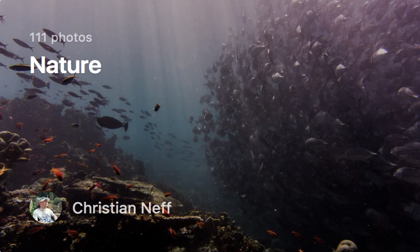

### photo

<div style="text-align:center;margin-top:20px" align="center">
  
</div>   

***   
``` html
<div class="root-animation">
    <div class='place-holder'></div>
    <div class='container'>
        <a class='file-info'>
            <div class='file-info-date'>Apr 26, 2017</div>
            <p class='file-info-name'>Into the Woods</p>
        </a>
        <div class='author-info'>
            <span class='author-info-container'>
            <span class='author-info-avatar'>
                <a class='author-info-avatar-link'>
                
                </a>
            </span>
            <div class='author-info-name'>
                <a class='author-info-name-link'>Alice Donovan Rouse</a>
            </div>
            </span>
        </div>
    </div>
</div>  
```
***
``` css
.root-animation {
    position: relative;
    height: 250px;
    width: 376px;
    border-radius: 5px;
    background-image: url(../images/author.jpg);
    background-size: cover;
    background-position: 50%;
    cursor: pointer;
    margin: 0 auto;
    animation: show .2s 1;
    margin-left:100px;
}

@keyframes show{
    from{
        transform: scale(0.8);
        opacity: 0.8;
    }
    to{
        transform: scale(1);
        opacity: 1;
    }
}

.place-holder {
    width: 100%;
    height: 100%;
    border-radius: 5px;
    position: absolute;
    top: 0;
    left: 0;
    right: 0;
    bottom: 0;
}

.container {
    position: relative;
    transition: background-color .15s ease-in-out;
    background-color: rgba(0, 0, 0, .25);
    width: 100%;
    height: 100%;
    border-radius: 5px;
}

.container:hover {
    background-color: rgba(0, 0, 0, .35);
}

.file-info {
    text-decoration: none;
    position: absolute;
    top: 0;
    left: 0;
    right: 0;
    bottom: 0;
    padding: 28px 30px 30px;
}

.file-info-date {
    font-size: 12px;
    letter-spacing: .02em;
    color: #fff;
    text-shadow: 0 1px 1px rgba(0, 0, 0, .15);
    opacity: .6;
}

.file-info-name {
    font-size: 23px;
    margin: 0;
    color: #fff;
    text-shadow: 0 1px 1px rgba(0, 0, 0, .1);
    line-height: 1.3;
    font-weight: 600;
}

.author-info {
    position: absolute;
    left: 20px;
    bottom: 20px;
    height: 32px;
    line-height: 30px;
}

.author-info-container {
    position: relative;
    pointer-events: auto;
    display: -webkit-inline-box;
    display: inline-flex;
    -webkit-box-align: center;
    align-items: center;
}

.author-info-avatar {
    position: relative;
}

.author-info-avatar-link {
    display: inline-block;
    width: 32px;
    height: 32px;
    line-height: 1;
    margin-right: 10px;
    border-radius: 50%;
    overflow: hidden;
    vertical-align: middle;
    box-shadow: 0 0 1px rgba(0, 0, 0, .5);
    background-color: rgba(0, 0, 0, .2);
}

.author-info-avatar-img {
    width: 100%;
    vertical-align: middle;
    border: 0;
}

.author-info-name {
    max-width: 200px;
    position: relative;
    min-width: 0;
}

.author-info-name-link {
    color: #fff;
    -webkit-transform: translateZ(0);
    transform: translateZ(0);
    text-shadow: 0 1px rgba(0, 0, 0, .04);
    display: block;
    font-size: 15px;
    opacity: .8;
    transition: opacity .2s ease-in-out;
    overflow: hidden;
    white-space: nowrap;
    text-overflow: ellipsis;
}
```