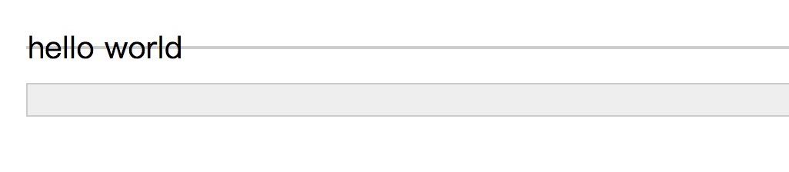

### 水平居中

#### 子元素是行内元素(inline)或者inline-block, inline-table, inline-flex
父元素直接设置`text-align:center`

#### 子元素是块级元素
* 子元素直接设置`margin:0 auto;`

* 父元素设置`position:relative`,子元素设置`position: absolute;left: 50%;transform: translateX(-50%);`

> 注意这个时候需要子元素需要设置一个宽度(如果子元素不设置宽度的话，块级元素的宽度将是100%，也就不需要所谓的水平居中了)

#### 多个块级子元素
如果有多个块级子元素需要居中对齐，最好的方法就是把多个子元素全部设置为`display:inline-block`,然后父元素设置`text-align:center`

### 垂直居中

#### 子元素是行内元素(inline)或者inline-block, inline-table, inline-flex

* 单行(一行能够摆开)：父元素的line-height设置为和height的值一样,其实这个是利用`line box`的[垂直居中行]()来实现的。

先说一个大家都熟知的现象，有一个空的div，`<div></div>`，如果没有设置至少大于1像素高度height值时，该div的高度就是个0。如果该div里面打入了一个空格或是文字，则此div就会有一个高度。那么您思考过没有，为什么div里面有文字后就会有高度呢？

这是个看上去很简单的问题，是理解`line-height`非常重要的一个问题。可能有人会跟认为是：文字撑开的！文字占据空间，自然将div撑开。我一开始也是这样理解的，但是事实上，深入理解inline模型后，我发现，根本不是文字撑开了div的高度，而是`line-height`。
``` html
<style>
    .test1{font-size:20px; line-height:0; border:1px solid #ccc; background:#eee;}
    .test2{font-size:0; line-height:20px; border:1px solid #ccc; background:#eee;}
</style>  

<div class="test1">hello world</div>
  <br>
<div class="test2">测试</div>
```
上面的代码的结果是怎么样的呢？

<div style="text-align:center;margin-top:20px" align="center">
  
</div>  

是不是很震惊，可以看到test1的文字`font-size:20px`,文字虽然现实出来了，但是隐式行内框`hello world`的外层div元素的高度却是0；而test2的文字`font-size:0`，文字没有显示出来，但是隐式行内框`hello world`却把外层div元素的高度撑起来了。

本质上的原因是行框的高度是由`line-height`来决定的，而不是行内元素的`height`决定的，更不是由行内的文字高度决定的。

其实`line boxes`不是直接的生产者，属于中层干部，真正的活儿都是它的手下 – `inline boxes`干的，这些手下就是文字啦，图片啊，`<span>`之类的inline属性的标签啦。`line boxes`只是个考察汇报人员，考察它的手下谁的实际`line-height`值最高，谁最高，它就要谁的值，然后向上汇报，形成高度。例如，`<span style="line-height:20px;">取手下line-height<span style="line-height:40px;">最高</span>的值</span>`。则line boxes的高度就是40像素了。

由上面的知识可以推导出，如果父元素内只有一个`inline-*`元素，那么只要把父元素的`line-height`设置为和`height`的值一样即可。(实质上这种情况下，父元素的height的值已经没用了，因为line-height具有继承性，也就是说子元素的line-height也被设置为了和父元素一样的行高，父元素的高度是由子元素撑起来的，这个时候父元素的height已经没有存在的价值了)

* 多行
如果行内元素要占据多行的情况下，则稍微麻烦一点，可以使用老式的table布局，不过这个实在是太out了。

现在来说最为时尚的做法是使用伪元素，使用一个100%高度的伪元素进行一个占位，然后让行内元素相对于改伪元素进行垂直居中看代码：
``` html
<style>
.ghost-center {
    background: black;
    width: 240px;
    height: 200px;
    margin: 20px;
    color: white;
    resize: vertical;
    overflow: auto;
    padding: 20px;
}

.ghost-center::before {
    content: " ";
    display: inline-block;
    height: 100%;
    width: 1%;
    vertical-align: middle;
}

.ghost-center span {
    display: inline-block;
    vertical-align: middle;
    width: 190px;
    margin: 0;
    padding: 20px;
    background: rebeccapurple;
}
</style>

<div class="ghost-center">
    <span>
        I'm vertically centered multiple lines of text in a container. Centered with a ghost pseudoelement
    </span>
</div>
```

#### 子元素是已知高度的块级元素
这种情况是最简单的，一般思路是父元素先使用绝对定位，把子元素的左上角拉到父元素的中间位置，然后使用`负margin`,`translateY`,等等把子元素往上拉一半的高度：

``` css
.parent {
  position: relative;
}
.child {
  position: absolute;
  top: 50%;
  height: 100px;
  margin-top: -50px; /* account for padding and border if not using box-sizing: border-box; */
}
```

#### 子元素是未知高度的块级元素
其实这个时候整体思路上和上面的是一样的，不同的地方在于，这种情况下不能再使用`负margin-top`来把元素拉上去，因为没法设定margin-top的具体的值，更不能用百分比，因为margin的百分比是相对于父元素的宽度而言的，这个时候只能用相对于自身高度的`translateY`:

``` css
.parent {
  position: relative;
}
.child {
  position: absolute;
  top: 50%;
  transform: translateY(-50%);
}
```

### conclusion
以上边上常用的水平垂直居中对齐的各种方案，一般能够应付常见的业务场景了。不过用现在浏览器兼容性的程度来说，`flex box`会是更简单方便的方案了。
