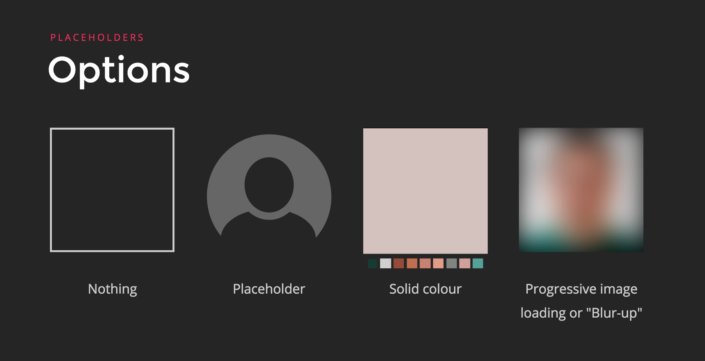
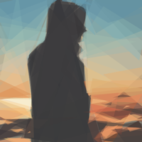
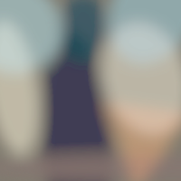

###优化方案
根据统计，用户打开网站，最满意的时间是1-2秒，如果超出了1-2秒，用户就会感觉卡顿，如果超过10秒以上，98%的用户会选择直接关闭这个网站，任何大于两秒的下载时间都将会使你的用户失去耐心，而现在网站中大部分的需要下载的资源都是`image`，那么优化`image`的加载速度就是重点部分，我们可以先了解一下，目前国外访问量比较大，比较火的网站对图片的优化方案
#### [Quartz](https://qz.com/894001/theres-a-wrong-and-a-right-way-to-talk-to-your-dog-according-to-science/)
* 1.首先加载一个非常小的的``，在他们的网页中他们使用了50px宽度和80%质量的图片
* 2.使用css来使图片模糊化
* 3.在小的图片加载完成的时候，开始加载大的图片
* 4.在大图片加载完毕的时候，隐藏小的图片的同时通过`transition:opacity .3s`来展现大的图片
* 5.在用户禁用JavaScript的时候，使用一个`<noscript>`里面包含一个``作为回退方案
``` html
<picture style="padding-bottom: 56.23333333333328%;">
    
    
    <noscript>
        
    </noscript>
</picture>
```

#### [Quora](https://www.quora.com)
quora也是先渲染一个模糊的`canvas`作为placeholder,然后懒加载一个大的图片，先看一下html结构：
``` html
<div style="position: relative;">
    <!-- a canvas with a data-uri containing the thumbnail -->
    <!-- which is in PNG format and very small (in this page 6x10 px) -->
    <canvas style="position: relative"
        width="499"
        height="874"
        data-src="data:image/PNG;base64,UklGRmgAAABXRUJQVlA4IFwAAADwAQCdASoGAAoAAUAmJYgCdEf/g…iD0z/yA/5ipcuk5xHSdrS38j8CkH7s+vKeZu9EwRy0f/KPIlo/+UifdfcpiRcJiRnXXAAAAA==">
    </canvas>
    <!-- a lazy image with src set as data-src and master_src -->
    <!-- data-src is a webp image (at least when requested using Chrome). -->
    <!-- the size for data-src in this page is ~34kB -->
    <!-- master_src is a png image. Its size in this page is ~177kB -->
    
</div>
```
 * 1.外层的容器`div`和`canvas`都设置了`position:relative`,然后设置`img`标签`position:absolute`来让img标签可以完全重叠在canvas上，并且设置img标签`opacity:0`，使用户可以看到模糊的图片，模糊的图片的内容用`base64`内嵌在html中，这样可以减少一次http请求，加快渲染速度。

 * 2.这里使用`canvas`作为placeholder而不是`img`标签的原因是，我们需要手动设置占位符图像的宽度和高度，如果你希望输出的图像的宽高比和源图像的宽高比不一样的话，这个时候img标签就无能为力了
 * 3.使用JavaScript来操作展现全部的canvas,首先获取全部带有`data-src`属性的`canvas`标签，然后遍历，并获取`canvas`上的`data-src`属性，然后使用该值动态创建`img`，`img`的load事件中在canvas中绘制出来新建的图片，用户就可以看到模糊的图片了
``` js
function loadPlaceholderImage(placeholder) {
    if(placeholder.getAttribute('data-src')) {
        var placeholder_img = new Image();
            placeholder_img.src = placeholder.getAttribute('data-src');
        var width = placeholder.getAttribute('width');
        var height = placeholder.getAttribute('height');
        var ctx = placeholder.getContext('2d');
            placeholder_img.addEventListener('load', function () {
                ctx.drawImage(
                placeholder_img,
                0,
                0,
                width,
                height);
            }, false);
    }
}
function loadPlaceholderImages() {
    var placeholders = document.querySelectorAll('canvas[data-src]');
    // Progressively load placeholder images on page load
    [].forEach.call(placeholders, loadPlaceholderImage);
}
// We want to load the placeholder images as soon as possible
loadPlaceholderImages();
```

* 4.在页面加载完成之后，直接获取所有带有`data-src`属性的img标签，并便利，重新设置`img`的`src`属性，在该`img`元素加载完毕之后，设置该元素的`opacity`的值为1(让清晰的img元素显示出来)，并隐藏原来的占位符`canvas`元素(记得中间添加过度的动画元素) 

``` js
function loadDeferredImages() {
    var imgDefer = document.querySelectorAll('img[data-src]');
    for (var i = 0; i < imgDefer.length; i++) {
        loadDeferredImage(imgDefer[i]);
    }
}

function loadDeferredImage(img_element) {
    if (img_element.getAttribute('data-src')) {
        img_element.setAttribute('src', img_element.getAttribute('data-src'));
        img_element.removeAttribute('data-src');
        img_element.addEventListener('load', function () {
            img_element.style.opacity = 1;
            // hide the placeholder image
            var placeholder_elm = img_element.previousElementSibling;
            if (placeholder_elm && placeholder_elm.classList.contains('qtext_image_placeholder')) {
            // Without timeout, we would see a flash of white before the image loads in.
            setTimeout(function () {
                placeholder_elm.style.visibility = 'hidden';
            }, 1000);
            }
        });
    }
}

window.onload = loadDeferredImages;
```
* 5.为什么清晰的`img`元素上面还要添加`master_src`属性，是为了在用户点击的时候，可以全屏展现更大更清晰的图片

[在线的例子](https://jsfiddle.net/zhangela/wmppojjq/)

#### [Clicktorelease](https://www.clicktorelease.com/)
先看一下html结构：
``` js
<div class="hero image">
    <!-- the lazy loaded image -->
    <!-- thumb-src is a matrix of DCT coefficients -->
    <!-- note that a background-color is also set so -->
    <!-- it is rendered while the image is fetched -->
    <div thumb-lazy
        original-src="/images/graphical-web-2016.jpg"
        thumb-src="/images/graphical-web-2016-thumb.png"
        thumb-width="2880" thumb-height="1800"
        style="background-color:#121513;width:100%">
    <!-- a div with intrinsic ratio -->
    <div style="padding-bottom:62.5%">
        <!-- fallback for browsers not using JS / bots -->
        <noscript></noscript>
    </div>
</div>
```

* 使用`div`上的`thumb-src`属性值创建一个`img`元素,一般是一个16X16的png图片，大小一般在300B之内
* 使用上一步创建的img,动态创建`<canvas/>`标签，`canvas`中的内容是`img`
* 使用`div`上的`original-src`请求大的图片，如果支持webp的时候，可以使用webp

上面的代码还添加了一个使用`<noscript></noscript>`，这是一个渐进增强的例子，`<noscript>`可以在用户禁用JavaScript的时候，提供一个很好的替代方案，并且从一个纯色的背景到一个模糊的渐变色。

[在线的例子](https://codepen.io/jmperez/pen/yYjPER)

#### medium
* 1.创建一个`div`标签作为placeholder，并且使用`padding-bottom`属性，来设置该div的宽高比和图像的宽高比一样，防止图片在加载的时候出现塌陷的问题
* 2.请求一个很小的图片，一般是一个很小的jpeg图片，并且有很低的分辨率(e.g.20%),可以使用一个img标签来使浏览器自动去加载该图片资源
* 3.在小图片的`onload`的时候，把小图片渲染进`canvas`标签中，同时使用一个自定义的模糊化函数来使图像模糊化，类似于[StackBlur](http://www.quasimondo.com/StackBlurForCanvas/StackBlurDemo.html),同时，开始加载大的image图像
* 在大图片加载完成的时候，显示大的图片，然后隐藏`canvas`     
在上述步骤中，注意使用css动画和渐变，来使上面的过程更加平缓和渐进
``` html
<figure name="7012" id="7012" class="graf--figure graf--layoutFillWidth graf-after--h4">
    <div class="aspectRatioPlaceholder is-locked">
        <div class="aspect-ratio-fill" style="padding-bottom: 66.7%;"></div>
        <div class="progressiveMedia js-progressiveMedia graf-image is-canvasLoaded is-imageLoaded" data-image-id="1*sg-uLNm73whmdOgKlrQdZA.jpeg" data-width="2000" data-height="1333" data-scroll="native">
            
            <canvas class="progressiveMedia-canvas js-progressiveMedia-canvas" width="75" height="47"></canvas>
            
            <noscript class="js-progressiveMedia-inner">
                
            </noscript>
        </div>
    </div>
</figure>
```

### Lazy loading     
几乎所有的懒加载都是通过JavaScript来实现的
#### Scroll Listeners and relayout
我们一般会通过监听元素的`scroll`事件，来检查图像的占位符是否位于当前可是区域内，如果是，则开始加载，这是目前我们大多数人采用的思路，但是`scroll`事件可能会对页面性能产生负面影响，在滚动期间，浏览器会多次触发`scroll`事件，并加载我们即将要被加载的图像，这会导致浏览器的重新布局，这是一个很影响性能的操作，可以尽量给scroll监听的事件添加`防抖`来降低触发频率，或者我们可以缓存某些元素的位置，这样可以防止反弹的发生，类似于`Quora`的解决方案

首先回忆几个基本概念：
* clientHeight:clientHeight描述的是可见内容的高度，不包括由垂直滚动条引起的隐藏内容。并且要去除掉水平滚动条和border和margin的大小，因为他们不是实际可见内容。     
所以 `clientHeight = visible content + padding`

* scrollHeight:描述的是内容的总高度。包括可见内容的高度和填充(padding);由于垂直滚动条导致的隐藏的内容和padding的高度。 注意这里不包括border和margin,以为这两个也不是真正的内容。     
所以 `scrollHright = entier content + padding`

* offsetHeight:描述的是元素在html页面中占用的空间量。包括一下内容：可见内容的高度和可见的填充(不包括由垂直滚动条引起的隐藏内容高度)；顶部和底部的边框；如果有水平滚动条的情况下，还应该包括水平滚动条的高度。注意这里也不包括margin,因为margin看作是该元素和它的邻居之间的距离，而不是它本身所占据的空间。      
所以 `offsetHeight = visible content + padding + border + horizontal scrollbar`

[详细图解](http://usefulangle.com/post/40/javascript-client-height-vs-offset-height-vs-scroll-height)

* scrollTop:代表有滚动条时，滚动条向下滚动的距离，也就是元素顶部被遮挡住的高度，在没有滚动条的时候scrollTop===0,可读可设置。

* offsetTop:当前元素顶部距离最近父元素顶部的距离，和有没有滚动条没有关系，是只读属性。

[详细图解](https://www.imooc.com/article/17571)

根据以上概念，判断滚动条即将(eg.500px)滚动到底部的逻辑如下:
``` js
/**
 * 判断滚动条即将滚动到底部
 * @param {Event} event scroll 事件
 */
function handleDocScroll(event) {
    var htmlHeight = document.documentElement.scrollHeight || document.body.scrollHeight;

    //clientHeight是网页在浏览器中的可视高度，
    var clientHeight = document.documentElement.clientHeight || document.body.clientHeight;

    //scrollTop是浏览器滚动条的top位置，
    var scrollTop = document.documentElement.scrollTop || document.body.scrollTop;

    //通过判断滚动条的top位置与可视网页之和与整个网页的高度是否相等来决定是否加载内容；
    if (scrollTop + clientHeight >= htmlHeight - 600) {
        console.log('即将滚动到底部')
    }
}
```
上面的`handleDocScroll`函数在页面滚动的时候会频繁触发，而我们想要的是在用户滚动结束之后，执行该监听函数，这个时候就需要`防抖`，
``` js
/**
 * 函数防抖，滚动事件结束之后，在执行
 * @param {Function} fn 
 * @param {Number} wait 
 * @returns {Function}
 */
const debounce = (fn, wait) => {
    let timeout = null;
    return function () {
        if (timeout !== null) {
            clearInterval(timeout)
        }
        timeout = setTimeout(fn, wait)
    }
}
```

判断元素是否在可是区域内
``` js
/**
* @params {HTMLElement} el
*/
function isElementInViewport(el) {
    var rect = el.getBoundingClientRect();

    return (
    rect.top >= 0 &&
    rect.left >= 0 &&
    rect.bottom <= (window.innerHeight || document.documentElement.clientHeight) &&
    rect.right <= (window.innerWidth || document.documentElement.clientWidth)
    );
}
```
#### passive event listeners
DOM2.0中`addEventListeners`函数,可以接收三个参数，其中第三个参数是用来控制监听器是在事件捕获阶段执行还是事件冒泡阶段执行，`true`为捕获阶段，`false`为冒泡阶段，默认值为`false(冒泡阶段)`，因为传`true`的情况太少了

<div style="text-align:center;margin-top:20px" align="center">
  
</div>  

此过程被称为事件传播，会以此执行捕获阶段的监听函数和冒泡阶段的监听函数(注意`触发事件元素本身的监听函数，会按照监听顺序执行，而不是先执行捕获阶段的，后执行冒泡阶段的`，因为目标本身只有一个，自己本身没有捕获和冒泡,自然会按照监听的顺序执行)。在捕获过程中最外层的祖先元素最先响应，然后依次向目标元素捕获；而在冒泡过程中，子元素最先响应，然后依次向父元素冒泡。

在事件处理函数中，会传递`Event`对象作为参数，而这个参数最常用的2个方法就是：
* event.stopPaopagation()   阻止事件传播
* event.preventDefault()    阻止事件的默认行为

我们可以使用如下代码绑定事件：
``` js
div.addEventListeners("touchstart",function (e){
    // 逻辑代码
    // e.preventDefault()  浏览器在没有执行上面的逻辑代码的时候不知道这里会有阻止默认事件的方法
})
```
由于`touchstart`事件对象的`cancelable`属性为`true`，也就是说它的默认行为可以被监听器通过`e.preventDefault()`方法阻止，那它的默认行为是什么呢，通常来说就是滚动当前页面（还可能是缩放页面），如果它的默认行为被阻止了，页面就必须静止不动。但浏览器无法预先知道一个监听器会不会调用`e.preventDefault()`，它能做的只有等监听器执行完后再去执行默认行为，而监听器执行是要耗时的，有些甚至耗时很明显，这样就会导致页面卡顿。视频里也说了，即便监听器是个空函数，也会产生一定的卡顿，毕竟空函数的执行也会耗时。

统计发现，有`80%`的滚动事件监听器是不会阻止默认行为的，也就是说大部分情况下，浏览器是白等了。所以，`passive监听器`诞生了，passive 的意思是“顺从的”，表示它不会对事件的默认行为说 no，浏览器知道了一个监听器是`passive`的，它就可以在两个线程里同时执行监听器中的JavaScript代码和浏览器的默认行为了

这里有一个视频，可以看到`passive监听器`和普通监听对页面性能的影响[视频地址](https://www.webreflection.co.uk/blog/2016/04/17/new-dom4-standards)，现在大部分的浏览器都支持`passive`,我们可以用起来了，不过也要做好回退的方案。
``` js
let passiveEventSupported = false;
try {
    const opts = Object.defineProperty({}, 'passive', {
        get() {
            passiveEventSupported = true
        }
    })
    window.addEventListener('test', null, opts)
} catch (e) { }

const passiveEvent = passiveEventSupported ? { capture: false, passive: true } : false

div.addEventListeners("touchstart",function (e){},passiveEvent)
```

如果我们在`passive`监听器中调用了`e.preventDefault`函数会如何呢？不用担心，这个时候`e.preventDefault`函数将不会起作用，并且浏览器会发出警告。

#### IntersectionObserver
[IntersectionObserver](https://developer.mozilla.org/en-US/docs/Web/API/Intersection_Observer_API)是一个处于试验阶段的api,可以直接监听image元素进入可视区域内，并触发回调函数,由于现在已经实现的浏览器实在是太少了，就不在做讲解，如果感兴趣可以去看一下文档

### Responsive image
错误格式的图片，或者是没有压缩的图片，还有就是图片太大的时候这些情况会极大地影响你的页面的初始化速度。

面对大小、格式、压缩等级等多样选择，到底应该从何处下手，PNG,JPG,SVG,内联的base64编码的字符串，webp等等到底有什么细节的区别？

随着硬件的进步，现代显示器，已经普遍达到了2k,4k的分辨率；越来越多的web页面运行在移动端，移动端的dip,dp,px,dpi,density等等概念又那么的令人容易误解,下面我们从硬件和逻辑像素入手逐一了解这些概念

#### 硬件和逻辑像素
* **屏幕尺寸**：屏幕的对角线的长度，电脑，电视，手机等等都是
* **屏幕比例**：只确定了对角线的长度，2个边的长度还是无法确定，所以有了`4:3`，`16:9`这种屏幕宽高比，这样就可以计算出屏幕的两个边长了
* **分辨率**：纵横2个方向的像素点的数量，常见的取值有`480 x 800`,`320 x 480`等
* **dpi**：dots per inch,直接来说就是一英寸的距离中有多少个像素点，常见的取值是120，160，240。又被称为像素密度
* **density**:像素密度因子，一平方英寸中含有的像素点数量

那么反映到电脑上，举个例子，13寸的MacBook Pro的屏幕图像宽度为1280px,但是retina屏的实际分辨率为2560 x 1600，这是为什么？因为其像素密度因子为2。

以前的显示器的像素密度因子为1，但是近年来屏幕分辨率的增加，硬件像素不再等于逻辑或CSS像素。

硬件像素和CSS像素之间的关系可由一下公式描述：   

**CSS像素 = 硬件像素 / 像素密度**    

因此，2560像素的硬件分辨率转换为retina屏上的1280个CSS像素。

现在，移动设备上像素密度因子有3，甚至4已经开始普及
#### WebP格式
根据google的说法，WebP是现代的图像格式，可以为网络上的图像提供卓越的无损和无损压缩

在一张JPEG格式的图片无损转换为WebP格式之后，可以减少34%的占用空间。

不过现在WebP不是所有的浏览器都支持，根据[Can I use](),只有Chrome和Opera支持WebP，不过这已经是全球浏览器市场份额的60%了，我们完全有动力去做这件事情，但是毫无疑问，我们必须考虑回退选项。

我们可以选择支持三个分界线的图片：`600px`,`900px`,`1440px`和两种像素密度因子(用来支持retina屏和普通屏)，这样就是由原来的一张图片转换为了6张图片，同时我们要尽可能的支持WebP,那么这时候，就是12张图片了。

#### Responsive images in HTML
最基本的`img`标签又一个`src`属性可以指向图片的URL:
``` html

```
但是你可以更进一步使用`srcset`属性，根据不同屏幕的像素密度因子制定不同清晰度的图片：
``` html

```
我们使用了两种不同的像素密度因子：`1x`和`2x`,根据实际的硬件设备，浏览器会选择正确的那个，同时使用`src`属性指向回退选项。

目前除了IE,Edge之外的大多数浏览器都实现了`srcset`属性。

但是对于相同的像素密度因子，无论显示大小如何，你的浏览器都会选择相同的图片，不过有时候我们却想在web端显示大而清晰的图片，而在手机端的时候，我们要选择小而清晰的图片。

`srcset`属性除了能接受像素密度因子，之外，还可以接受宽度单位`w`,相当于CSS像素。使用宽度，可以使浏览器能够显示我们想要的正确的图像。

``` html

```
但是这里又一个问题就是，有了宽度浏览器去决定要获取哪一个图片的时候，它还不知道我们的CSS设置，因为在这个时候，CSS文件还没有请求到，这个时候浏览器只能假设我们要显示一个全宽的图片。

如果全宽的图像正是你想要的，那么OK！但是如果你只想在一个`50vw`宽度的容器内显示图像呢，那么`sizes`属性可以为你解决这个问题
``` html

```
通过添加`sizes=50vw`属性，我们告诉浏览器图片将会被渲染在`50vw`的宽度内，基于这个信息，浏览器可以选择使用哪张图片了

但是如果你想在一个大屏幕上使用`50vw`来展示一张图片，然后在手机端使用`100vw`全屏来展示一张图片，这个时候该怎么做呢，`sizes`属性还支持媒体查询

你可以在`600px`一下的时候，使用全屏宽度来展示图片，如果宽度超过`600px`，就可以使用`50vw`来展示图片。
``` html

```
这个解决方案，看上去很不错啦，不过我们发现我们的像素密度因子去哪了？如果我们使用上面的方案，我们会在`1x`和`2x`的屏幕上选择相同的图片。

<h4>picture元素</h4>
HTML5的`picture`元素可以接受`source`和`img`元素作为子元素，我们可以使用`source`元素列出来我们想要提供给浏览器的其他图片。
``` html
<picture>
    <source
        srcset="image.webp"
        type="image/webp" >
    
</picture>
```
让我们在`picture`元素中添加`source`元素作为`WebP`格式的第一个选项，然后是指向常规JPG图像的`img`。 现在，当浏览器不支持WebP时，它将优雅地回退到`img` 元素(例如Safari)。
`source`元素向我们打开了一个新世界，它可以接受媒体查询，首先在`media`属性中，我们使用媒体查询，然后在`srcset`属性中，放置合适的图像，尽可能的使用`source`元素增加我们的选项
``` html
<picture>
    <source
        media="(min-width: 900px)"
        srcset="image-lg.webp"
        type="image/webp" >
    <source
        media="(min-width: 600px)"
        srcset="image-md.webp"
        type="image/webp" >
    <source
        srcset="image-sm.webp"
        type="image/webp" >
    
</picture>
```
上面我们已经准备了三个WebP格式的图像，这取决于显示器的大小，并且一个JPG图像作为回退选项。

`srcset`属性的最后一个秘密是它也接受像素密度因子，我们可以决定在哪个屏幕上以及在哪个像素密度因子下提供不同的图像。方法就是在图像的`srcset`中，后跟一个空格和像素密度因子，例如：`1x`,`2x`,`3x`,`4x`.
``` html
<picture>
    <source
        media="(min-width: 900px)"
        srcset="image-lg_1x.webp 1x, image-lg_2x.webp 2x"
        type="image/webp" >
    <source
        media="(min-width: 601px)"
        srcset="image-md_1x.webp 1x, image-md_2x.webp 2x"
        type="image/webp" >
    <source
        media="(max-width: 600px)"
        srcset="image-sm_1x.webp 1x, image-sm_1x.webp 1x"
        type="image/webp" >
    
</picture>
```
上面我们使用了WebP格式的图片和像素密度因子，但是有些浏览器不支持WebP格式，我们必须在`img`标签内设置回退选项。
``` html
<picture>
    <source
        media="(min-width: 900px)"
        srcset="image-lg_1x.webp 1x, image-lg_2x.webp 2x"
        type="image/webp" >
    <source
        media="(min-width: 601px)"
        srcset="image-md_1x.webp 1x, image-md_2x.webp 2x"
        type="image/webp" >
    <source
        srcset="image-sm_1x.webp 1x, image-sm_2x.webp 2x"
        type="image/webp" >
    
</picture>
```
我们用`picture`元素替换了`img`元素。在可能的情况下，我们希望根据显示尺寸和2种不同的像素密度，以三种不同的大小提供WebP格式的图像。如果览器不支持 `picture`元素或`WebP`格式，它将回落到具有三种不同大小`JPG`的标准`img`元素。

>请注意，在`img`元素中，`srcset`属性应放置在`src`属性之前。否则，浏览器会首先下载`src`图像，如果在`srcset`中找到了更好的图像，它也会下载这个图像。这样我们最终会得到两个图像。

<h4>CSS中的响应式图片</h4>
如果我们想要用图像覆盖容器的高度和宽度，我们可以使用`div`这样的元素，然后使用`background-image`属性指向图像的URL：
``` css
background-image: url(“/images/image.jpg”);
```
CSS与HTML类似，可以优化图像的大小。

CSS中的`image-set`与HTML中的`srcset`等效。目前，这个属性已经在Chrome、Safari等浏览器中使用，或者你也可以添加[polyfills](https://github.com/wtfil/image-set-polyfill)在其他浏览器上设置`image-set`,但考虑到Chrome和Safari有70%的市场占有率，那么我们就有动力使用起来了，大多数浏览器都会在不远的将来实现这个属性。

并且我们完全可以使用常规的`background-image`作为回退选项。

要创建一个高度为500px的全宽图像元素，我们应当首先使用回退选项`background-image`，然后，使用`-webkit-image-set`，我们需要列出不同像素密度因子的WebP图片，并配合媒体查询
``` css
div {
    height: 250px;
    width: 400px;
    background-image: url('./resImg/2017-12-24_md_1x.jpeg');
    background-size: cover;
    background-position: center;

    background-image: -webkit-image-set( url('./resImg/2017-12-24_lg_1x.webp') 1x,
    url('./resImg/2017-12-24_lg_2x.webp') 2x);

    background-image: image-set( url('./resImg/2017-12-24_lg_1x.jpeg') 1x,
    url('./resImg/2017-12-24_lg_2x.jpeg') 2x);
}

@media(max-width: 900px) {
    div {
        background-image: url('./resImg/2017-12-24_md_1x.jpeg');
        background-image: -webkit-image-set( url('./resImg/2017-12-24_md_1x.webp') 1x,
        url('./resImg/2017-12-24_md_2x.webp') 2x);
        background-image: image-set( url('./resImg/2017-12-24_md_1x.jpeg') 1x,
        url('./resImg/2017-12-24_md_2x.jpeg') 2x);
    }
}

@media(max-width: 600px) {
    div {
        background-image: url('./resImg/2017-12-24_sm_1x.jpeg');
        background-image: -webkit-image-set( url('./resImg/2017-12-24_sm_1x.webp') 1x,
        url('./resImg/2017-12-24_sm_2x.webp') 2x);
        background-image: image-set( url('./resImg/2017-12-24_sm_1x.jpeg') 1x,
        url('./resImg/2017-12-24_sm_2x.jpeg') 2x);
    }
}
```
#### How to generate responsive images
上面提到了不同屏幕，尺寸，格式下的图片都需要不同的图片，不过设计师一般给我们的都是一张图片，应当如何处理呢，特别是存在大量图片的时候，我们需要一个能够批量处理图片的工具。

[ImageMagic](http://www.imagemagick.org/script/index.php)和[GraphicsMagick](http://www.graphicsmagick.org/)都是免费且强大的图片处理工具，并且现在都有node.js的版本，这是我们前端开发工程师擅长的领域。

[gm](https://github.com/aheckmann/gm)就是node.js版本的GraphicsMagick,使用方法如下：
首先安装GraphicsMagick和ImageMagick
```
brew install graphicsmagick
brew install imagemagick --with-webp
```
然后安装gm:
```
npm install gm
```
然后我们就可以写代码批量处理某个文件夹的所有文件,gm的[具体api](http://aheckmann.github.io/gm/)很简单，直接看文档就可以了，不再具体说明。
``` js
const fs = require('fs');
var path = require('path');

var gm = require('gm'),
    dir = __dirname + '/imgs',
    imageMagick = require("imagemagick")

var filePath = path.resolve('./imgs');

fs.readdir(filePath, function (err, files) {
    if (err) {
        console.warn(err)
    } else {
        //遍历读取到的文件列表  
        files.forEach(function (filename) {
            //获取当前文件的绝对路径  
            var filedir = path.join(filePath, filename);
            //根据文件路径获取文件信息，返回一个fs.Stats对象  
            fs.stat(filedir, function (eror, stats) {
                if (eror) {
                    console.warn('获取文件stats失败');
                } else {
                    var isFile = stats.isFile();//是文件   
                    if (isFile) {
                        var name = filename.split('.')[0]
                        var type = filename.split('.')[1];
                        const createFun = createResponsiveImgs(filedir, name, type);
                        createFun(200, 'sm', '1x');
                        createFun(400, 'sm', '2x');
                        createFun(400, 'md', '1x');
                        createFun(800, 'md', '2x');
                        createFun(800, 'lg', '1x');
                        createFun(1600, 'lg', '2x');
                    }
                }
            })
        });
    }
});

function createResponsiveImgs(filePath, fileName, fileType) {
    return function (size, name, density) {
        const file = gm(filePath);
        file.resize(size)
            .write(`resImg/${fileName}_${name}_${density}.${fileType}`, err => {
                if (err) return console.log(err);

                imageMagick.convert([`resImg/${fileName}_${name}_${density}.${fileType}`, `resImg/${fileName}_${name}_${density}.webp`],
                    err => {
                        if (err) throw err;
                        console.log(fileName + '创建成功')
                    })
            });
    }
}
```
原文件的图像都在imgs文件夹内，新生成的图像在resImg文件夹内，新生成的图像具有一下命名结构：    

**originName _ description _ density.type**  

在我的项目中，原图片的大小为486kb,新生成的12个图片中，最大的为 124kb,最小的为7kb,这样计算的话，我们减少了`4-70`倍的大小，对于网速加载速度而言，自然会快很多，尤其是在不同的终端，不同的分辨率之下！

### placeholder
我们通常会在大的图片加载完成之前，先使用一个`placeholder`来给图像占位，通常情况下我们可以使用四种方法：    
<div style="text-align:center;margin-top:20px" align="center">
  
</div>      

* 使用一片空白占位：这样可以在图像还没有加载出来的时候出现页面塌陷和跳动，不仅用户体验比较差，性能上会导致浏览器的重绘
* 一张固定图片作为占位符：我们经常会在用户头像的地方使用这个方案，在用户头像没有设置的时候，或者用户头像家在失败的时候，我们可以使用一个内联的矢量图像(e.g.:svg/base64)作为默认的图像
* 纯色：从图像中获取主颜色，并将其用作占位符的背景颜色，这样可以在你从没有图像到图像家在成功的时候有一个视觉上更加平滑的过度
* 使用渐变色：使用渐变色，可以获取最终图像的更准确的预览，效果上比纯色更棒。
* 模糊图像：也称为模糊技术。首先渲染一个低像素和提及很小的模糊话的图像，然后在大图像加载成功的时候，隐藏模糊图像，也会有一个平滑的过度

<h4>基于SVG的placeholders</h4>

 SVG对于矢量图像非常理想，但是我们作为开发人员大多数拿到的图像都是位图，那么问题就是我们应该如何是量化位图，整体上来说，有三种解决方案：描绘轮廓，形状和区域。 
   
* 使用轮廓：我们可以尝试找出图像的边缘并创建动画      
[使用轮廓动画](https://codepen.io/jmperez/pen/oogqdp)      

* 形状：SVG可以用于从图像中绘制区域而不是轮廓，在某种程度上，我们可以用三角形来是量化一个位图，从而创建一个占位符，三角形的生成基于[三角剖分](https://en.wikipedia.org/wiki/Delaunay_triangulation)，很明显三角形越多，对图像的描绘会更多，但是体积也会更大       
[三角形占位符](https://codepen.io/jmperez/pen/BmaWmQ)         

* Primitive：使用[Primitive](https://github.com/fogleman/primitive)库可以将位图转化由重叠的图像(三角形，矩形，圆形)组成的SVG,它的尺寸很小使其适合内嵌到页面中,从上到下分别是10个，100个多边形组成的图像和原图
<div style="text-align:center;margin-top:20px" align="center">
  
  
  
</div>      
* SQIP:SQIP试图在模糊化的图像和`Primitive`之间寻找一个平衡点：它利用Primitive生成一个由几个简单形状组成的SVG,近似于原图像的主要特征，然后使用SVGO为SVG添加一个模糊的效果，这样可以生成一个仅占据800-1000字节的SVG占位符，这样可以在屏幕上看起来很流畅，并提供了图像内容的视觉提示，它和其他网站使用的模糊话的技术不一样的地方在于，这里使用的是SVG的矢量图，而其他大都是使用的位图(eg JPG or WebP).SQIP也可以生成Base64编码的模糊化的图像，直接内嵌在html中，这样可以减少一次网络请求
<div style="text-align:center;margin-top:20px" align="center">
  
</div>  

#### How to generate placeholder image
我们可以使用[`sqip`](https://github.com/technopagan/sqip)生成svg格式的placeholder图片,首先安装sqip
``` 
npm install -g sqip
```
然后，直接在node.js中调用sqip方法即可：
``` js
/**
 * 创建svg图片
 * @param {string} filePath 
 * @param {string} fileName 
 */
function createSVG(filePath, fileName) {
    const result = sqip({
        filename: filePath,
        numberOfPrimitives: 10
    });
    var svgName = `${fileName.split('.')[0]}.svg`;
    fs.writeFile(`./svg/${svgName}`, result.final_svg, function (err) {
        if (err) {
            return console.log(err)
        }
        console.log('svg 生成成功');
    })
}
```

### Conclusion
图片优化从一下几个方面来思考：
* **懒加载**:首先加载首屏内的图片，其他的部分可以做`预加载`或者滚动到了再加载的`懒加载`,注意使用`passive event listeners`和`节流`技术来优化`scroll`事件的频繁触发
* **placeholder**:先加载一个很小的`blur-up`的图片作为占位符，让用户首先感知到这里是一张图片，然后加载大的图片，大图片加载完成之后使用过度的动画效果，隐藏占位图，显示大图
* **响应式**：使用响应式图片(图片格式，大小，分辨率)，在不同的终端，不同的像素密度因子的屏幕上，显示最合适的图片，可以很明显的节约我们的网络加载时间
