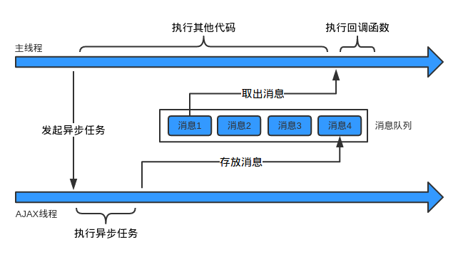

### Event Loop
#### 单线程
我们常说“JavaScript是单线程的”。

所谓单线程，是指在JS引擎中负责解释和执行JavaScript代码的线程只有一个。不妨叫它**主线程**。

但是实际上还存在其他的线程。例如：处理AJAX请求的线程、处理DOM事件的线程、定时器线程、读写文件的线程(例如在Node.js中)等等。这些线程可能存在于JS引擎之内，也可能存在于JS引擎之外，在此我们不做区分。不妨叫它们**工作线程**。

#### 同步与异步
假设存在一个函数A：
``` js
A(args...);
```
**同步**：如果在函数A返回的时候，调用者就能够得到预期结果(即拿到了预期的返回值或者看到了预期的效果)，那么这个函数就是同步的。

例如：
```js
Math.sqrt(2);
console.log('Hi');
```
* 第一个函数返回时，就拿到了预期的返回值：2的平方根。

* 第二个函数返回时，就看到了预期的效果：在控制台打印了一个字符串。

所以这两个函数都是同步的。

**异步**：如果在函数A返回的时候，调用者还不能够得到预期结果，而是需要在将来通过一定的手段得到，那么这个函数就是异步的。
例如：
``` js
fs.readFile('foo.txt', 'utf8', function(err, data) {
    console.log(data);
});
```
在上面的代码中，我们希望通过`fs.readFile`函数读取文件`foo.txt`中的内容，并打印出来。
但是在`fs.readFile`函数返回时，我们期望的结果并不会发生，而是要等到文件全部读取完成之后。如果文件很大的话可能要很长时间。

下面以AJAX请求为例，来看一下同步和异步的区别：

- 异步AJAX：
  * 主线程：“你好，AJAX线程。请你帮我发个HTTP请求吧，我把请求地址和参数都给你了。”

  * AJAX线程：“好的，主线程。我马上去发，但可能要花点儿时间呢，你可以先去忙别的。”

  * 主线程：：“谢谢，你拿到响应后告诉我一声啊。”

  * (接着，主线程做其他事情去了。一顿饭的时间后，它收到了响应到达的通知。)

- 同步AJAX：
  * 主线程：“你好，AJAX线程。请你帮我发个HTTP请求吧，我把请求地址和参数都给你了。”

  * AJAX线程：“......”

  * 主线程：：“喂，AJAX线程，你怎么不说话？”

  * AJAX线程：“......”

  * 主线程：：“喂！喂喂喂！”

  * AJAX线程：“......”

  * (一炷香的时间后)

  * 主线程：：“喂！求你说句话吧！”

  * AJAX线程：“主线程，不好意思，我在工作的时候不能说话。你的请求已经发完了，拿到响应数据了，给你。”

正是由于JavaScript是单线程的，而异步容易实现非阻塞，所以在JavaScript中对于耗时的操作或者时间不确定的操作，使用异步就成了必然的选择。

任何时候，只要把一段代码包装成一个函数，并指定它在响应某个事件(定时器、鼠标点击、Ajax响应等)时执行，你就是在代码中创建了一个`将来`执行得块，那么实际上就是程序中引入了`异步机制`。

#### 异步过程的构成要素
从上文可以看出，异步函数实际上很快就调用完成了。但是后面还有工作线程执行异步任务、通知主线程、主线程调用回调函数等很多步骤。我们把整个过程叫做异步过程。异步函数的调用在整个异步过程中，只是一小部分。

总结一下，一个异步过程通常是这样的：

**主线程发起一个异步请求，相应的工作线程接收请求并告知主线程已收到(异步函数返回)；主线程可以继续执行后面的代码，同时工作线程执行异步任务；工作线程完成工作后，通知主线程；主线程收到通知后，执行一定的动作(调用回调函数)。**

异步函数通常具有以下的形式：
``` js
A(args..., callbackFn)
```
它可以叫做异步过程的`发起函数`，或者叫做`异步任务注册函数`。args是这个函数需要的参数。callbackFn也是这个函数的参数，但是它比较特殊所以单独列出来。

所以，从主线程的角度看，一个异步过程包括下面两个要素：

* 发起函数(或叫注册函数)A

* 回调函数callbackFn

它们都是在主线程上调用的，其中**注册函数用来发起异步过程，回调函数用来处理结果**。

举个具体的例子：
``` js
setTimeout(fn, 1000);
```

其中的setTimeout就是异步过程的发起函数，fn是回调函数。

注意：前面说的形式A(args..., callbackFn)只是一种抽象的表示，并不代表回调函数一定要作为发起函数的参数，例如：
``` js
var xhr = new XMLHttpRequest();
xhr.onreadystatechange = xxx; // 添加回调函数
xhr.open('GET', url);
xhr.send(); // 发起函数
```
发起函数和回调函数就是分离的。

#### 消息队列和事件循环
现在让我们澄清一件事情(可能令人震惊)：尽管你显然能够编写异步JavaScript代码，但是直到ES6的出现，JavaScript才真正内建有直接的异步概念。

什么?！这种说法似乎很疯狂，对不对？但事实就是这样。JavaScript引擎本身所做的只不过在需要的时候，在给定的任意时刻执行程序中的单个代码块。

需要？谁的需要？这正是关键所在！

JavaScript引擎并不是独立运行的，它运行在`宿主环境`中，对多数开发者来说就是web浏览器和node.js(实际上JavaScript现在已经嵌入到了从机器人到电灯泡等各种各样的设备中)。

但是所有的这些环境都有一个共同的“点”，即他们都提供可一种机制来处理程序中的多个块的执行，并且执行每块时调用JavaScript引擎来执行代码，这种机制被称为**事件循环**。

换句话说，JavaScript引擎本身并没有时间的概念，只是一个按需执行JavaScript任意代码块的工具。“事件”(JavaScript代码执行)调度总是由包含它的环境进行。

> 前面提到的“直到最近”，是指ES6从本质上改变了在哪里管理事件循环。本来它几乎已经是一种正式的技术模型了，但现在ES6精确指定了事件循环的工作细节，这意味在机上将其纳入了JavaScript引擎的势力范围，而不只是由宿主环境来管理。这个改变的主要原因是ES6中Promise的引入，因为这项技术要求对事件循环队列的调度能够直接进行精细控制。

上文讲到，异步过程中，工作线程在异步操作完成后需要通知主线程。那么这个通知机制是怎样实现的呢？答案是利用消息队列和事件循环。

用一句话概括：

**工作线程将消息放到消息队列，主线程通过事件循环过程去取消息。**

* **消息队列：**消息队列是一个先进先出的队列，它里面存放着各种消息。

* **事件循环：**事件循环是指主线程重复从消息队列中取消息、执行的过程。

实际上，主线程只会做一件事情，就是从消息队列里面取消息、执行消息，再取消息、再执行。当消息队列为空时，就会等待直到消息队列变成非空。而且主线程只有在将当前的消息执行完成后，才会去取下一个消息。这种机制就叫做**事件循环机制**，**取一个消息并执行的过程叫做一次循环**。

事件循环用代码表示大概是这样的：
``` js
while(true) {
    var message = queue.get();
    execute(message);
}
```
那么，消息队列中放的消息具体是什么东西？消息的具体结构当然跟具体的实现有关，但是为了简单起见，我们可以认为：

**消息就是注册异步任务时添加的回调函数。**

再次以异步AJAX为例，假设存在如下的代码：
``` js
$.ajax('http://segmentfault.com', function(resp) {
    console.log('我是响应：', resp);
});

// 其他代码
...
...
...
```
主线程在发起AJAX请求后，会继续执行其他代码。AJAX线程负责请求segmentfault.com，拿到响应后，它会把响应封装成一个JavaScript对象，然后构造一条消息：
``` js
// 消息队列中的消息就长这个样子
var message = function () {
    callbackFn(response);
}
```
其中的callbackFn就是前面代码中得到成功响应时的回调函数。
主线程在执行完当前循环中的所有代码后，就会到消息队列取出这条消息(也就是message函数)，并执行它。到此为止，就完成了工作线程对主线程的通知，回调函数也就得到了执行。如果一开始主线程就没有提供回调函数，AJAX线程在收到HTTP响应后，也就没必要通知主线程，从而也没必要往消息队列放消息。

用图表示这个过程就是：


从上文中我们也可以得到这样一个明显的结论，就是：

**异步过程的回调函数，一定不在当前这一轮事件循环中执行。**

每一个消息完整的执行后，其它消息才会被执行。这为程序的分析提供了一些优秀的特性，包括：一个函数执行时，它永远不会被抢占，并且在其他代码运行之前完全运行（且可以修改此函数操作的数据）。这与C语言不同，例如，如果函数在线程中运行，它可能在任何位置被终止，然后在另一个线程中运行其他代码。

这个模型的一个缺点在于当一个消息需要太长时间才能处理完毕时，Web应用就无法处理用户的交互，例如点击或滚动。浏览器用“程序需要过长时间运行”的对话框来缓解这个问题。一个很好的做法是缩短消息处理，并在可能的情况下将一个消息裁剪成多个消息。

例如：函数`setTimeout`接受两个参数：待加入队列的消息和一个延迟（可选，默认为0）。这个延迟代表了消息被实际加入到队列的`最小延迟时间`。也就是说`setTimeout`并没有把回调函数直接挂在事件循环队列中，它所做的是设定一个定时器。当定时器到时后，宿主环境会把回调函数放在事件循环队列中。如果队列中没有其它消息，在这段延迟时间过去之后，消息会被马上处理。但是，如果有其它消息，setTimeout 消息必须等待其它消息处理完(通常没有抢占的方式直接将其排到队首，所以它得排到其他项目之后)。因此第二个参数仅仅表示**最少延迟时间，而非确切的等待时间**，这也就解释了为什么`setTimeout`定时器的精度可能不高。

> 一定要清楚，setTimeout(...)并没有直接把你的回调函数挂在事件循环队列中，它所做的时设定一个定时器。当定时器到时后，环境会把你的回调函数放在事件循环中，这样，顺序的排队执行

#### tasks & microtasks
以上的事件循环过程是一个宏观的表述，实际上因为异步任务之间并不相同，因此他们的执行优先级也有区别。不同的异步任务被分为两类：微任务(micro task)和宏任务(macro task，有时候也被称为task)。

现在看一个一段代码：
``` js    
console.log('script start');

setTimeout(function() {
  console.log('setTimeout');
}, 0);

Promise.resolve()
.then(function() {
  console.log('promise1');
}).then(function() {
  console.log('promise2');
});

console.log('script end');
```
正确答案：`script start`, `script end`, `promise1`, `promise2`, `setTimeout`

>可能某些老版本的浏览器执行的结果不是这样的,Microsoft Edge, Firefox 40, iOS Safari and desktop Safari 8.0.8之前的版本可能会先打印setTimeout，然后是`promise1`, `promise2`，不过现在所有厂商的新版本的浏览器执行的结果都是一样的，测试时间(2018.11.15)

想要知道为什么会产生这样的结果，你需要知道事件循环如何处理tasks和microtasks,可能当你第一次遇到的这个问题的时候，会让你大吃一惊，但是现在我们会慢慢的解开谜题：

**Tasks**通常都是被放进一个队列，按照顺序执行，然后在每个Task执行的间隔区间，浏览器可能会执行更新DOM等等
**Microtasks**通常被安排在当前正在执行的脚本执行完成之后马上执行，只要没有其他Javascript处于执行中，在每个Task结束的时候，都是顺序执行完成当前全部的microtasks，在microtasks执行期间，如果有其他的microtasks添加到microtasks队列中，也会等到新加入的microtasks执行完成，在执行下一个Task

> microtasks 类似于ES6中新增的任务队列(job queue)，主要是在Promise中用到,它是挂在事件循环队列的每个tick之后的一个队列。事件循环类似于一个游乐园游戏：玩过一哥游戏之后，你需要重新到队尾才能再玩一次，而任务队列类似于玩过了游戏之后，插队接着继续玩。但是一个job可能会引起更多的任务被添加到通一个队列末尾。所以理论上来说，任务循环(job loop)可能无限循环(一个任务总是添加另一个任务，以此类推)，进而导致程序的饿死，无法转移到下一个事件循环的tick,从概念上江，这和代码中的无限循环的体验几乎是一样的。

以下事件属于Tasks:
* script全部代码
* setInterval()
* setTimeout()
* ajax
* DOM Event(鼠标、键盘、屏幕拖拽)
* UI render

以下事件属于Microtasks:
* promiseFullfil
* promiseReject
* new MutaionObserver()

看看这段代码在执行过程中的Task和Microtask的过程中，两个队列以及call stack的变化情况


### 总结
事件循环的作用是查看调用栈并确定调用栈是否空闲。如果调用栈空闲，event loop 会查看消息队列是否有待处理的 callback 需要触发。例子中的消息队列只包含一个 callback，当调用栈为空的时候，event loop 会将 callback 推入调用栈中触发 networkRequest 的回调。

事件循环的顺序，决定js代码的执行顺序。进入整体代码(宏任务)后，开始第一次循环。接着执行所有的微任务。然后再次从宏任务开始，找到其中一个任务队列执行完毕，再执行所有的微任务。
