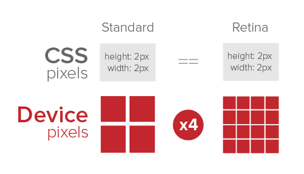
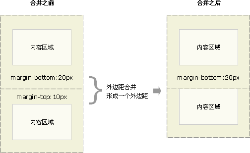
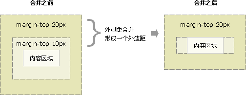
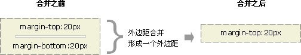

### CSS使用方法

* link 标记
link必须放在head元素中，绝不能放在其他元素内部,因为link标记用来链接外部的样式，所以也被成为外部样式表
``` html
<link rel='stylesheet' type='text/css' href='main.css'/>
```
* style 元素
可以使用style元素包含样式表，它在文档中单独出现，因为这个样式表嵌套在文档中，所以也被成为文档样式表或者嵌套样式表
``` html
<style>
    p{
        color:#000;
    }
</style>
```
* @import
与link类似，`@import` 用于指示Web浏览器加在一个外部样式表，并在表现HTML文档时使用其样式，唯一的区别在于命令的具体语法和位置。

可以看到，`@import`出现在style容器中，它必须放在这里，也就是要放在其他CSS规则之前，否则将根本不起作用，考虑下面的例子：
``` html
    <style>
        p{
            color:#000;
        }
        @import url('...')
    </style>
```
这里外部引入的css将不会有任何作用，因为放在了其他的规则之后

* 内联样式
如果你只是想为单个元素设定一些样式，而不需要嵌套或者外部样式表，就可以使用HTML的`style`属性来设置一个内联样式(inline style),例如
``` html
<p style="color:red">hello world</p>
```
style属性可以应用在body内部出现的任何HTML元素上

### CSS选择器
* 通配选择器： * 选择全部的元素
* 元素选择器： div span
* 类选择器和ID选择器：.classname #id
* 多类选择器： .class1.class2 选择同时包含两种类的元素
* 属性选择器：
    * `h1[class]{color:#000}`  选择包含class属性的h1
    * `h1[title]{color:#000}` 选择包含title属性的h1
    * 多属性选择器： `a[href][title]{color:#fff}` 同时包含href和title属性的a
    * = 具体属性值选择器：`a[href='http://www.baidu.com']{color:###}` 选择href属性值等于'http://www.baidu.com'的元素，即：选择具体属性值的元素
    * ～= 部分属性值选择器：`img[title ~= 'hello']{…}` 选择所有title属性中有hello字符串的img,并且要求hello字符串两边都是空格，即：属性值部分包含就可以,但是要求该值两边都是空格
    * |= 部分属性选择器：`img[title |= 'hello']{…}` 选择所有title属性值是以'hello’或者’hello-' 为开头的img,即：属性值必须以某个字符串或者`字符串 + '-'` 开头,典型的应用场景是匹配语言简写代码，如'zh-CN','zh-TW'
    * ^=  部分属性选择器：`img[title ^= 'hello']{…}` 选择所有title属性值是以hello为开头的img,即：属性值必须以某个字符串开头
    * $=  部分属性选择器：`img[title $= 'hello']{…}` 选择所有title属性值是以hello为结尾的img,即：属性值必须以某个字符串结尾
    * *=   部分属性选择器：`img[title *= 'hello']{…}` 选择所有title属性值中包含hello字符串的的img, 即：属性值包含某个字符串就可以了,不要求是空格或者其他
* 父子选择器
    * 祖先与后代：`div p{...}` 选择div内部的看所有的p元素，不论嵌套多少层
    * 父与子：`div>p{...}` 选择div元素内直接嵌套的p元素，要求是直接嵌套
    * 相邻兄弟：`div+p{...}` 选择紧跟在div元素后面的p元素，要求必须是紧接着并且拥有同一个父元素，中间不能有其他元素，例如家里的老大和老二，老三和老四，老大和老三则不行
    * 通用兄弟：`div~p{...}` 选择div元素后面的p元素，要求他们拥有同一个父元素，但是不要求div和p是紧挨着的，例如:老大和老二，老大和老四，都是可以的
* 伪类
    伪类可以为某些元素的状态指定特定的样式，换句话说会根据另外某种条件而非文档结构向文档中的某些元素应用样式

    **静态伪类**：一般除了第一次显示之后，不会再次改变文档的样式
    * :link 用来选中尚未访问的超链接，包括那些已经给定了其他伪类选择器的链接，为了正确渲染链接元素的样式，:link伪类选择器一般应该放在其他选择器的前面
    * :visited 用来选择已经访问过的超链接
    * :focus 指示当前拥有输入焦点的元素，一般为`input`,`select`之类的元素，拥有了输入焦点
    * :hover 鼠标停留在某个元素上的时候，该元素`:hover`伪类中的样式就会应用到该元素上
    * :active 被用户激活的元素，例如:当鼠标指针停留在一个超链接上，如果用户点击了鼠标，就是激活了这个超链接
    * :first-child 选取属于其父元素的首个子元素的指定选择器,而绝非字面意思上的，该元素下的第一个元素
    **动态伪类**：可以根据用户的行为改变文档的外观

> 对于伪类，可以注意"link-visited-focus-hover-active"的顺序

* 伪元素
伪元素能够在文档中插入假象的元素，从而得到某种效果，常用的伪元素为:
    * :first-letter 会选中某元素第一行的第一个字母，并且文字所处的行之前没有其他内容
    * :first-line 会应用到某个块级元素的第一行，第一行的长度取决于很多因素，包括元素宽度，文本的文字的大小，:first-line 伪元素只能在块容器中,所以,:first-line伪元素只能在一个display值为`block`, `inline-block`, `table-cell` 或者 `table-caption`中有用。在其他的类型中，:first-line 是不起作用的。
    * :before 可以用来在某个元素之前插入指定的内容，并且可以用content，设置插入的内容和内容的样式
    * :after 可以用来在某个元素之后插入指定的内容，同before

### 结构和层叠
`继承`是指从一个元素向其后代元素传递属性值所采用的机制，而每一个合法的文档都会生成一个结构树，了解这一点，就能根据元素的祖先、属性、兄弟元素等等创建选择器来选择元素，有了这个结构树，选择器才能够起作用，这就是`继承`的核心所在。

在确定要想要为元素应用那些值的时候，用户代理不仅要考虑继承，还要考虑声明的特殊性，另外需要考虑声明的来源，而这个过程就叫做`层叠`。

这也是CSS的三个核心内容：`特殊性`，`继承`，`层叠`

#### 特殊性
应用到同一个元素上的多个CSS规则，浏览器会计算选择器的特殊性，并将这个特殊性附加到规则中的各个声明，如果一个元素有两个或者多个冲突的属性声明，那么最高特殊性的声明就会胜出。

选择器的特殊性由选择器本身的组件确定。特殊性值表述为4个部分，如：0，0，0，0。

一个选择器的具体啊特殊性如下确定：
* 对于选择器中给定的各个id属性值，加0，1，0，0
* 对于选择器中给定的各个类属性值、属性选择或者伪类，加0，0，1，0
* 对于选择器中给定的各个元素和伪元素加0，0，0，1
* 结合符和统配选择器对特殊性没有任何贡献，为0，0，0，0
* HTML内联样式的特殊性为1，0，0，0

>0,0,0,0的特殊性相比与没有任何特殊性还是有所区别的，而且很容易让人混淆，在后面的继承一节中会具体说明

#### 重要性
有时候某个声明可能非常重要，超越了所有其他声明，这个时候就是`!important`发挥的时候了，可以在CSS属性声明的结束分号之前插入`!important`来标志。例如：
``` css
    p.dark{ 
      color:#333 !important;
      background:#fff;
    }
```
`!important`声明必须放在声明的最后，即分号前面。如果一个属性的值包含多个关键词，例如：font,则必须将`!important`放在所有font属性值的最后，否则整个声明都是无效的。

标志为`!important`的声明没有特殊的特殊性，不过要与非重要声明分开考虑。也就是说所有的`!important`声明会分为一组，而所有的非重要性声明分为一组，各自在小组内部使用特殊性来判断。但是如果一个重要声明和一个非重要声明发生冲突的话，那么毫无疑问，胜出的都是重要声明。

#### 继承
基于继承机制，样式不仅可以应用到指定的元素，还会应用到它的后代元素，例如向一个div元素应用一个颜色，那么这个颜色将会应用到div中的所有文本，甚至还会应用到div中的h1,p等等子元素。

继承的值会沿着树向下传播到后代元素，并且一直继续，直到没有更多的后代元素继承这个值为止。但是值绝对不会向上传播，也就是说不会把属性应用到父元素上去，这个是显而易见的。

>在HTLML中，不能向上传播的规则有一个例外：应用到body元素的背景样式可以传递到html元素，也就是文档的根元素

继承是CSS中最基础最常见的内容，除非有必要的理由，否则一般不会特殊考虑，正所谓`熟视无睹`,不过有几点需要说明。
* 不是所有的属性都可以继承。一般的，大多数的框模型(包括外边距，边框，内边距，背景)等属性都不能继承
* 继承的属性没有任何特殊性，这完全区别与`*`的0特殊性，看个例子：
``` html
    <style>
        * {
        color: gray
        }

        h1 {
        color: black;
        }
    </style>
    <h1>hello
        <em>world</em>
    </h1>
```
因为通配选择器适用于所有的元素，而且特殊性为0，那么很明显其颜色声明的`gray`要优先于没有任何特殊性继承而来的`black`,所以`em`会显示为灰色而不是黑色。

#### 层叠
如果有带特殊性相等的两个规则同时应用到同给一个元素会怎么样呢？浏览器究竟会作出什么选择呢？举个例子：
``` css
    h1{ color : red;}
    h1{ color : blue;}
```
哪一个会占上风呢，这两个规则的特殊性都是`0,0,0,1`所以他们的权重相等，都应该应用的元素，但是同一个元素不可能既是红色的又是蓝色的，但是到底应用哪一个规则呢，这个时候需要引出CSS中`层叠`的概念。

我们先来看一下层叠的规则：
* 按显式权重对应用到该元素的所有声明排序。标志`!important`规则的权重要高于没有`!important`标志的规则。
* 按照特殊性对应用到给定元素的所有声明进行排序。有较高特殊性的规则权重大于有较低特殊性的元素。
* 按照出现顺序对应用到给定元素的所有声明排序。一个声明在样式表中或者文档中出现的越靠后，那么它的权重越大。如果样式表中有导入的样式，那么导入的样式权重低于文档中的样式。因为`@import`都是在`<style></style>`标签的最前面

#### 关于按照顺序进行排序有一个常见的误区
看例子代码：
``` html
<style>
    .h1 {
        color: red;
    }

    .h1-oth {
        color: blue;
    }
</style>
<h1 class='h1 h1-oth'>hello1</h1>
<h1 class='h1-oth h1'>hello2</h1>
```
实际上，上面的两个`hello`都是显示的蓝色(blue),而绝不会是第一个显示蓝色，第二个显示红色，在层叠的时候是按照属性在样式表或者文档中的先后顺序进行排序的，**而绝不是按照在HTML元素`class`属性中出现的顺序进行排序的**。

#### link,visited,hover,active
由于正是按照前后顺序排序的，所以超链接才会按照link,visited,hover,active的顺序进行，如下所示：
``` css
    a:link {
      color: blue
    }

    a:visited {
      color: purple
    }

    a:hover {
      color: red
    }

    a:active {
      color: orange
    }
```
上面四个选择器的特殊性都是0，0，1，0。他们有相同的权重，来源和特殊性，所以与元素匹配的最后一个选择器才会胜出。

如果不使用这个规则的话，例如按照首字母顺序排序`active-hover-link-visited`,那么任何时候都不会显示`:hover`或者`:active`的样式，因为所有的超链接，要么是没有访问的(link)，要么是已经访问的(visited)！

### 值和单位
#### 长度单位
所有的长度单位都可以表示为正数和负数，其后跟一个两个字母缩写的长度单位，例如in(英寸)或pt(点)，不过长度为0的时候不需要单位。

长度单位可以规划为两类：绝对长度单位和相对长度单位。

**绝对长度单位**
绝对长度单位比较好理解，就是现实世界中的实际长度，不过web中很少用到绝对长度单位。
* 英寸(in)
    是指美国尺子上常用的度量单位，奇葩中的奇葩，全世界仅此一家
* 厘米(cm)
    世界通用长度单位，和上面的英寸的换算规则为:1in=2.54cm
* 毫米(mm)
    世界通用长度单位，1mm=0.1cm
* 点(pt)
    点是一个标准印刷度量单位，在打印机和打字机上已经使用了数十年，一般来说一英寸是72点，那么`p{font-size:18pt}`就等价于`p{font-size:.25in}

**相对长度单位**
相对单位之所以得名，是他们的值是根据其他事物的关系计算得来的，而不是现实世界中实际长度
#### 像素
* px
css中的px,是让很多前端同学备受折麽的单位，毕竟1px,到底是多长呢，在不同的电脑上不一样，不同的手机上不一样，到底怎么回事，怎么计算呢？真是让人头大，想象一下常见的对话场景：

切图仔：设计稿做好发给你了。    
BUG仔：好哒，我看看。    
BUG仔：What is this FXXX ? 为啥你的设计稿是640px宽，iphone5不是320px宽吗 ?    
切图仔：This pixel is not your pixel !    
BUG仔：What is this FXXX ?    

为什么会出现以上的情况，难道是他们当中的有个人出错了？  

实际上他们都是对的，只是他们谈论的不是一个`像素`

此像素非彼像素

* 设备像素(device pixel)
设备像素是一个实际的物理概念，指的是设备中使用的物理像素，如果有一个设备，那么这个设备的设备像素就是固定的，例如:iphone5的设备像素是640 x 1136,MacBook Pro 13in的设备像素是2560 x 1600。
* CSS像素(css pixel)
CSS像素是Web编程的概念，指的是CSS样式代码中使用的逻辑像素，CSS中的px是一个相对单位，相对的是设备像素(device pixel)，也可以理解为js中的map(映射)的关系。
举个例子看一下，设备像素是怎么映射到CSS像素的。
iPhone5使用的是Retina视网膜屏幕(先不管这个名字)，使用2 x 2的device pixel 代表 1 x 1的CSS pixel,所以设备像素是640 x 1136,而CSS逻辑像素是320 x 568px

<div style="text-align:center;margin-top:20px" align="center">
  
</div>   

设备像素比(device pixel ratio)可以通过`window.devicePixelRatio`来读取，获得设备像素比，便可得知设备像素与CSS像素之间的比例。当这个比率为1:1时，使用1个设备像素显示1个CSS像素，当这个比率为2:1的时候，使用4个设备像素显示1个CSS像素，当这个比率为3:1的时候，使用9个设备像素显示一个CSS像素

主流设备的设备像素比可以参照[http://screensiz.es/](http://screensiz.es/)

了解了上面的知识之后，切图仔和BUG仔的矛盾便会迎刃而解：
设计师一般按照设备像素(device pixel)为单位制作设计稿
前端工程师拿到设计稿之后，根据设备像素比，进行换算成CSS像素

#### em与rem
* em
在CSS中，1个em定义为一种给定字体的font-size值，也就是说，如果一个元素的`font-size`为14px,那么对于该元素，1em就等于14px,2em等于28px;

**最常见的一个误解是em是相对于父元素的字体大小，这个错误的发生原因是，大部分元素的字体大小是继承自父元素的，但是如果该元素单独设定了`font-size`属性的值，则1em将不等于父元素的`font-size`**。

* rem
当使用rem作为单位的时候，根据根元素字体的`font-size`来计算px值。
其对应的像素值为根元素(html)的`font-size` x rem值，例如：如果设定`html { font-size : 14px }`,那么任意一个子元素，只要设定了`font-size:2em`那么字体大小就是28px。

em,rem都是与字体相关的长度单位，那么何时使用em,rem呢?

可以使用em设置当前元素的`padding`,`margin`,`line-height`等值，与当前字体大小成正比，对文字排版很重要

在移动端开发的时候，当不需要元素的尺寸、间距与当前的字体成正比，那么就可以选择使用rem,通过控制跟元素的`font-size`,让页面在各种尺寸的移送设备上自适应。

**与视口相关的长度单位**
视口相关的长度值相对于初始包含块的大小，也可以理解为相对于浏览器的宽高。当用户拖动浏览器的大小的时候，他们会相应的缩放
* vh
布局视口高度的1/100
* vw
布局视口宽度的1/100
* vmin
布局视口宽度和高度中较小值的1/100
* vmax
布局视口宽度和高度中较大值的1/100

#### 百分比
从小学就学过百分比也是一个相对值(我有巴菲特1%的财富，也是个超级富豪了)，在CSS世界里，百分数可以是相对于同一个元素的另一个属性的值，也可以是从父元素继承的一个值，或者是祖先元素的一个值。

对于没有经验的小白来说，CSS中的各种百分比都是相对于谁，是个和让人都头疼和混淆的问题：
* 相对于父元素宽度
[max/min-] width,left,right,padding,margin
* 相对于父元素高度
[max/min-] height,top,bottom
* 相对与继承字体大小
font-size:也就是如果父元素的`font-size:12px`,子元素`font-size:200%`,则子元素的字体实际大小为24px
* 相对于自身字体大小
line-height:一个元素自身`font-size:12px;line-height:200%`,那么`line-height`属性的实际值为24px
* 相对于自身宽高的
border-radius,background-size,transform:translate()

#### 相对定位
如果一个元素自身设置`position:absolute`,父元素是指：相对于离它最近的那个 position 不为 static 的祖先元素，如果没有这样的元素，则相对于视口。

如果 position: fixed，父元素指视口（父级不存在 transform 为非 none 值的情况下）。


### 字体
* 在使用`font-family`的时候，如果字体名字中包含一个或者多个空格，或者字体名包含`#`、`$`等之类的特殊字符的时候，建议用引号把该字体名称包裹起来
* `font-size`属性与你看到的实际字体大小之间的关系由字体的设计者来确定。这种关系设置为字体本身中的一个em方框，一般来说，定义字体时可能要求所有的字符都小于其em方框，(不是所有的字体都是这样的，所以会出现超出被截断的现象)
* `font-size`百分数值总是根据从父元素继承的值(而不是百分数)来计算，举例来说就是`<p style='font-size:10px'>hello <em style='font-size:150%'>world</em></p>`,那么em元素继承的值是15px,根据声明值`150%`，计算得知，最后的值为10px x 150% = 15px;
* font属性可以统一处理应用到字体上的多种属性。其中有个重要的规则是：必须以`font-size`和`font-family`作为声明的最后两个值，而且这两个值是必须的(如果少了其中某个属性，则浏览器会忽略掉整个规则)。前面的其他属性值，则没有特殊的顺序要求。
* `line-height`:尽管`line-height`是一个文本属性而并非字体属性，但是可以使用`font`属性来设置`line-height`,可以作为`font-size`值的一个补充，并用一个斜线(/)分割开来。例如：`body { font-size : 12px } h1 { font : 200%/1.25,sans-serif}`,例子中h1元素的`font-size`被设置为24px,`line-height`被设置为30px。
* 字体下载，使用`@font-face`属性可以在文档中下载一个远程字体来使用，要声明一个下载字体，可以使用如下规则：
``` css
@font-face {
    font-family:'hello-world';
    src:url(http://www.a.com/a.ps);
}
```
这样既可以在后面的css中使用`font-family:hello-world`作为字体名称了。

### 文本属性
#### 文本水平对齐
`text-align`属性会导致元素中的文本分别靠左，靠右，居中对齐等，该属性只能应用于块级元素。
#### 垂直对齐
在看文本垂直对齐之前，先来学习一个常见的属性**`line-height`** ,是指文本基线之间的距离，而不是字体的大小，她确定了将各个元素框的高度增加或者减少多少。

我们对于`line-height`最常见的使用方法就是增加或者减少文本行之间的垂直间隔。其实不然，文本之间的垂直距离是有行间距来控制的，而所谓的行间距就是文本的`line-height`属性值减去文本的`font-size`值之后的来的，行间距大多数的情况下都是一个正数，但是有时候也可以是一个负数，然后行间距再除于2，将行间距的一半分别应用到内容区的顶部和底部。

举个例子来说，假设`font-size`为14px,`line-height`为18px,则浏览器会在文本内容区的顶部和底部分别添加一个`2px`的空白区，作为间距。

`line-height`是有继承性的，当一个块级元素从另一个元素继承`line-height`时，问题会更复杂。`line-height`从父元素继承的时候，要从父元素计算，而不是在子元素上继承。看个例子：
``` css
body { font-size : 10px}
div { line-height : 1em}
p { font-size : 18px}
```
实际上`p`标签内的元素会上下挤成一团，为什么会造成这个现象呢？我们来分析一下：首先`div`会从body上继承`font-size`属性，也就是说`div`的`font-size`为10px,那么div的`line-height`也就是10px(1em === 当前元素的font-size值)，那么`p`元素也就是从`div`上继承的`line-height`为10px。那么`p`元素的内容会上下挤成一团也就很好理解了。

那么怎么解决这个问题呢？首先最简单的办法就是显式的为每个元素设置一个`line-height`属性值。更好的方法是为`line-height`设定一个缩放因子:`line-height:1`。

当指定一个数字的时候，缩放因子将是继承值而不是计算值。这个数会应用到该元素及其所有子元素，所以每个子元素都会根据自己的`font-size`来计算`line-height`。

#### vertical-align
* baseline,这个是默认值，会要求一个元素的基线与其父元素的基线对齐，这也是大多数情况是我们对文本内容所做的(大部分的文字都是需要一行中的所有元素底端对齐)
* sub/sup,sub意味着一个元素相对于其父元素的基线降低，sup则是相对于其父元素的基线上升，而这个上升和下降的具体数值一般由浏览器决定。
* bottom/top,bottom将元素行内框的底端与行框的底端对齐，top则将元素的行内框的顶端与行框的顶端对齐。
* middle:常常应用于图像，middle往往将元素的垂直中心点与父元素基线上方0.25em处的一个点对齐。

其他常用的文本元素的属性包括：字间隔(word-spacing),字母间隔(letter-spacing),文本大小写转换(text-transform),文本装饰(text-decoration),阴影(text-shadow)等比较简单。

### 盒模型
为了给文档树中的各个元素排版定位，浏览器会根据渲染模型，为每个元素生成四个嵌套的矩形框，分别是`content box`,`padding box`,`border box`,`margin box`。可以使用多种属性设置各外边距、边框、内边距。外边距通常是透明的，从中可以看到父元素的背景，外边距可以设置为负值，而内边距和边框则只能设置为正数，而且一般情况下都是不透明的，可以看到元素设置的背景。

#### 包含块
每个元素都相对于其包含块摆放。可以这么说，包含块就是一个元素的"布局上下文"，包含块一般由最近的块级祖先框、表单元格等构成。
* 正常流
文档从上到下，从左到右的显示，也就是传统的HTML文档流的文本布局。大多数的元素都在正常文档流中，脱离文档流唯一的办法就是使之成为浮动或定位元素
* 非替换元素
如果元素的内容包含在文档中，则称之为非替换元素。典型的代表比如`<p></p>`,`<li></li>`等等
* 替换元素
是指作为其他元素占位符的元素，例如：``,`<input type='text'/>`,img元素，一般包含一个链接，只是指向一个图像文件，这个文件将插入带文档流中该img元素所在的位置
* 块级元素
一般指段落，标题，div之类的元素，这些元素在正常的文档流中会在其框之前和之后生成“换行”，所以在正常文档流中的块级元素都会垂直摆放。
* 行内元素
这是指`span`，`strong`之类的元素，这些元素不会在之前和之后生成"换行分隔符"，他们都是块级元素的后代。行内元素内部原则是不允许放置块级元素。
* 根元素
位于文档树最外层的元素，在HTML文档中，就是`html`元素。

#### 块级元素
##### 水平格式化
水平格式化的7大属性是：`margin-left`,`boder-left`,`padding-left`,`width`,`padding-right`,`border-right`,`margin-right`。这七个属性值加在一起是元素包含块的宽度，而这往往是该元素的父元素的width值(因为块级元素的父元素一般也是块级元素)，举个例子来说，有如下元素：
``` html
<p style="width:200px;padding:10px;margin:20px;background: gray">hello world</p>
```
这段代码使段落内容区的宽度为200px,但是还分别在内容区的左右分别添加了10px的内边距和20px的外边距，而这些都会增加到元素框的宽度上。使得整个p元素框的宽度变为260px。

换句话说，就是padding,margin,border等会隐士的增加元素框的宽度。而用户指定的`width`属性则仅仅使内容区的宽度，而绝不是整个元素框的宽度。

对此有一个简单的规则就是，正常文档流中的块级元素框的水平部分的总和就等于其父元素的width。

在水平方向的7个属性中，只有三个属性可以设置为`auto`,元素内容的width，以及左右margin；width必须设置为auto或者某种类型的非负值。左右padding，左右border则必须设置为特定的值，或者默认宽度为0。

#### auto
##### 只有一个auto的情况
如果设置`width`、`margin-left`,`margin-right`中的某一个值为`auto`,而余下的两个属性值设置为具体的数值，那么设置为`auto`的属性会通过计算得到具体的值，计算逻辑就是元素框的宽度要等与父元素的width；举例来说就是：
``` html
<div style='width:400px'>
    <p style='margin-left:auto;width:100px;margin-right:100px;'>hello</p>
</div>
```
那么左外边距会被计算为`200px`。从某种程度上，也可以说，可以用auto来弥补实际值与所需总和的差距。

另外一种情况是`隐式的auto`,举个例子来说就是：
``` html
<div style='width:400px'>
    <p style='margin-left:100px;width:100px;margin-right:100px;'>hello</p>
</div>
```
上面的代码可以看出p元素框的宽度只有300px，而父元素的宽度却是400px;一旦遇到这种`过分受限`的情况下，浏览器就会把`margin-right`强制设置为auto,然后用这个auto来填充所需的距离，使得元素框的总宽度等于其包含块的width。

##### 多个auto
* width设置为固定的某个值，`margin-left`和`margin-right`设置为`auto`,这个时候两个margin就会被设置为一个相同的值，这样的结果就是元素被水平居中对齐，这个完全不同于`text-align`,`text-align`只能应用于块级元素的内联内容，而不能将该元素水平居中。
* `margin-left`或者`margin-right`设置为一个auto,一个为某个具体的数值；width也设置为auto;那么这个时候就会把设置为auto的外边距重置为0，然后width的值被设置为所需的值，使得元素完全填充其包含块。
* 三个都被设置为auto，这个也是默认的情况，两个margin都被重置为0，而width则会尽量的宽，以填充父元素。

#### 负外边距
* `margin-left/margin-right`为负值，width为auto;
外边距是可以设置为负值的，而且这个是完全符合规范的，看个例子：
``` html
<div style='width:400px;'>
    <p style='margin-left:10px;width:auto;margin-right:-50px'></p>
</div>
```
那么这个时候会出现什么情况呢？此时子元素的宽度会被重置为440px;
为什么是这样呢，看看下面的这个计算：`10px + 0 + 0 + 440px + 0 + 0 + (-50px) = 400px`;

440px是width:auto的实际计算值，尽管这导子元素超出了其父元素的边界，这个看上去很奇怪，但这其实是合法的。

* `width`为具体的值,`margin-right`自动计算为需要的值
``` html
<div style='width:400px;'>
    <p style='margin-left:10px;width:500px;margin-right:auto;'></p>
</div>
```
这种情况下`margin-right`被计算成了`-110px`;这个时候的计算公式为：

10px + 500px + (-110px) = 400px;

#### 替换元素
上面主要是描述的非替换块级元素的水平格式化。如果是替换元素呢例如：``,其实非替换块级元素的所有规则同样适用于替换块级元素。

只有一个例外就是：如果width为auto,元素的宽度则是内容的固有宽度，如果给width设置为一个其他的值，那么height的值也会等比例的计算。反过来也是一样的，如果height设置为具体的数值，那么width也会等比例的计算，除非显式的同时设置了height和width,这个时候替换元素就会被拉伸，以填充该元素的大小。

#### 垂直属性
与水平格式化一样，垂直格式化也有7个相关的属性，`margin-top`,`border-top`,`padding-top`,`height`,`padding-bottom`,`border-bottom`,`margin-bottom`。

这七个属性中只有3个属性可以被设置为auto：元素内容的height以及上下外边距，另外四个值则必须是指定的值，或者默认为0。

这七个属性的值加起来必须等于元素包含块的height，这往往式块级元素父元素的height值。

但是完全不同于水平格式化的是如果上下两个margin都被设置为auto,那么这个时候上下margin都被重置为0；那么也就是不能通过这个方法将元素垂直居中。

##### auto高度
如果块级正常流元素的height:auto,实际上显示的时候其高度将恰好足以包含其内联内容的行盒。高度为auto的时候，会在段落上设置一个边框，并认为没有内边距，这样正好上边框在文本第一行的上面，下边框在文本行的最后一行的下面。

如果块级正常流元素的height:auto,而且只有块级子元素，其默认高度将是从最高块级子元素的外边框界到最低块级子元素外边框边界之间的距离。因此，子元素的外边距会和父元素的margin合并。

##### 垂直margin合并
垂直格式化的另一个重要的是垂直相邻外边距的合并，外边距合并指的是，当两个垂直外边距相遇时，它们将形成一个外边距。合并后的外边距的高度等于两个发生合并的外边距的高度中的较大者。

首先来看一下，什么情况下会触发垂直margin合并：两个或者多个紧挨着的普通流中的块级元素垂直方向上的margin会折叠。

* 两个或者多个
说明其数量必须是大于一个，又说明，折叠是元素与元素间相互的行为，不存在 A 和 B 折叠，B 没有和 A 折叠的现象。

* 毗邻
是指没有被非空内容、padding、border 或 clear 分隔开，说明其位置关系。 注意一点，在没有被分隔开的情况下，一个元素的 margin-top 会和它普通流中的第一个子元素(非浮动元素等)的 margin-top 相邻；只有在一个元素的 height 是 "auto" 的情况下，它的 margin-bottom 才会和它普通流中的最后一个子元素(非浮动元素等)的 margin-bottom 相邻。

* 垂直方向
是指具体的方位，只有垂直方向的 margin 才会折叠，也就是说，水平方向的 margin 不会发生折叠的现象。

那么具体有哪些margin合并的情况呢？
* 当一个元素出现在另一个元素上面时，第一个元素的下外边距与第二个元素的上外边距会发生合并

<div style="text-align:center;margin-top:20px" align="center">
  
</div>

* 当一个元素包含在另一个元素中时（假设没有内边距或边框把外边距分隔开），它们的上和/或下外边距也会发生合并

<div style="text-align:center;margin-top:20px" align="center">
  
</div>

* 外边距甚至可以与自身发生合并。
假设有一个空元素，它有外边距，但是没有边框或填充。在这种情况下，上外边距与下外边距就碰到了一起，它们会发生合并：

<div style="text-align:center;margin-top:20px" align="center">
  
</div>

那么margin合并是一种非常正常的现象，但是有时候，我们不想要margin合并，那么这个时候应该怎么做呢？
* 给父元素添加padding,border(注意是要透明的)来隔离开父元素和子元素的margin,这样两个就不会发生重叠

* 浮动元素、inline-block 元素、绝对定位元素的 margin 不会和垂直方向上其他元素的 margin 折叠（注意这里指的是**上下相邻的元素**）

* 创建了块级格式化上下文的元素，不和它的子元素发生 margin 折叠（注意这里指的是**创建了BFC的元素和它的子元素不会发生折叠**）

>触发BFC的因素是float（除了none）、overflow（除了visible）、display（table-cell/table-caption/inline-block）、position（除了static/relative）


#### 行内元素
在了解行内布局的只是之前，先回顾一些基本的知识：
* 匿名文本
匿名文本是指所有未包含在行内元素中的字符串，例如：`<p>I am <em>so</em> happy</p>`中的"I am"和"happy"都是匿名文本。注意，空格也是匿名文本的一部分，因为空格与其他字符一样都是正常的字符
* em框
em框在字体中定义，也称为`字符框`。`font-size`的值决定了各个em框的高度
* 内容区
在非替换元素中，内容区一般就是元素中各字符的em框串在一起构成的框，在替换元素中，内容区就是元素的固有高度加上可能有的外边距，边框，或内边距
* 行间距
行间距是line-height和font-size值之差。这个差实际上要分为两半，分别应用到内容区的顶部和底部，为内容去增加的这两部分分别成为半间距。行间距只应用于非替换元素。
* 行内框
这个框通过向内容区增加行间距来描述。对于非替换元素，元素行内框的高度刚好等于line-height;对于替换元素，元素行内框的高度则恰好等于内容去的高度，因为行间距不能应用于替换元素。
* 行框
这是包含该行中出现的行内框的最高点和最低点的最小框，那么也就是说，行框的上边界要位于最高行内框的上边界，而行框的底边要放在最低行内框的下边界。

根据前面介绍的术语和定义，CSS还提供了一组行为和有用的概念：
* 内容区类似于一个块级元素的内容框
* 行内元素的背景应用于内容去及所有内边距
* 行内元素的边框要包围内容去及所有内边距和边框
* 非替换元素的内边距，边框，外边距对行内元素或者其生成的框没有垂直效果(尽管从浏览器盒模型上看依然存在内边距，边框，外边距)，但是实际上不会影响元素行内框的高度。
* 替换元素的外边距和外边框确实会影响该元素行内框的高度，相应的，也可能影响包含钙元素的行框的高度。

那么具体如何确定各个元素行内框的高度呢？
* 得到各行内非替换元素及不属于后代行内元素的所有文本的`font-size`值和`line-height`值，再将`line-height`减去`font-size`，这就得到了行内框的行间距。将这个行间距除以2.将其一半分别应用到em框的顶部和底部
* 得到行内替换元素的height,margin-top,margin-bottom,border-top-width;border-bottom-width,padding-top,padding-bottom的值，并把他们加在一起

* 对于各内容区，要确定它在整行基线的上方和下方分别超出多少。这个任务并不容易：你必须知道各元素及匿名文本各部分的基线的位置，还要知道改行本身基线的位置；然后把他们对齐，另外对于替换元素，要将其底边放在整行的基线上。

* 对于指定了vertical-align值的元素，要确定其垂直偏移量。由此可知该元素的行内框向上或者向下移动多远，并改变元素在基线上方或者下方超出的距离

* 既然知道了所有行内框的位置和高度，最后再来计算行框的高度。为此，只需将基线与最高行内框顶端之间的距离加上基线与最低行内框底端之间的距离。

#### 行内块元素
在设置一个文档的样式的时候，如果能改变元素的显示角色显然很方便，这个时候就需要`display`出场了，display属性可能的值有：`inline`,`block`,'inline-block','table'等等，上面已经了解了行内元素和块级元素，但是这个'inline-block'到底是个什么鬼呢？

首先应当了解的一点是，display属性改变的只是元素的显示角色，而不是其本质，换句话说：`<p style='display:inline'>hello</p>`，这行代码让一个段落生成行内框并不会把这个段落真正变成一个行内元素。display只是影响元素是如何显示的，而不影响它是何种元素。例如：

``` html
<a style='display:block'>
    <p style='display:inline'> hello world</p>
</a>
```
上面的这段代码将是无效的，因为块元素(p)不能嵌套在一个行内元素(span)中,那么两者都改变了显示角色，也不能让以上代码变成符合规范的。

`inline-block`看上去是一个混合产物，实际上确实如此，行内块元素(inline-block element) 确实是块级元素和行内元素的混合。

行内块元素作为一个行内框与其他元素和内容相关。换句话说，它就像一个图像一样放在一个文本行内，实际上，行内快元素会座位替换元素放在行内。这说明，行内快元素的底端默认地位于问本行的基线上，而且内部没有行分隔符。

在行内块元素内部，会像块级元素一样设置内容的格式。就像所有的块级元素和行内替换元素一样，行内块元素也会有属性`width`和`height`,如果比周围内容高，这些属性会使行高增加。

`inline-block`另一个非常常用的地方是，在某些时候(比如:常见的水平导航栏)可以替换掉`float`布局，`float`本意只是为了实现文字环绕效果而已，[查看详情]('')。

### 内边距，边框、外边距

#### 浏览器前缀
最常见的浏览器前缀例如：Firefox的`-moz-`,IE的`-ms-`,Opera的`-o-`,Safari和Chrome的`-webkit-`。

浏览器前缀的原本目的是浏览器厂商为了实验一部分的新功能，而特殊添加的，网页开发者可以自由的尝试这些加了前缀的特性，并把试用结果反馈给工作组，而工作组随后会将这些反馈吸收到规范中，并逐渐完善该项特性的设计，最终演化为一个标准版本。

然而，理想很美好，现实很残酷！

当开发者发现这些实验性的、加了前缀的属性可以轻而易举地 实现以前大费周章才能达到的效果时，他们就开始滥用了。这些加了浏览器 前缀的属性迅速成为 CSS 领域的一大潮流。网上的教程会写到它们，Stack Overflow 上的问答会提到它们......很快，几乎每个有上进心的 CSS 开发者 都开始争先恐后地使用它们。

由于网页开发者使用无前缀的属性是想确保代码的向前兼容，那么工作组想要修改这些无前缀语法就变得不可能了。我们基本上就跟这些半生不熟的早期规范绑在一起了，只能通过极其有限的途径来修改它们。用不了多久，这个“坑”里的每个人就会意识到，**浏览器前缀已是一场史诗般的失败**。

最近，浏览器厂商已经很少以前缀的方式来实验性地实现新特性了。取而代之的是，这些实验性特性需要通过配置开关来启用，这可以有效防止开发者在生产环境中使用它们，因为你不能要求用户为了正确地浏览你的网站而去修改浏览器设置。当然，这会导致一个后果:尝试这些实验性特性的开发者会减少;但我们仍然会得到足够多的反馈，甚至是更高质量的反馈，同时还避免了浏览器前缀的所有缺点。不过我们还需要很长 的时间，才能从浏览器前缀所引发的涟漪效应中解脱出来。
