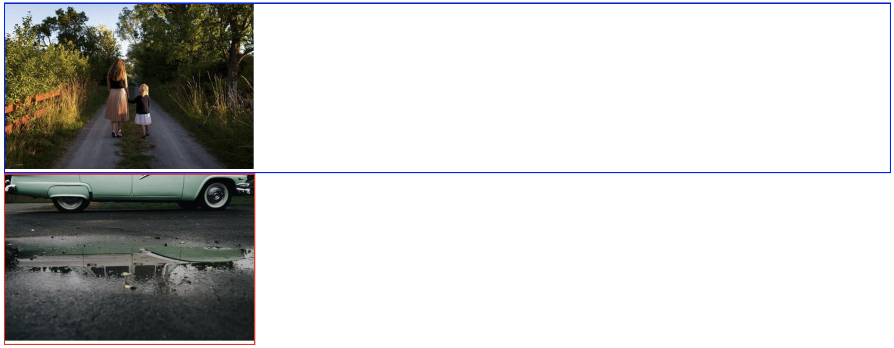
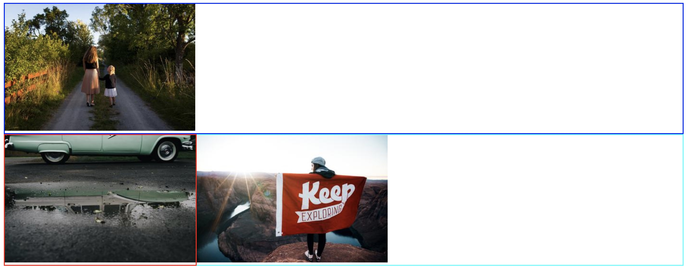
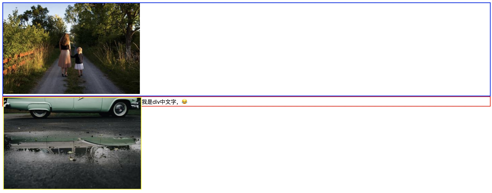
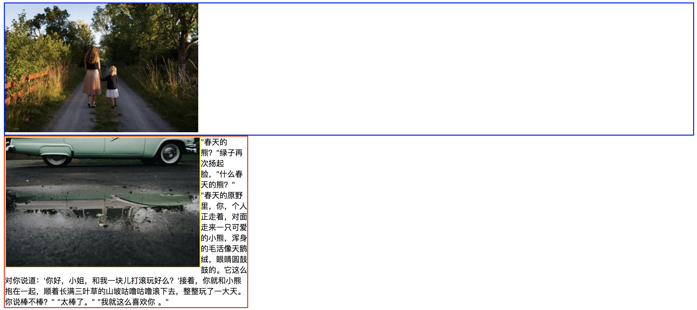
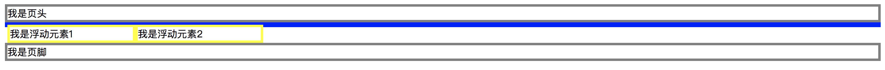
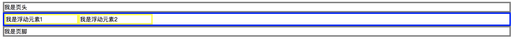

CSS中`float`是一个比较让人疑惑的属性，在平常的印象中，float大多数时候用来实现多列布局，还有float会莫名其妙的影响到他的邻居元素，以及作用于自身的`clear`。

### float的本意
CSS是相当灵活的语言，要想实现某个效果，可能有好多种方法，那么究竟应该使用哪一种呢，目前统一的判断标准，例如：重绘，回流，极简主义等等，在现在的代码中，存在大量的CSS使用违反了该CSS属性被创造时的本意，例如`text-align`属性用来规定元素中的文本的水平对齐方式，可是这个属性也被大量的应用在`inline`,'inline-block'元素相对于父元素的居中对齐上，虽然可以达到效果，可是这样真的好吗？我觉得遇到这种问题的时候，应该**根据该CSS被创造时的本意，该用哪个属性，就用哪个属性**。

那么float的本意是什么？**让文字像流水一样环绕浮动元素**。

怎样才能实现这种效果呢？用**包裹性**和**高度欺骗**

### 包裹性
先看一个简单的例子：
<div style="text-align:center;margin-top:20px" align="center">
  
</div>  

代码也非常简单：    
``` html
<div class='div1'>
    
</div>
<div class='div2'>
    
</div>
```     

``` css
.div1 {
    border: 2px solid blue
}

.div2 {
    border: 2px solid red;
    float: left;
}
```
上面的例子一目了然，block元素不指定width的话，默认是100%，一旦让该div浮动起来，立刻会像inline元素一样产生包裹性，宽度会跟随内容自适应(这也是通常float元素需要手动指定宽度的原因)。

如果我们在下面再添加一个div的话，看图：
<div style="text-align:center;margin-top:20px" align="center">
  
</div>  

``` html
<div class='div1'>
    
</div>
<div class='div2'>
    
</div>
<div class='div3'>
    
</div>
```    

``` css
.div1 {
    border: 2px solid blue
}

.div2 {
    border: 2px solid red;
    float: left;
}

.div3 {
    border: 2px solid aqua;
}
```
上面的这个例子，也是float所要做的事情的根本所在：让文字环绕图片，div3本身是占据了正常的文档流中的位置，但是div3中的img，却被上面的浮动元素div2挤到右边。
效果非常接近`display:inline-block`。但相比之下，浮动能设置为左浮动和右浮动，但是`display:inline-block`都是从左向右的，

### 高度欺骗
例1中浮动float被设在了外围div上，因此高度欺骗性没体现出来。现在给内层img元素设定float。
<div style="text-align:center;margin-top:20px" align="center">
  
</div>  
``` html
<div class='div1'>
    
</div>
<div class='div2'>
    
</div>
```

``` css
.div1 {
    border: 2px solid blue
}

.div2 {
    border: 2px solid red;
}

.img2 {
    float: left;
}
```
和例子1唯一的区别就是：将外层div的float移到内层img中。这下高度欺骗性体现出来了。例1中给外层div加上浮动，因此外层div会有包裹性，其内容是img图片，所以可以看到红色边框包裹着img。

例2中外层div没有了浮动，因此红色边框宽度默认是100%全屏。其内容img由于加上了float，使得该img具有了欺骗性。float给img施了个障眼法，让该img的inline-height高度塌陷为0了。这样外层div计算高度时，认为img的高度为0，相当于div的content的高度为0，因此红色边框看起来是一条直线。

但请注意障眼法毕竟是障眼法，并不是真的让img的高度塌陷为0了，可以看到上图中img的黄色边框还是有正常高度的。如果给div里加点文字，效果如下：
<div style="text-align:center;margin-top:20px" align="center">
  
</div>  
可以看到，外层div在没有手动设定height的前提下，其高度是由内部content的最大高度决定的，由于img的float使得img具有高度塌陷的欺骗性，让div误以为img的line-height为0，因此div的高度就是文字的匿名inline-box的inline-height。

因此浮动并不是让元素的高度塌陷了，而是让元素具有高度塌陷的欺骗性。骗谁？骗别人！但骗不了自己，元素自身还是有高度的（见上图的黄框）。

回过头再看看浮动float的本意：让文字像流水一样环绕图片。重要的事情多看几遍...给div设定一个width:200px，并加点文字吧：
<div style="text-align:center;margin-top:20px" align="center">
  
</div> 
这就是浮动元素的本意。该效果是很难被其他CSS属性等价地模拟的。

回过头看用float来水平布局。是好是坏呢？好处是上手简单，随便什么程度的CSSer都能搞定。坏处是有时需要定高难以自适应。而display:inline-block;属性可是根正苗红的水平布局的属性，可以用其替代float。让float尽量多的干其本职工作：**让文字像流水一般环绕浮动元素**。

### 清除浮动
这个相对比较简单了。用clear即可。稍微要注意的是，**clear是仅作用于当前元素**，例如元素A是浮动元素，靠左显示。元素B是block元素紧跟在A后面。此时要清除浮动，是在B上设clear:left。你在A上设clear:right是没有用的，因为A的右边没有浮动元素。

先明确一个概念，用clear确实能达到我们期望的清除浮动的效果，这点没异议。但深入点看，究竟是清除了什么样的浮动呢？
<div style="text-align:center;margin-top:20px" align="center">
  
</div> 
代码如下：

``` html
<div style="border:4px solid gray;clear:left;">我是页头</div>
<div style="border:4px solid blue;">
    <div style="width:200px;border:4px solid yellow;float:left;">
        我是浮动元素1
    </div>
    <div style="width:200px;border:4px solid yellow;float:left;">
        我是浮动元素2
    </div>
</div>
<div style="border:4px solid gray;clear:left;">我是页脚</div>
```
因为浮动元素的高度欺骗性，导致外层div失去了高度（蓝色边框成了一条线）。为了让页脚显示到浮动元素下面，对页脚应用了clear:left。这是常规做法，没有任何新奇之处。但是外层div的高度仍旧处于塌陷状态，我们脑海真真正期望的清除浮动后的样子难道不是下面这样吗？
<div style="text-align:center;margin-top:20px" align="center">
  
</div> 
让清除浮动后，原本被欺骗的外层div获得正确的高度！借用文首大神链接的说法，我们脑中期望的其实并不是上图的清除浮动，而是下图的 闭合浮动。

#### 添加子元素清除浮动
缺点是会增加一个无意义的DOM节点
``` html{8}
<div style="border:4px solid blue;">
    <div style="width:200px;border:4px solid yellow;float:left;">
        我是浮动元素1
    </div>
    <div style="width:200px;border:4px solid yellow;float:left;">
        我是浮动元素2
    </div>
    <div style="clear:both"></div>
</div>
<div style="border:4px solid gray;clear:left;">我是页脚</div>
```    
#### 添加清除浮动的br
缺点也是增加一个无用的DOM元素
``` html{8}
<div style="border:4px solid blue;">
    <div style="width:200px;border:4px solid yellow;float:left;">
        我是浮动元素1
    </div>
    <div style="width:200px;border:4px solid yellow;float:left;">
        我是浮动元素2
    </div>
    <br clear=”all” />
</div>
<div style="border:4px solid gray;clear:left;">我是页脚</div>
```
#### 父元素设置 overflow:hidden或者auto
通过出发BFC来清除浮动
``` html{1}
<div style="border:4px solid blue;overflow:hidden">
    <div style="width:200px;border:4px solid yellow;float:left;">
        我是浮动元素1
    </div>
    <div style="width:200px;border:4px solid yellow;float:left;">
        我是浮动元素2
    </div>
</div>
<div style="border:4px solid gray;">我是页脚</div>
```
#### 父元素添加float:left
父元素也设成float。这样确实实现了闭合浮动，但页脚将上移，所以页脚仍旧需要clear:left
``` html{1,9}
<div style="border:4px solid blue;float:left">
    <div style="width:200px;border:4px solid yellow;float:left;">
        我是浮动元素1
    </div>
    <div style="width:200px;border:4px solid yellow;float:left;">
        我是浮动元素2
    </div>
</div>
<div style="border:4px solid gray;clear:left">我是页脚</div>
```
#### 父元素设置display:table
缺点是子元素的盒子模型被改变
``` html{1}
<div style="border:4px solid blue;display:table">
    <div style="width:200px;border:4px solid yellow;float:left;">
        我是浮动元素1
    </div>
    <div style="width:200px;border:4px solid yellow;float:left;">
        我是浮动元素2
    </div>
</div>
<div style="border:4px solid gray;">我是页脚</div>
```
#### 父元素使用:after伪类
本质上和第一种方法没有区别
``` html{1}
<div style="border:4px solid blue;" class='clearFloat'>
    <div style="width:200px;border:4px solid yellow;float:left;">
        我是浮动元素1
    </div>
    <div style="width:200px;border:4px solid yellow;float:left;">
        我是浮动元素2
    </div>
</div>
<div style="border:4px solid gray;">我是页脚</div>
```

``` css
.clearFloat:after {
    clear: both;
    content: ".";
    display: block;
    height: 0;
    visibility: hidden;
}
```