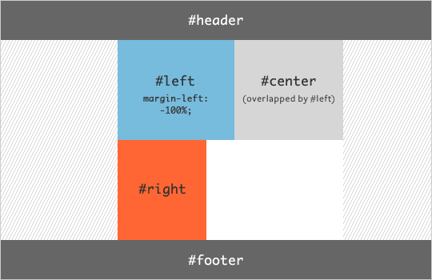
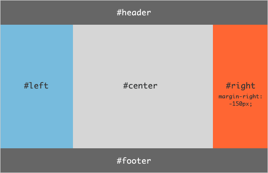

圣杯布局算是一个"古老"的话题了，关于其来源网上资料众多，在此不多做表述。
下面看一下实现的过程，先看HTML结构：
``` html
<header class='header'>header</header>
<main class='main'>
    <div class='content'>content</div>
    <div class='left'>left</div>
    <div class='right'>right</div>
</main>
<footer class='footer'>footer</footer>
```
下面来一步一步的实现圣杯布局的样式：
* 首先实现`header`,`main`,`footer`的上中下三大块的布局
``` css
.header {
        height: 100px;
        background: rebeccapurple;
    }
    .footer {
        height: 100px;
        background: hotpink;
    }
    .main {
        padding: 0 200px 0 150px;
    }
```
我们将main的内边距设置为左右两边各自的宽度。它看起来就像这样：


* 有了基本的大结构，现在可以把中间部分的三列加进去，并将它们设置为`float:left`
``` css
.content {
        width: 100%;
        background: yellowgreen;
        float:left;
    }
    .left {
        width: 200px;
        background-color: aquamarine;
        height: 200px;
        float:left;
    }
    .right {
        width: 150px;
        background-color: aquamarine;
        height: 400px;
        float:left;
    }
    .footer {
        height: 100px;
        background: hotpink;
        clear: both;
    }
```
由于`content`占据了100%的宽度，所以left和right只能放在下一排了，同时footer要清除浮动的影响


* 把左侧栏放上去
中间栏已经就位，剩下的事情就是把左右两栏放上去了，接下来我们先放左侧栏。
为了详述过程，这里将分为两个小步骤。首先，我们先将它的外边距设置为 -100%，这样一来，由于浮动的关系，左侧栏就能上位，与中间栏交叠在一起，并占据了左边。而右侧栏由于左侧栏的上位，自动向前浮动到了原来左侧栏的位置。

接着我们要用到相对定位属性（relative），并设置一个与左侧栏等宽的偏移量：
``` css
.left {
    width: 100px;
    background-color: aquamarine;
    height: 200px;
    float: left;
    margin-left: -100%;
    position: relative;
    left: -200px;
}
```


可以看到，它设置的`left`属性就是相对于`main`的左边线向左偏移200px，如此一来，它就完美地跑到了`main`左内边距的位置，也就是我们希望它呆的地方，如下图所示：


* 把右边栏放上去
最后，我们需要把右侧栏放上去，此时只需利用上面的原理把他放到`main`的右外边距的位置即可，我们需要再一次设置一个负外边距的值，它等于右侧栏的宽度,然后使用相对定位，把右边栏向右挪动本身宽度的距离
``` css
.right {
        width: 150px;
        background-color: aquamarine;
        height: 400px;
        float: left;
        margin-left: -150px;
        position: relative;
        right: -150px;
    }
```



### 疑惑
上面的第三步，把左侧栏放上去这一过程，有很多人有疑惑，为什么设置`margin-left : -100%`,就可以让左侧部分上去呢？

现在我们知道这三个盒子全都脱离了文档流，那么让元素"爬升"至上一行，需要用到负margin，这个负margin是多少呢？这又要看他的上一行中还留下多长的"空白"，这个"空白"是用来放待上位元素减去负margin值（多说一句，当然减的是绝对值）的那一部分。因此用待上位元素的宽度（包括padding）减去这个"空白"的宽度，即为负margin的值。下面画两张图理解：


设置 margin-left : -34px后效果：（两张图貌似大小不对等，我标注时没量，请脑补一下上图空白处166px与下图的166px大小一样就是了）


margin-left负值可以把元素向左拉动，并且不占用原来的位置，而浮动元素只有当一行放不下的时候，才会把元素"挤"入下一行，那么上面的例子，设置`margin-left: -34px`之后,可以把元素绿色元素向左拉动'34px'，这一行的宽度将会刚刚好能放下两个元素。这个时候绿色元素正好实现了上位。

#### 那么在此布局中，让left盒子"爬升"：

* a. 首先，我们发现left的上一行没有给它留一丁点"空白"，即"空白"=0，按照上面解释的，left宽度减去"空白"宽，那么left向左移动200px它就"上位"成功了
``` css
/* 此非圣杯布局中的css，仅作解释说明用 */
.left{
        margin-left: -200px;
    }
```
现在的效果：


left"上位"成功了！不过排在`main`的末端，我们要让它到最左侧。如果你以前不清楚如何进行圣杯布局，到这里可能会有点蒙圈，这移动到左边的距离可咋算？那么咱们进行下一步:

* b. 我们先让left盒子移动到父容器`main`的左侧，即上图中m与n重合。假设`main`宽度为x，left还需左移（x-200）px,还记得left怎么上的位么？设置`margin-left:-200px`！考验小学数学功底的时间到了

问：left上位所必需的的200px占`main`宽度（去padding）的百分比是多少？
答： 200/x

问：据上图看，left上位后mn重合所移动距离占`main`宽度（去padding）的百分比是多少？
答：(x-200)/x

问： left完成上位过程所移动的距离占`main`宽度（去padding）的百分比是多少？
答： (200/x) + (x-200)/x = 100%

问：`main`是不是left的父元素？
答：是

到这里，你的小学老师表示很欣慰=_=
这里还牵扯到一个基础知识，`margin-left`设置百分比是相对于父元素宽度的，这个宽度是不包括padding在内的。
综上，用margin-left完成left"上位"，只需设置

.left{
    margin-left: -100%
}
到这里，有疑惑的同学就该明白这-100%到底怎么回事了吧！