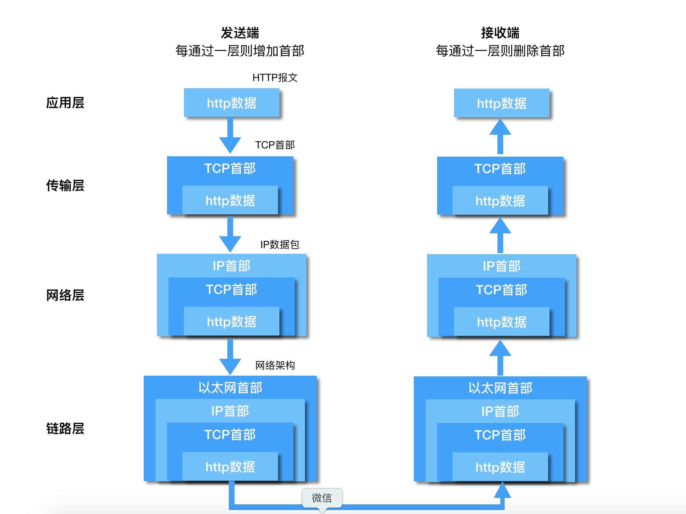

工作了这么长的时间，每天都在写大量的业务代码，对有些基础知识有所忘却，尤其是http协议部分，读书的时候就学了理论知识，却没有自己去验证过，到现在连理论部分都有所忘却了，现在重新捡起书本和拿起工作已经掌握的技能从新认识一下http协议。

### 网络基础
#### TCP/IP分层
TCP/IP体系一般分为五层，从上到下分别为应用层、传输层、网络层、数据链路层、物理层，不过按照协议来划分的话，物理层没有必要划分出来，因为物理层不存在任何协议，所以有的书也认为TCP/IP应该划分为四层，即把数据链路层和物理层合并为网络接口层，这两种分法都是正确的，只是角度不同，没必要纠结。    

|  |  |  
| - | - |  
| 应用层 | http,ftp,dns等协议就位于该层上，用于向用户提供应用服务 |       
| 传输层 | 最主要的就是TCP和UDP协议，为应用层实体提供端到端的通信功能 |      
| 网络层 | 核心为IP协议，规定了通过什么样子的路径到达对象计算机，并把数据包传递给对方，ARP、RARP协议也位于该层。|   
| 网络接口层 |负责接收IP数据包并通过网络发送，或者从网上上接收物理帧，抽出IP数据包，交给网络层 |     

#### TCP/IP通信传输流

利用TCP/IP协议族进行通信的时候，会分层于对方通信。发送端从应用层往下走，每经过一层就会打上一个与该层对应的首部信息，反之，接收端在层与层的传输数据的时候，每经过一层会把对应的首部信息剔除。

#### TCP/IP协议的三次握手
`TCP/IP`协议位于传输层，其作用就是提供可靠的字节流服务。为了可以准确无误的将数据送达到目标处，`TCP`协议采用三次握手的策略来保证其可靠性。其整体流程如下：

客户端首先会发起一个带SYN标志的数据包给服务端，表示客户端向服务端发起连接请求，服务端收到之后，回传一个ACK(表示准许这个连接)和SYN(表示服务端向客户端发连接请求)，客户端收到之后，传递ACK(表示准许这次连接)给服务端。


>从上面建立连接的过程，我们可以看到TCP/IP连接是一个全双工通信，并没有明确的客户端和服务端，客户端可以做服务端，服务端也可以做客户端，我们这里这样说，只是为了更好理解。


#### TCP/IP协议的四次挥手
上面建立连接的过程，我们可以清楚的看到是客户端向服务端，发起了连接请求，并且连接成功，并且服务端也向客户端发起了连接请求，并连接成功。

那么在断开连接的时候，同样需要客户端向服务端发起断开连接的请求，服务端表示断开成功，然后服务端也要向客户端发起断开连接的请求，然后客户端响应断开成功。

这也就解释了为什么断开连接需要四次挥手，因为断开也是双向的，需要总共两个来回。

* 第一次分手：客户端发送`FIN`报文段给服务端，表示请求断开连接，客户端进入`FIN_WAIT_1`状态，表示没有后续的数据需要发送给服务端了，并且等待服务端断开连接。
* 第二次分手：服务端收到客户端的`FIN`报文段之后，向客户端发送一个`ACK`报文段,同意客户端断开连接，服务器进入`CLOSE_WAIT`状态，客户端在收到服务端的`ACK`报文之后，客户端关闭向服务端传输数据的连接，客户端进入`FIN_WAIT_2`状态。
* 第三次分手：服务端发送`FIN`报文段给客户端，请求断开服务端向客户端的连接，服务端进入`LAST_ACK`的状态，等待客户端的确认。
* 第四次分手：客户端收到服务端的`FIN`报文段之后，回传一个`ACK`报文段给服务端，同意断开连接。客户端进入`TIME_WAIT`的状态，服务端接收到来自客户端的`ACK`报文之后，关闭服务端向客户端的连接，服务端进入`CLOSED`状态，客户端在登台两个`MSL`时间之后，自动进入`CLOSED`状态。

#### URI和URL的区别
URI叫统一资源标示符号，URL叫统一资源定位符;

URI就是通过某种规则把某个资源独一无二的标识出来，举个例子就是在中国，车牌号就是一种URI,通过车牌号我们就可以确定并且唯一的某辆车。
URL是指通过某种地址来标识一辆车，举例来说就是个人拥有有私人车位，那么我只要确定了车位具体的位置(`浙江省杭州市滨江区风雅钱塘地下一层1203`)，那么这个位置确定来下之后，那么这辆车也就可以确定。
 
所以不管是使用URL还是使用URI都可以用来确定某辆车，都是URI的一种实现方式，而URL的特别之处在于是使用地址来定位URI的，那么实现URI的方式却绝不止URL一种，但是大都不是很流行，所以导致现在看到的URI大部分是URL,仅此而已。

### HTTP协议
#### HTTP请求方法
| 名称 | 描述 | 最低支持版本 |   
| - | - | - |
| GET  | 请求服务器上的某一资源 | 1.0 |   
| POST | 向指定资源提交数据进行处理请求,数据包含在请求体中 | 1.0 |    
| HEAD | 用于确认URI的有效性及资源更新的日期时间，不返回报文主体，只返回报文文首部| 1.0 |   
| PUT  | 向用来传输文件，将文件内容放进报文主体中，保存到URI指定位置上 | 1.1 |    
| DELETE | 与PUT相反，请求URI删除指定资源 | 1.1 |   
| OPTIONS | 查询针对请求URI指定的资源支持的方法 | 1.0 |   
| TRACE | 用于追踪路径。发送请求时，首部字段Max-Forwards会指定一个数值，每经过一个服务器之后，该数值减1。当该数值为0时，停止传输，最后接收到的服务器响应 | 1.0 |   
| CONNECT | 用于在与代理服务器通信时建立隧道，实现用隧道协议进行TCP通信 | 1.0 |   

#### HTTP协议1.1
**持久连接**  
在1.0版本中，每进行一次HTTP通信就要断开一次TCP连接。TCP连接的新建成本很高，频繁地打开关闭会极大地增加开销，影响性能。于是在1.1版本中引入持久连接的方法。其特点就是任意一端没有明确提出断开连接，则保持TCP连接的状态。  

**管道机制**  
在1.1版本之前，在一个TCP连接中，客户端发送一个请求之后，必须等待服务器响应之后才能发送下一个请求，不能同时并行发送多个请求。1.1版本的管道机制解决这个问题，客户端不必等待服务端响应之后再发送请求了，可以并行发送多个请求。

**增加HOST字段**   
1.0版本中，认为每台物理服务器对应唯一的IP地址。所以，在1.0版本中是没有主机名这个概念的。但随着Web技术的发展，一台物理服务器可以存在多个虚拟主机，他们共享同一个IP地址。为了解决这个问题，HOST字段应运而生。

**分块传输编码**   
在1.1版本中，在一个TCP连接中存在多个响应。如何区分数据包对应哪个响应就成了问题。在1.1版本中就出现Content-Length这个字段，标记本次响应的数据长度。

在使用Content-Length的前提条件就是得知道整个数据长度才行。因此，产生出一个数据块的时候是不能立即传输给客户端，得等所有数据产生完毕才能发送。这中间的等待时间势必会影响性能。为解决这个弊端，1.1版本中提出了“分块传输编码”的解决方案，在响应头会有一个Transfer-Encoding这个字段，告诉客户端这次响应是由数量未定的数据块组成，每一个非空数据块都有一个16进制的数值来标记其长度。最后以长度为0的数据块来表示这次响应的数据发送完毕。

**状态码100**   
随着Web应用的复杂度不断增加，往往服务端会加入权限控制。如果客户端发送一个HTTP请求，请求体重带着大量数据过来，结果服务端因为其没有权限给它打回了。那么这就造成无谓的开销。100状态码引入之后，客户端事先发送一个带部分请求体的HTTP请求，如果服务端的响应码为100，客户端会带上剩余的请求体再次发送HTTP请求。反之，则取消后续的带有剩下的请求体的HTTP请求。

#### HTTP协议2.0
**二进制分帧**   
在HTTP协议2.0中，应用层和传输层之间会多一个二进制分帧层。在二进制分帧层上，HTTP 2.0 会将所有传输的信息分割为更小的帧,并对它们采用二进制格式的编码 。之前HTTP1.x版本中的HTTP报文首部信息会被封装到Headers帧，而我们的HTTP报文主体则封装到Data帧里面。原先我们是以HTTP报文为单位传输的，现在HTTP报文被拆成了多个帧的形式，并且这些帧可以乱序发送，我们只需根据每个帧首部的流标识符就可以重新完成组装。这样极大提升了HTTP的性能。

**多路复用**   
多路复用允许同时通过单一的`TCP连接`连接发起多重的请求-响应消息。在`HTTP/1.1协议`中 客户端在同一时间，针对同一域名下的请求有一定数量限制。超过限制数目的请求会被阻塞。针对这一个情况，2.0中采用了多路复用的机制，通过单一的 HTTP/2 连接可以发起多重的请求-响应报文，这样就不用依赖多个TCP连接了。

**首部压缩**   
每次HTTP请求都会有一个请求首部，这个首部放到一些重要信息，比如Cookie、User Agent之类的字段，这些字段每次请求都是一样的，但还必须要带上。这就造成了一些不必要的浪费。2.0中就优化这一点，引入首部压缩机制，客户端和服务端会维护同样一张首部信息表，每次请求只要发送索引号就可以了，不必带上请求首部上冗余的key-value，极大地减少了不必要的浪费。

**服务端推送**   
在2.0之前的版本中，服务端是属于被动一方，只有客户端发送请求，服务端才能发送资源。2.0协议中，服务端可以主动地向客户端发送资源。例如：客户端请求一个html，里面所需要的js和css完全不需要客户端解析完html之后再去请求这些内容那么麻烦，服务端可以在客户端请求html的时候一起回传过来。

**使用Cookie做状态管理**    
HTTP是一种无状态协议，就是它不会对之前发生过的请求和响应做做任何记录和管理，换句话说就是无法根据之前的状态来处理本次的请求，例如我们需要访问一个需要登录验证的网页，如果登录之后没有对登录状态做任何管理的话，那么每次打开一个新网页都需要重新登录一下，毫无疑问，这个体验非常差，这个时候Cookie技术应运而生。

**第一次打开网页**：客户端发送一个请求给服务端，服务端验证之后，将登录信息存储在Cookie中，并将其返回给客户端，客户端拿到Cookie存储在本地。

**第二次发开网页**：客户端再次请求的时候会把之前存储在本地的Cookie，添加到`Headers`中发送给服务器，服务器根据Cookie信息来验证是否已经登录，是，则直接处理请求，否，则跳转到登陆页。

Cookie在浏览器中只是个字符串的存在，可以使用`document.cookie`来获取，不过如果Cookie是`HTTPOnly`的，前端是无法获取到，更无法更改。

### HTTP报文
#### HTTP报文结构
用于HTTP协议传输的信息被称为HTTP报文，客户端的HTTP报文被称为请求报文，服务端回传的叫做响应报文。

HTTP报文本身是一个多行字符串组成的数据。

HTTP报文大致可分为`请求行/响应行`、`报文首部`和`报文主体`两块。

请求报文的`请求行`主要有三部分组成：请求方法，URI地址，HTTP协议版本号，我们可以在chrome浏览器dev tools 找到一个http请求，然后在`Request Headers`点击 `view source`,可以看到关于请求报文的详细信息：
``` 
GET /example.do HTTP/1.1
```
响应报文的`响应行`主要有三个部分组成：HTTP协议版本号，响应状态码，状态码简述，在chrome中打开方法和请求报文打开的方法类似。
```
HTTP/1.1 200 OK
```
##### 常见HTTP状态码
状态码的职责是当客户端向服务端发送请求的时候，描述返回的请求结果。借助状态码，用户可以快速知道服务器是正常处理了请求，还是出现了错误，常见的HTTP状态码如下：
* 1XX
    * 100  Continue (继续)
    客户端应当继续发送请求，这个临时响应是用来通知客户端，已发送的部分请求已经接收到，并且期望客户端继续发送请求。如果请求已经完成，则忽略这个响应。服务器必须在请求完成后向客户端发送一个最终响应。
    * 101 Switching Protocols (切换协议)
    服务器收到了客户端的请求，并通过Upgrade消息头来通知客户端将切换其他为其他的协议来完成这个请求。
* 2XX
    * 200 OK (成功)
    表示从客户端发来的请求已经被服务端正常处理了
    * 204 No Content (无内容)
    服务器成功处理了请求，但是返回的响应报文不包含任何实体内容。
    * 206 Partial Content (部分内容)
    客户端进行了范围请求，而服务器成功执行了这部分的GET请求。响应报文中包含有`Content-Range`指定范围的实体内容。
* 3XX
    * 301 Moved Permanently (永久重定向)
    表示请求的资源已被永久分配了新的URI,以后应使用资源现在所指的URI。响应报文的`Headers` 会使用`location`字段来标记新的URI。
    * 302 Found (临时重定向)
    请求的资源被临时分配了新的URI。由于这样的重定向是临时的，客户端应该继续向原有地址发送请求。同样，在响应报文的`Headers` 会使用`location`字段来标记新的URI。
    * 303 See Other (查看其他位置)
    该状态码表示对应当前请求的响应可以在另一个URI上被找到，而且客户端应当采用GET的方式访问那个资源。这里需要注意到的一点就是，303明确说明需要用GET方法获取。跟上面一样，在响应报文的首部字段location中也会标记本次被分配到的新的URI。
    * 304 Not Modified (未修改)
    该状态码表示所请求的资源未修改，服务器返回此状态码时，不会返回任何资源。客户端通常会缓存访问过的资源，通过提供一个头信息指出客户端希望只返回再置顶日期之后修改的资源。
    * 307 Teoporary Redirect (临时重定向)
    跟302 Found的含义是一样的。为什么会有307呢?因为标准禁止POST变成GET,在浏览器中一直都有，实践在先，规范在后，就会出现这种奇葩的问题，但是307会严格遵守标准，不会把POST改成GET。再POST的重定向中非常有用。
* 4XX
    * 400 Bad Request (错误请求)
    该状态码表示包含语法错误，服务器无法理解。再开发过程中400的错误大多数的情况，都是前端传递的数据不符合后端的要求而导致的，一般前后端的同学分别检查一下自己的参数就可以解决。
    * 401 Unauthorized (未授权)
    该状态码表示当前请求需要用户验证。该响应必须包含一个适用于被请求资源的WWW-Authenticate信息头用以询问用户信息。
    * 403 Forbidden (已禁止)
    该状态码表示对请求资源的访问被服务器拒绝了。这种在爬虫过程中最常见，对方发现你正在爬他们网站的数据，然后对你的IP进行限制，就会造成403.
    * 404 Not Found (未找到)
    该状态码表示服务器上没有找到请求的资源，有可能是前端请求的URI打错了，或者网站后端挂了，等等都会造成。
    * 405 Method Not Allowed (方法禁用)
    该状态码表示请求行中指定的请求类型不被支持。该响应报文必须返回一个Allow头信息用以表示出当前资源能够接受的请求方法的列表。
* 5XX
    * 500 Internal Server Error (服务器内部错误)
    该状态码表示服务器在执行请求时发生了错误，可以是代码存在bug或者某些临时性的故障。
    * 503 Service Unavailable (服务不可用)
    该状态码表示服务器暂时处于超负载或正在进行停机维护，现在无法处理请求。

**HTTP首部**  

HTTP报文的首部，可以分为请求首部(请求头)和响应首部(响应头)。其中，请求首部可拆分为请求首部字段、通用首部字段、实体首部字段、其他拓展首部字段，而响应首部可拆分成响应首部字段、通用首部字段、实体首部字段、其他拓展首部字段。由上我们可以得出：

>报文首部=请求首部字段/响应首部字段+通用首部字段+实体首部字段+其他拓展首部字段

**请求首部字段**   
* Accept
该字段用于指定客户端接受哪些类型的信息。
``` 
Accept:application/json, text/plain, */*
```
* Accept-Charset
用于定义客户端接受的字符集，q表示权重用;隔开
```
Accept-Charset:iso-8859-1,unicode-1-1;q=0.5
```
* Accept-Encoding
指定客户端可接受的内容编码
```
Accept-encoding:gzip, deflate;q=0.2, br
```
* Accept-Language
指定客户端可接受的自然语言集(常见，英文，中文，日文)
```
Accept-Language:zh-CN,zh;q=0.9,en;q=0.8,zh-TW;q=0.7
```
* Host
指明了服务器的域名(用于区分虚拟主机)，以及服务器监听的TCP端口号。端口号是可选的，如果未指定端口，则使用背请求服务器的默认端口号。
```
Host: google.com.hk 
```

**响应首部字段**    
* Age
当缓存服务器用自己缓存的资源去响应请求时，用该头部标识该资源在缓存服务器缓存的时长，单位为秒。
``` js
Age:600
```
* ETag
服务器分配给每份资源的唯一标识符，当资源更新的时候，ETag也会更新，ETag分为强ETag和弱ETag。
``` js
Etag:"5E11B3FC376FC9C90A9A445C5F6ACF98"   // 无论实体发生多么细微的变化都会改变其值。
ETag: W/"0815"   // 只有资源发生了根本改变，产生差异时才改变ETag值。字段值最开始处附加W/ 
```
* Location
指定需要将页面重定向至新的地址，一般在响应码为3XX的时候才有意义
``` js
Location:http://www.baidu.com
```

**通用首部字段**    
* Cache-Control
指定指令，用于控制缓存行为。指令可以多选，中间用”,“分割。
``` js
Cache-Control: no-cache, no-store, must-revalidate
```
**缓存 请求指令**   

| 指令 | 参数 | 说明 |  
| - | - | - |   
| no-cache  | 无 | 强制向源服务器再次验证 |   
| no-store | 无 | 不缓存请求或响应的任何内容 |    
| only-if-cached | 无 | 从缓存获取资源 |   
| max-age=<seconds>  | 必需 | 响应最大Age值 |    
| min-fresh | 必需 | 期望在指定时间内的响应仍有效 |   

**缓存 响应指令**   

| 指令 | 参数 | 说明 |  
| - | - | - |  
| no-cache  | 无 | 缓存前必须先确认其有效性 |   
| no-store | 无 | 不缓存请求或响应的任何内容 |    
| public | 无 | 响应可以被任何对象（包括：发送请求的客户端，代理服务器，等等）缓存 |   
| private  | 无 | 响应只能被特定该用户缓存，不能作为其他用户的缓存 |    
| max-age=<seconds> | 必需 | 响应最大Age值 | 
| must-revalidate | 无 | 可缓存但必须再向源服务器进行确认 |   

* Connection
 决定当前的事务完成后，是否会关闭网络连接。Http协议1.1之后默认都是keep-alive（持久连接），1.0则是close（非持久连接）。

**实体首部字段**    
* Allow
告诉客户端资源所支持的HTTP方法。
``` js
Allow:GET,POST,HEAD
```
* Content-Encodeing
告知客户端服务器对实体主体部分选用的内容编码格式
``` js
Content-Encodeing:gzip
```
* Content-Lanuage
告知客户端，实体主体使用的自然语言
``` js
Content-Lanuage:zh-CN,en
```
* Content-Length
表明实体部分的大小，单位是字节
``` js
Content-Length:1000
```
* Content-Location
表示返回的数据对象的URI,主要用于指定要访问的资源经过内容协商后的结果的URI
``` js
Content-Location:http://www.baidu.com
```
* Content-Range
主要用于范围请求，告诉客户端当前发送部分的内容范围以及整个实体大小。
``` js
Content-Range:bytes 200-1000/5674
```
* Content-Type
表明实体主体内对象的媒体类型
``` js
Content-Type:text/html;charset=utf-8
```
* Expires
资源的失效日期。缓存服务器在接收到含有Expires首部字段的响应后，会在Expires指定时间之前，响应的副本会一直被保存。反之，缓存服务器会向源服务器请求资源。但是当Cache-Control有指定max-age或者s-maxage指令时，Expires则会被忽略。
``` js
Expires: Thu, 01 Dec 2018 13:00:00 GMT
```
* Last-Modified
表明资源最终的修改时间
``` js
Last-Modified: Wed, 21 Oct 2015 07:28:00 GMT
```
* Set-Cookie
用来由服务器向客户端发送cookie
``` js
Set-Cookie: id=a3fWa;Domain=somecompany.co.uk; Path=/ Expires=Wed, 21 Oct 2015 07:28:00 GMT; Secure; HttpOnly
```
Domain:指定Cookie可以发送的主机名
Path:限定可以发送Cookie的路径
Expires:指定Cookie的有效期
Max-Ages:多少秒之后cookie失效，优先级高于Expires
HttpOnly:前端JS无法获取或者操作该cookie
Secure:仅在https安全通信的时候才会发送cookie
* Cookie
含有先前由服务器通过Set-Cookie首部投放并存储到客户端的Cookie。
``` js
cookie:PHPSESSID=web2~b20cab71412082a123d813e929bfea0c; _ga=GA1.2.1761868222.1519782823; _gid=GA1.2.498891564.1519782823; afpCT=1; Hm_lvt_e23800c454aa573c0ccb16b52665ac26=1519812353,1519824670,1519884945,1519884983; _gat=1; Hm_lpvt_e23800c454aa573c0ccb16b52665ac26=1519886759
```

### HTTPS
HTTPS是什么呢，说一句大白话就是HTTPS是HTTP的安全版，在HTTP层面上加入了安全控制，那么HTTP有哪些缺点呢？
#### HTTP缺点
**使用明文通信可能会被窃听**         
由于HTTP本身不具备加密的功能，所以HTTP报文都是以明文的方式发送的。而整个互联网的那些设备都不可能是你一个人的，这就不能排除某个环节中遭到恶意窥探行为。即使你人为的在发送之前采用对称价目算法加密了，且不说影响效，率接收方每次都要解密一下。这样真的安全吗？很明显不是的！因为接收方想要解密密文，首先要知道是什么方式加密的或者密钥是什么，这个是需要发送方传给接收方的，而这个过程，很明显依旧有被窃听的可能。

**不验证通信方的身份就有可能遭遇伪装**     
HTTP协议是不会对通信方进行确认的。无论谁发送过来的请求都会回应响应。这就可能存在伪装的客户端，发送海量无意义的请求，超出服务器的负荷，导致服务器宕机，而这个就是`DOS攻击`

**无法证明报文完整性，可能已遭篡改**    
前面我们说到互联网上网络设备由于不属于你个人的，很难保证他人会不会劫取你的信息并进行篡改。导致服务器传送给客户端的文件和客户端实际接收到的文件不能保证一致。

#### HTTP+加密+认证+完整性保护=HTTPS
HTTPS并非应用层的一种新协议。只是HTTP通信接口部分用SSL或者TLS协议代替而已。原先HTTP协议直接和TCP协议对接，而HTTPS则是HTTP先与SSL/TLS通信,再由SSL/TLS和TCP通信。     
**加密**    
HTTP是采用明文传输的，那么你的信息很有可能被篡改，即便采用了对称加密算法，但是发送密钥的过程也有可能会被窃听。那么如果我们能够保证密钥传输的安全，那么整个通信过程便不怕被窃听到。HTTPS采用非对称加密的方式，用公钥去加密，用私钥去解密。服务器把公钥交给客户端去加密通信密钥，然后用自己的私钥去解密就可以过去到通信密钥。常见的非对称加密算法是RSA。

非对称加密算法看上去是个好东西，服务器和客户端的所有的通信报文全部采用非对称加密算法不就万事大吉了，干嘛还要使用非对称加密和对称加密的组合。HTTPS这样设计是有其原因的，其一，非对称加密看上去非常完美，但是其对CPU和内存的开销比较大，会在一定程度上影响性能；其二：非对称加密算法有一个致命的缺点就是加密内容的长度不得超过公钥的长度，常用的公钥的长度是2048位，也就是256个字节。现在随随便便一个响应报文的长度都超过了这个大小，很明显这个时候不能使用非对称加密算法。

**认证**    
在HTTP的过程中，传输的报文是可以被截取到的，所以在发送公钥的过程中很难保证其不被掉包。为了保证密钥的合法性，HTTPS采用了数字证书这个概念。

**完整性保护**    
有了加密和认证可以保证我们通信报文不会被他人看到，但是我们的报文有可能被他们截取到并篡改的。HTTPS使用了MAC算法来保证其完整性，发送方发送报文会带有一个由MAC算法得出的一个MAC值，接受方会根据密钥和MAC算法再计算出一个MAC值，与传过来的MAC值进行对比，如果一致则没有遭到篡改。

#### HTTPS相比较HTTP的缺点
* **速度慢**
原本HTTP直接和TCP进行通信，现在中间出现了一个第三者SSL/TLS，势必会造成处理的通信次数变多，连接过程更复杂，拖累速度。

* **CPU及内存资源消耗大**
频繁的加密解密，毫无疑问就需要更多的CPU和内存等资源的支持，导致负载增强。

* **要钱**
要进行HTTPS通信，数字证书是必不可少的，这个需要向认证机构购买，会增加运营成本，但是为了安全还是有必要的。