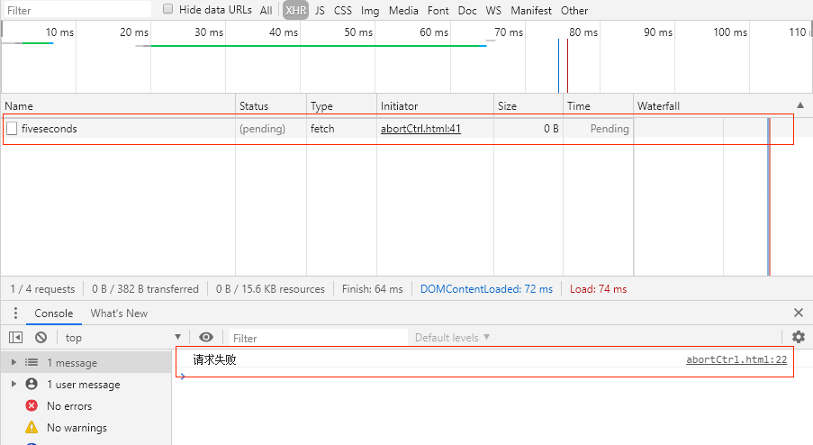
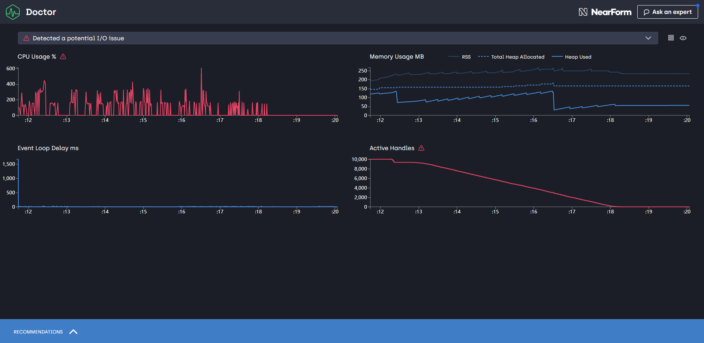
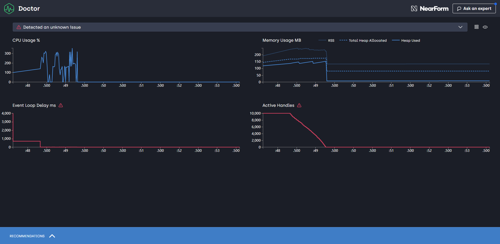

### 应用场景
现在前端主流的技术方案都是[服务端渲染](https://www.freecodecamp.org/news/what-exactly-is-client-side-rendering-and-hows-it-different-from-server-side-rendering-bd5c786b340d/)，那就面临着一个问题，Node.js需要承担接口转发的任务，所以原来的[客户端渲染](https://www.freecodecamp.org/news/what-exactly-is-client-side-rendering-and-hows-it-different-from-server-side-rendering-bd5c786b340d/)的`http`请求的路线(brower -> server),需要调整为(Node.js -> server);看上去没有什么本质的区别，无非是原来是又浏览器发起请求，现在改为Node.js发起请求。

但是高并发呢？举个例子，假如有1000000个请求，原来从browser请求到server,server端如果没有做限流处理，那么部分请求就会一直处于`pendding`状态；但是1000000个`pendding`是分布在每个客户端上的，所以并没有什么压力；但是如果是Node.js发起的请求，则会出现很大一部分请求在Node.js端处于`pendding`状态，则会导致Node.js的CPU和内存占用压力剧增。

### Promise timeout方案
前端`http`请求的代码一般会添加一个`timeout`的时间限制，配合`Promise.race`大概的代码思路是：
``` js
function timeout() {
    const ms = 2000;
    return new Promise((resolve, reject) => {
        setTimeout(() => {
            reject({
                code: 999,
                msg: ` 调用接口超时: >${ms}ms`,
            });
        }, ms);
    });
}

Promise.race([fetch(url, option), timeout()])
    .then(
        res => res.json(),
        err => {
            console.log('请求失败')
            return Promise.reject({
                code: 0,
                msg: '加载失败',
            });
        }
    )
```
上面的代码很简单，借助`Promise.race`,如果期望的fetch请求在2000ms内没有返回，则timeout中的`promise`会进入`rejected`状态，导致整个promise reject,相当于正常的fetch请求我们不会继续处理，直接抛弃了。

但是事实如此吗？这个被我们抛弃的Promise实际上依然处于`pendding`状态，直到http请求结束，promise进入`resolve or reject`状态，下图可见，错误日志已经打印出来了，但是http依然处于`pendding`的状态；可见`Promise.race`并不能真正的"抛弃请求"。内存占用，cpu占用依然存在。



上面的例子是发生在browser,问题不大，因为通常一个页面请求不会超过10个，对于单个用户机器来说，性能完全没有什么问题。

**但是如果上述事件是发生在Node.js请求server的过程中呢？大量的请求堆积在Node.js端，导致机器cpu或者内存占满，别忘了我们是服务端渲染，这个时候，用户打开页面将会异常缓慢(肯本没有机会继续处理页面渲染了)，或者长时间的等待之后502**。

> 上面的例子是在云音乐项目中实际案例。

所以我们需要找到另外一种解决方案(能真正取消fetch请求的方案)，此时`[AbortController](https://developer.mozilla.org/en-US/docs/Web/API/AbortController)`映入眼帘。

### AbortController使用方法
使用方法很简单，直接看文档。
[MDN文档](https://developer.mozilla.org/en-US/docs/Web/API/AbortController)     
[Google Developers: abortable-fetch](https://developers.google.com/web/updates/2017/09/abortable-fetch)

现在我们已经确定`AbortController`可以真正的取消请求，但是对性能的影响呢？下面我们做个实验：

### 使用AbortController取消 Node.js -> java server的请求

#### 测试代码：
``` js
const fetch = require('node-fetch');
const AbortController = require('abort-controller');

function App() {
    const controller = new AbortController();
    const signal = controller.signal;
    Promise.race([fetchInterface(signal), timeout(controller)]).then(res => {
        // console.log('请求成功')
    }, err => {
        //console.log('请求失败')
    })

}
function timeout(controller) {
    const ms = 2000
    return new Promise((resolve, reject) => {
        setTimeout(() => {
            // 是否取消请求
            controller.abort();
            reject({
                code: 999,
                msg: ` 调用接口超时: >${ms}ms`,
            });
        }, ms);
    });
}

function fetchInterface(signal) {
    return fetch('http://xx.xx.xx.xx:xxxx/fiveseconds', {
        signal
    })
        .then(function (response) {
            // handle success
        })
        .catch(function (error) {
            // handle error
        })
}


for (let index = 0; index < 10000; index++) {
    App()
}

// 全部延迟到6s之后关闭进程
setTimeout(() => {
    console.log('测试结束')
}, 6000)
```

#### Node.js 进程性能监控
##### 监控工具
Node.js 版本 - v10.16.3     
[node-clinic](https://github.com/nearform/node-clinic)

测试命令：`clinic doctor -- node abort.js`

##### 测试方法
在Node.js端连续发起**10000**次(~~再多电脑散热器要揭竿而起~~)fetch请求,请求随机延迟0-5秒之后响应；

设置2s的超时期限；分别测试2s之后，取消请求与不取消请求的差别下Node.js进程的性能对比；

> 最后采用`setTimeout 6s`的原因是全部延迟Node.js进程到6s之后结束,取消请求会导致2s后进程关闭，后面的性能数据无法继续采集

###### 测试结果
- 不取消请求的结果
    - 相同点：2s之后`Promise.race`返回的promise毫无疑问处于rejected状态
    - **不同点：2s之后，原来发起的请求，依然处于pending状态，Node.js进程并未结束，需等待所有异步请求结束之后才会结束进程**

- 取消请求的结果
    - 相同点：2s之后`Promise.race`返回的promise毫无疑问处于rejected状态
    - **不同点：2s之后，原来发起的请求，处于canceled状态，Node.js进程结束**

- 性能图对比：
    - 不取消请求
        - cpu持续占用，最高600%
        - 内存逐渐小幅度增加，最高252MB
        - active handles到结束逐渐减少
    
    - 取消请求
        - 2s内cpu持续占用，最高355%，2s后极速降低为0
        - 2s内内存逐渐小幅度增加，最高248MB，2后极速降低到133MB
        - active handles 2s后极速降低到0
    


> CPU占用超过100%的原因JS为单线程，但是Node.js为多线程，Node.js会启用其他线程进行垃圾回收，性能优化等等,所以CPU占用是一个综合之后的数据

### node-fetch timeout
现在在Node.js端做转发请求一般会使用[node-fetch](https://github.com/node-fetch/node-fetch)库，node-fetch本身实现了`timeout`的option，node-fetch `timeout`的实现原理如下：
``` js 
if (request.timeout) {
    req.once('socket', socket => {
        reqTimeout = setTimeout(() => {
            reject(new FetchError(`network timeout at: ${request.url}`, 'request-timeout'));
            finalize();
        }, request.timeout);
    });
}
```
node-fetch并不推荐使用`timeout`，而是建议使用标准的`AbortController`来控制超时：
- [node-fetch timeout vs abortsignal](https://github.com/node-fetch/node-fetch#request-cancellation-with-abortsignal)
- [建议使用AbortController的原因](https://stackoverflow.com/questions/54204342/node-fetch-why-is-signal-recommended-over-timeout)

### 结论
引入[`abort-controller`](https://www.npmjs.com/package/abort-controller) polyfill包 **3kb**，还是值得的,周下载量超过200万，应该是挺多人在使用。


