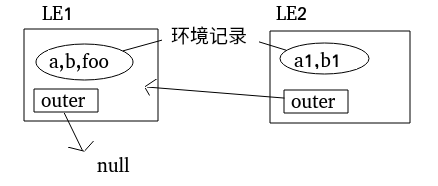

尽管通常认为JavaScript是一门“动态”或者“解释执行”的语言，但是事实上JavaScript是一门“编译”语言。而在传统的编译语言的流程中，编译主要分为一下三个步骤：
* 词法分析 - 这个过程会将由字符组成的字符串分解成有意义的代码块，这些代码块被称为词法单元。例如：`var a = 2`。这段程序通常会被分解成下面这些词法单元：`var`,`a`,`=`,`2`。
* 语法分析 — 这个过程是将词法单元流转换成一个由元素主机嵌套所组成的代表了程序语法结构的树，这个树被称为“抽象语法书”
* 代码生成 - 就是将语言代码，转换为机器能够理解并执行的代码，抛开细节，简单来说，例如：`var a = 2`,就是创建一个叫做`a`的变量(包括分配内存等)，并将一个值2储存在a中。

对于JavaScript来说，任何代码在执行之前都要进行编译，大部分情况下比编译发生在代码执行之前的几微秒(甚至更短！)的时间内，因此，JavaScript编译器首先会对`var a = 2`,这段代码进行编译，然后做好执行它的准备，并且通常马上就回执行它。

### lexical environment
`词法环境`（Lexical Environments）是一种规范类型，用于根据ECMAScript代码的词法嵌套结构来定义标识符与特定变量和函数的关联。词法环境由一个`环境记录`（Environment Record）和一个可能为空的`外部词法环境`（outer Lexical Environment）引用组成。通常，词法环境与ECMAScript代码的特定语法结构相关联，例如FunctionDeclaration，BlockStatement或TryStatement的Catch子句，并且每次执行这样的代码时都会创建新的词法环境。

环境记录记录了在其关联的词法环境作用域内创建的标识符绑定。它被称为词法环境的环境记录。环境记录也是一种规范类型。规范类型对应于在算法中用来描述ECMAScript语言结构和ECMAScript语言类型的语义的元值。

全局环境是一个没有外部环境的词法环境。全局环境的外部环境引用为null。
模块环境是一个包含模块顶层声明绑定的词法环境。模块环境的外部环境是一个全局环境。
函数环境是一个对应于ECMAScript函数对象调用的词法环境。

上面的描述是官方文档的翻译，是在是有点晦涩难懂，举个例子来说明一下：
``` js
var a, b = 1;
function foo(){
  var a1,b1;
}
foo();
```
看上面这段简单的代码,JavaScript在执行上面的这段代码的时候，做了如下操作：
* 创建了一个词法环境我把它记为`LE1`（这里的`LE1`其实是一个`global environment`）。
* 确定`LE1`的环境记录（我在这不细说环境记录，只知道它里面包含了`{a，b，foo}`标识符的记录，我会在之后详细介绍）。
* 设置外部词法环境引用，因为`LE1`已经在最外面了，于是外部词法环境引用就是`null`，到此`LE1`就确立完毕了。
* 接着执行代码，当执行到`foo()`这句话时，js调用了foo函数。此时foo函数是一个`FunctionDeclaration`，于是js开始执行foo函数。
* 创建了一个新的词法环境记为`LE2`.
* 设置`LE2`的外部词法环境引用，很明显`LE2`的外部词法环境引用就是`LE1`。
* 确定`LE2`的环境记录`{a1,b1}` 。
* 最后继续执行`foo`函数，直到函数执行完毕。

>注意：所有创建词法环境以及环境记录都是不可见的，编译器内部实现。

简单的用图来表示一下`LE1`和`LE2`的关系


### Emvironment Record
环境记录是一个抽象类，它具有三个具体的子类，分别是声明式环境记录，对象环境记录和全局环境记录。其中全局环境记录在逻辑上是单个记录，但是它被指定为封装对象环境记录和声明性环境记录的组合。

#### 对象环境记录（Object Environment Record）
每个对象环境记录都与一个对象联系在一起，这个对象被称为`绑定对象`(binding object)。一个对象环境记录绑定一组字符串标识符名称，直接对应于其绑定对象的属性名称。无论绑定对象自己的和继承的属性的[[Enumerable]]设置如何，它们都包含在集合中。由于可以动态地从对象中添加和删除属性，因此对象环境记录绑定的一组标识符可能会因为任何添加或删除对象属性操作的副作用而改变。即使相应属性的`Writable`的值为false。因此由于这种副作用而创建的任何绑定都将被视为可变绑定。对象环境记录不存在不可变的绑定。
with语句用到的就是对象环境记录，我们看一下简单的例子：
``` js
var withObject = {
    a:1,
    foo:function(){
        console.log(this.a);
    }
}

with(withObject){
    a = a + 1;
    foo();                    //2
}
```
在js代码执行到with语句的时候，

* 创建新的词法环境。
* 接着创建了一个对象环境记录即为OER，OER包含withObject这个绑定对象，OER中的字符串标识符名称列表为withObject中的属性«a,foo»，在with语句中的变量操作默认在绑定对象中的属性中优先查找。
* 为OER设置外部词法环境引用。

#### 声明性环境记录（Declarative Environment Record）
每个声明性环境记录都与包含变量，常量，let，class，module，import和/或function的声明的ECMAScript程序作用域相关联。声明性环境记录绑定了包含在其作用域内声明定义的标识符集。这句话很好理解，举个例子如下：
``` js
import x from '***';
var a = 1;
let b = 1;
const c = 1;
function foo() {};
class Bar {};
// 这时声明性环境记录中就有了«x,a,b,c,foo,Bar»这样一组标识符，当然实际存放的结构肯定不是这个样子的，还要复杂。
```
#### 函数环境记录（Function Environment Record）
函数环境记录是一个声明性环境记录，它用来表示function中的顶级作用域，此外如果函数不是一个箭头函数（ArrowFunction），则为这个函数提供一个this绑定。如果一个函数不是一个ArrowFunction函数并引用了super，则它的函数环境记录还包含从该函数内执行super方法调用的状态。
函数环境记录有下列附加的字段:

| | 字段名称 | 值 | 含义 |
| --- | --- | --- |
| [[ThisValue]] | Any | 用于该函数调用的this值 |
| [[ThisBindingStatus]] | "lexical" ，"initialized" ，"uninitialized" | 如果值是“lexical”，这是一个ArrowFunction，并且没有一个本地的this值。 |
| [[FunctionObject]]  | Object | 一个函数对象，它的调用导致创建该环境记录  |
| [[HomeObject]] | Object或者undefined | 如果关联的函数具有super属性访问权限，并且不是一个ArrowFunction，则[[HomeObject]]是该函数作为方法绑定的对象。 [[HomeObject]]的默认值是undefined。 |
| [[NewTarget]]  | Object或者undefined | 如果该环境记录是由[[Construct]]的内部方法创建的，则[[NewTarget]]就是[[Construct]]的newTarget参数的值。否则，它的值是undefined。|

简单介绍一下这些字段，`[[ThisValue]]`这个字段的值就是`函数中的this对象`，`[[ThisBindingStatus]]`中"initialized" ，"uninitialized"看字面意思也知道了，主要是`lexical`这个状态为什么是代表`ArrowFunction`，我的理解是ArrowFunction中是没有一个本地的this值，所以ArrowFunction中的this引用不是指向调用该函数的对象，而是根据`词法环境`进行查找，本地没有就向外部词法环境中查找this值，不断向外查找，直到查到this值，所以[[ThisBindingStatus]]的值是`lexical`。看下面例子：
``` js
var a = 'global.a';
var obj1 = {
    a:'obj1.a',
    foo: function(){
     console.log(this.a);
    }
}
var obj2 = {
    a:'obj2.a',
    arrow:()=>{
     console.log(this.a);
    }
}
obj1.foo()                  // obj1.a
obj2.arrow()                // global.a不是obj2.a
obj1.foo.bind(obj2)()       // obj2.a
obj2.arrow.bind(obj1)()     // global.a  强制绑定对ArrowFunction没有作用
```
对ArrowFunction中this的有趣的说法就是：我没有this，你送我个this我也不要，我就喜欢拿别人的this用，this还是别人的好。

[[FunctionObject]]：在上一个例子中指得就是obj1.foo、obj1.arrow。
[[HomeObject]]：只有函数有super访问权限且不是ArrowFunction才有值。看个MDN上的例子：
``` js
var obj1 = {
  method1() {
      console.log("method 1");
  }
}

var obj2 = {
  method2() {
      super.method1();
  }
}

Object.setPrototypeOf(obj2, obj1);
obj2.method2();                          //method 1

//在这里obj2就是[[HomeObject]]
//注意不能这么写：
var obj2 = {
  foo:function method2() {
      super.method1();                 //error,function定义下不能出现super关键字，否则报错。
  }
}                 
```
[[NewTarget]]：构造函数才有[[Construct]]这个内部方法，如用new关键词调用的函数就会有[[Construct]]，newTarget参数我们可以通过new.target在函数中看到。
``` js
function newTarget(){
   console.log(new.target);
}

newTarget()             //undefined
new newTarget()         /*function newTarget(){
                              console.log(new.target);
                        }
                        new.target指代函数本身*/
```

### 全局环境记录（Global Environment Records）
全局环境记录用于表示在共同领域（Realms）中处理所有共享最外层作用域的ECMAScript Script元素。全局环境记录提供了内置全局绑定，全局对象的属性以及所有在脚本中发生的顶级声明。
全局环境记录有下表额外的字段。

| 字段名称 | 值 | 含义 |
|---|---|---|
| [[ObjectRecord]] | Object Environment Record | 绑定对象是一个全局对象。它包含全局内置绑定以及关联领域的全局代码中FunctionDeclaration，GeneratorDeclaration，AsyncFunctionDeclaration和VariableDeclaration绑定。 |
| [[GlobalThisValue]] | Object | 在全局作用域内返回的this值。宿主可以提供任何ECMAScript对象值。 |
| [[DeclarativeRecord]] | Declarative Environment Record | 包含在关联领域的全局代码中除了FunctionDeclaration，GeneratorDeclaration，AsyncFunctionDeclaration和VariableDeclaration绑定之外的所有声明的绑定 |
| [[VarNames]] | List of String | 关联领域的全局代码中的FunctionDeclaration，GeneratorDeclaration，AsyncFunctionDeclaration和VariableDeclaration声明绑定的字符串名称。 |

这里提一下FunctionDeclaration，GeneratorDeclaration，AsyncFunctionDeclaration和VariableDeclaration不在Declarative Environment Record中，而是在Object Environment Record中，这也解释了为什么在全局代码中用var、function声明的变量自动的变为全局对象的属性而let、const、class等声明的变量却不会成为全局对象的属性。
