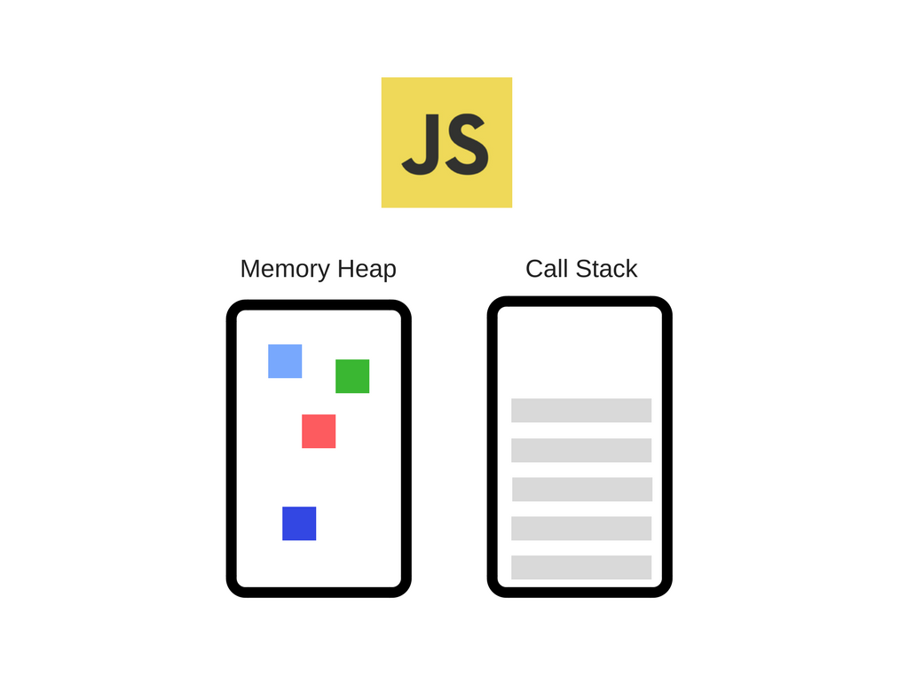

- [JavaScript 如何工作系列: 引擎、运行时、调用栈概述](https://juejin.im/post/5c090bd9e51d45242973cad2)

- [JavaScript 如何工作：在 V8 引擎里 5 个优化代码的技巧](https://juejin.im/post/5a102e656fb9a044fd1158c6)

- [JavaScript 工作原理：内存管理 + 处理常见的4种内存泄漏](https://juejin.im/post/5a2559ae6fb9a044fe4634ba)

- [JavaScript 如何工作的: 事件循环和异步编程的崛起 + 5 个关于如何使用 async/await 编写更好的技巧](https://juejin.im/post/5a221d35f265da43356291cc)

- [Event Loop](https://juejin.im/entry/5a731a955188257a6d634f3e)

- [Event Loop in Node](https://zhuanlan.zhihu.com/p/55511602?utm_source=wechat_session&utm_medium=social&utm_oi=880452006622420992)

- [JavaScript 是如何工作的：深入剖析 WebSockets 和拥有 SSE 技术 的 HTTP/2，以及如何在二者中做出正确的选择](https://github.com/xitu/gold-miner/blob/master/TODO/how-javascript-works-deep-dive-into-websockets-and-http-2-with-sse-how-to-pick-the-right-path.md)

- [JavaScript 是如何工作的：渲染引擎和性能优化技巧](https://github.com/xitu/gold-miner/blob/master/TODO1/how-javascript-works-the-rendering-engine-and-tips-to-optimize-its-performance.md)

JavaScript 越来越流行，在前端、后端、hybrid apps、嵌入式设备开发等方向上都有它活跃的身影。
这篇文章是 How JavaScript Works 系列的开篇，该系列的文章旨在深入挖掘 JavaScript 及其实际的工作原理。我们认为了解 JavaScript 的构建块及其共同作用，可以帮助我们写出更优雅、更高效的代码和应用。
正如 GitHut stats 所展示的一样，JavaScript 各方面的统计数据都是棒棒哒，顶多也就在个别统计项上落后了其他语言那么一丢丢。

如果项目深度依赖 JavaScript，这意味着开发者需要对底层有极其深入的了解，并利用语言和生态提供的一切东西来构建出色的应用。

然而，事实上，很多开发者虽然每天都在使用 JavaScript，却对其背后发生的事情一无所知。

### 概述
几乎每个人都听说过 V8 引擎的概念，大多数人也都知道 JavaScript 是一门单线程语言或者知道它是基于回调队列的。

在这篇文章中，我们将详细的介绍这些概念并且解释 JavaScript 实际的运行方式，通过对这些细节的了解，你可以写出更好、无阻塞的应用。

如果你是一名 JavaScript 新手，这篇文章将帮助你理解为什么 JavaScript 和其它语言对比起来显得那么"奇怪"。

如果你是一名老司机，希望能够为你带来一些对 JavaScript 运行时的新思考。

### JavaScript 引擎
说起 JavaScript 引擎，不得不提的就是 Google 的 V8 引擎，Chrome 和 Nodejs 内部也是使用的 V8。这里有一个简单的视图：



就如JVM虚拟机一样，JS引擎中也有堆(Memory Heap)和栈(Call Stack)的概念。

* 栈-用来存储方法调用的地方，以及基础数据类型(如var a = 1)也是存储在栈里面的，会随着方法调用结束而自动销毁掉(入栈-->方法调用后-->出栈)。

* 堆-JS引擎中给对象分配的内存空间是放在堆中的。如var foo = {name: 'foo'} 那么这个foo所指向的对象是存储在堆中的。


此外，JS中存在闭包的概念，对于基本类型变量如果存在与闭包当中，那么也将存储在堆中。详细可见此处1,3

关于闭包的情况，就涉及到Captured Variables。我们知道Local Variables是最简单的情形，是直接存储在栈中的。而Captured Variables是对于存在闭包情况和with,try catch情况的变量。
``` js
function foo () {
  var x; // local variables
  var y; // captured variable, bar中引用了y

  function bar () {
  // bar 中的context会capture变量y
    use(y);
  }

  return bar;
}
```
复制代码如上述情况，变量y存在与bar()的闭包中，因此y是captured variable，是存储在堆中的。

### RunTime
JS在浏览器中可以调用浏览器提供的API，如window对象，DOM相关API等。这些接口并不是由V8引擎提供的，是存在与浏览器当中的。因此简单来说，对于这些相关的外部接口，可以在运行时供JS调用，以及JS的事件循环(Event Loop)和事件队列(Callback Queue)，把这些称为RunTime。有些地方也把JS所用到的core lib核心库也看作RunTime的一部分。


同样，在Node.js中，可以把Node的各种库提供的API称为RunTime。所以可以这么理解，Chrome和Node.js都采用相同的V8引擎，但拥有不同的运行环境(RunTime Environments)

### Call Stack
JS被设计为单线程运行的，这是因为JS主要用来实现很多交互相关的操作，如DOM相关操作，如果是多线程会造成复杂的同步问题(例如当两个线程同时操作同一个DOM元素的时候该如何处理)。因此JS自诞生以来就是单线程的，而且主线程都是用来进行界面相关的渲染操作 (为什么说是主线程，因为HTML5 提供了Web Worker，独立的一个后台JS，用来处理一些耗时数据操作。因为不会修改相关DOM及页面元素，因此不影响页面性能)，如果有阻塞产生会导致浏览器卡死。

如果一个递归调用没有终止条件，是一个死循环的话，会导致调用栈内存不够而溢出，如：

``` js
function foo() {
    foo();
}
foo();
```

例子中foo函数循环调用其本身，且没有终止条件，浏览器控制台输出调用栈达到最大调用次数。

JS线程如果遇到比较耗时操作，如读取文件，AJAX请求操作怎么办？这里JS用到了Callback回调函数来处理。
对于Call Stack中的每个方法调用，都会形成它自己的一个执行上下文Execution Context，关于执行上下文的详细阐述请看[这篇文章](https://juejin.im/post/5a5ee28f6fb9a01cbe655860)


