### 单位

#### 英寸
一般用英寸描述屏幕的物理大小，如电脑显示器的`13`、`15`,手机显示器的`4.8`,`5.7`等使用的单位都是英寸。

需要注意的是英寸都是指屏幕对角线的长度

> 英寸(inch,缩写为in)在荷兰语中本意是指大拇指，一英寸就是普通人拇指指甲底部的宽度。

英寸和厘米的换算规则为：`1英寸 = 2.54厘米`

#### 屏幕比例

只确定了对角线的长度(屏幕英寸)，2个边的长度还是无法确定，所以有了`4:3`，`16:9`这种屏幕宽高比，这样就可以计算出屏幕的两个边长了

#### 分辨率
##### 像素
像素即一个小方块，具有特定的位置和颜色。

图片、电子屏幕(手机、电脑)就是由无数个具有特定颜色和特定位置的小方块拼接而成。
像素可以作为图片或者电子屏幕的最小组成单位。
下面我们使用`sketch`打开一张图片：

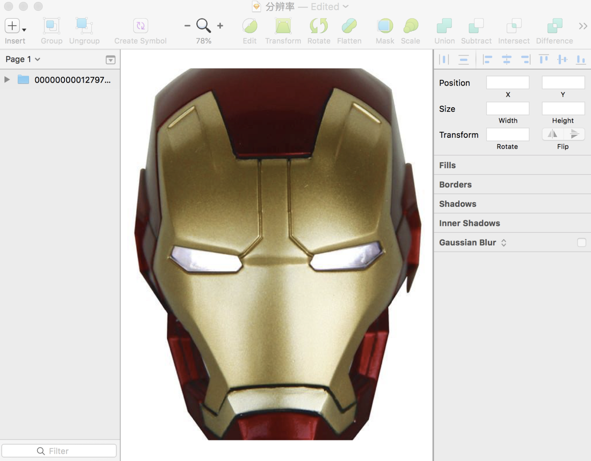

我们通常所说的分辨率有两种，一种屏幕分辨率一种是图像分辨率

##### 屏幕分辨率
屏幕分辨率是指一个屏幕具体有多少个像素点组成。

下面是`apple`的官网对手机分辨率的描述：

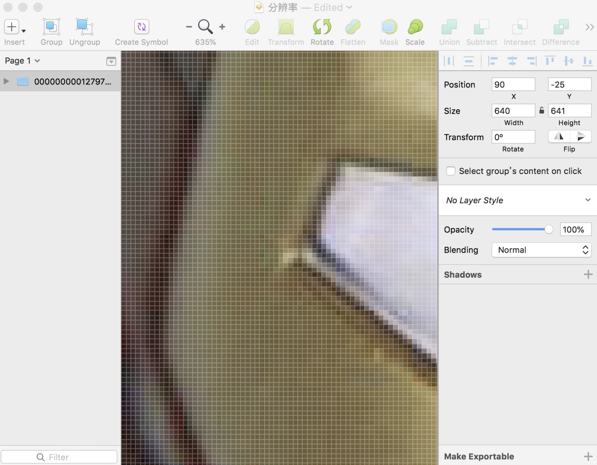

`iphone xs max`和`iphone SE`的分辨率分别为`2688 x 1242`和`1136 x 640`,这表示手机分别在垂直和水平方向上所具有的像素点数。

当然分辨率高不代表屏幕就清晰，屏幕的清晰程度还与尺寸有关。

> 同尺寸下，自然分辨率越高屏幕越清晰

##### 图像分辨率
我们通常所说的`图片分辨率`实际上是指图片所含有的`像素数`,比如一张图片的分辨率为`800 x 400`。这表示图片分别在垂直和水平上所具有的像素点数为`800`和`400`。

统一尺寸的图片，分辨率越高，图片越清晰。

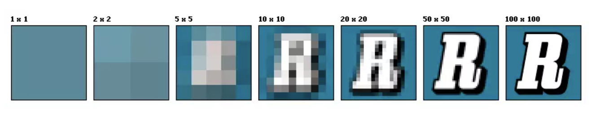

##### PPI
`PPI`(Pixel Per Inch):每英寸包括的像素数。

`PPI`可以用于描述屏幕的清晰度以及一张图片的质量。

使用`PPI`描述图片时，`PPI`越高，图片质量越高，使用`PPI`描述屏时，`PPI`越高，屏幕越清晰。

在上面描述手机分辨率的图片中，我们可以看到：`iPhone XS Max` 和 `iPhone SE`的`PPI`的分辨率分别为458和326，这足以证明前者的屏幕更清晰。

由于手机尺寸为手机对角线的长度，我们通常使用如下的方法计算`PPI`：

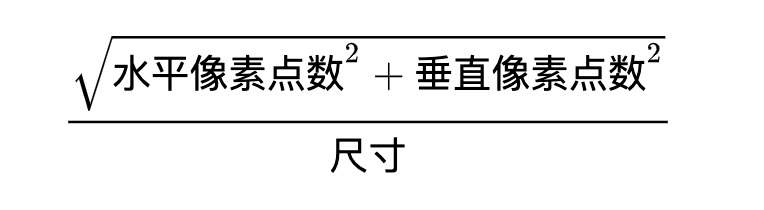

iPhone6的`PPI`为

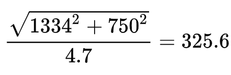

那它每英寸包含约`326`个物理像素点。

##### DPI
`DPI`(Dot Per Inch):即每英寸包括的点数。

这里的点是一个抽象的单位，它可以是屏幕像素点，图片像素点也可以是打印机的墨点。

平时你可能会看到使用`DPI`来描述图片和屏幕，这时的`DPI`应该和PPI是等价的。

> `DPI`更多的时候是用来描述打印机，表示打印机每英寸可以打印的点数。这个和开发无关，不继续深入研究

### 设备独立像素
实际上，上面我们描述的像素像素都是物理像素，即设备上真实的物理单元。

下面我们来看看设备独立像素究竟是如何产生的：

智能手机发展的速度非常之快，在几年之前，我们还用着分辨率非常低的手机，比如下面白色的手机，它的分辨率是`320 x 480`，我们可以在上面浏览正常的蚊子、图片等等。

但是，随着科技的发展，低分辨率的手机已经不能满足我们的需求了。很快，更高分辨率的屏幕诞生了，比如下面的黑色手机，它的分辨率是640 x 960,正好是白色手机的两倍。

理论上来说，在白色手机上相同大小的图片和文字，在黑色手机上会被压缩一倍，因为它的分辨率提高了一倍。但是如果真的这样下去，岂不是后面出现更高分辨率的手机，页面元素会变得越来越小吗？

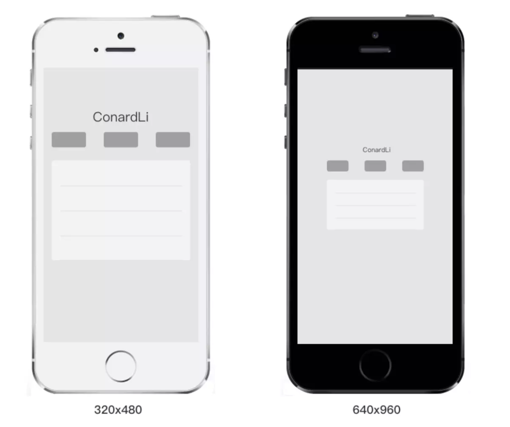

然而，事实并不是这样，我们现在使用的智能手机，不管分辨率多高，他们所展示的界面比例都是类似的。乔布斯在iPhone4的发布会上首次提出了Retina Display(视网膜屏幕)的概念，它正式解决了上面的问题，这也使它成为一款跨时代的手机。

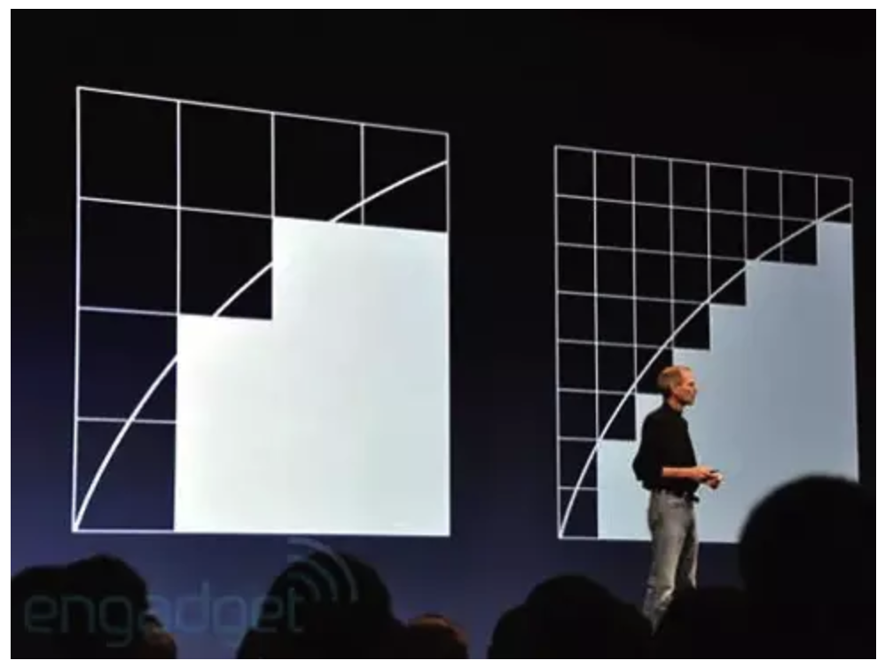

在iPhone4使用的视网膜屏幕中，把两个像素当成1个像素使用，这样让屏幕看起来更精致，同时能保持元素的大小不变。

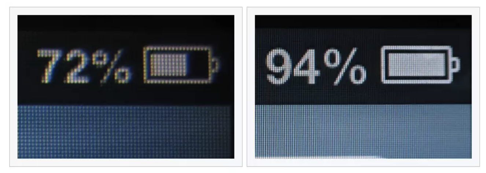

如果黑色的手机使用了视网膜屏幕的技术，那么显示结果应该是下面的情况，比如列表的宽度为300个像素，那么在一条水平线上，白色手机会用300个物理像素去渲染它，而黑色手机实际上会用600个像素去渲染它。

我们必须用一种单位来同时告诉不同分辨率的手机，它们在街面上显示的元素的大小是多少，这个单位就是设备独立像素(Device Independent Pixels)简称`DIP`或`DP`,上面我们说，列表的宽度为300个像素，实际上我们可以说：列表的宽度为300个设备独立像素。

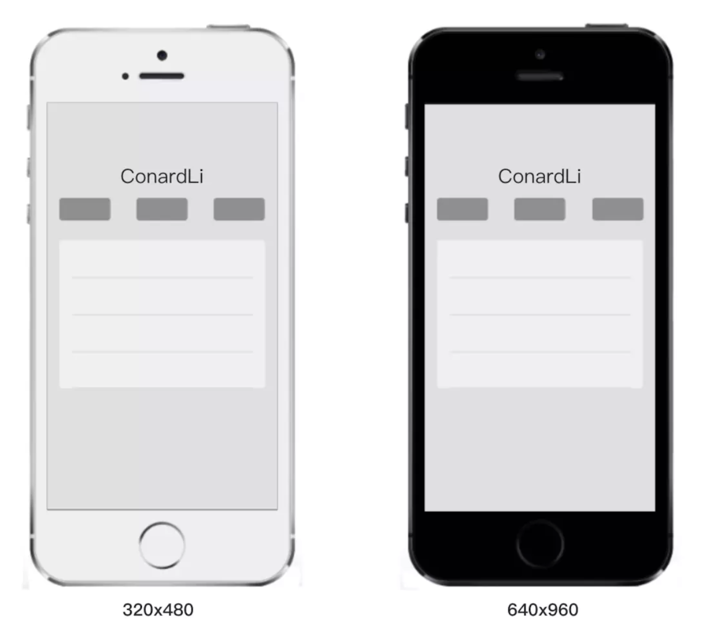

打开chrome的开发者工具，我们可以模拟各个手机型号的显示情况，每种型号上面会显示一个尺寸，比如iPhone X显示的尺寸就是375 x 812,实际上iPhone X的分辨率会比这高很多，这里显示的就是设备独立像素。

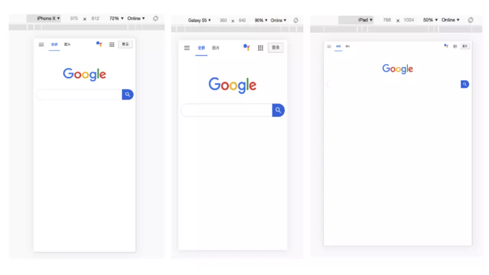

#### 设备像素比

设备像素比`device pixek ratio`简称dpr,即物理像素和设备独立像素的比值。

在`web`中，浏览器为我们提供了`window.devicePixelRatio`来帮助我们获取`dpr`。

在`css`中，可以使用媒体查询`min-device-pixel-ratio`，区分`dpr`：
``` css
@media (-webkit-min-device-pixel-ratio:2){}
```
在`React Native`中，我们也可以使用`PixelRatio.get()`来获取`dpr`。

当然，上面的规则也有例外，iPhone6、7、8 plus的实际物理像素是`1080 x 1920`,在开发者工具中我们可以看到：它的设备独立像素是`414 x 736`,设备像素比为3，设备独立像素和设别像素比的乘积不等于`1080 x 1920`,而是等于`1242 x 2208`。

实际上，手机会自动把`1242 x 2208`个像素点塞进`1080 x 1920`个物理像素点来渲染，我们不用关心这个过程，而`1242 x 2208`被成为屏幕的设计像素。我们开发的过程中也是以这个`设计像素`为准。

实际上，从苹果提出视网膜屏幕开始，才出现设备像素比这个概念，因为在这之前，移动设备都是直接使用物理像素来进行展示。

紧接着，Android同样使用了其他的技术方案来实现DPR大于1的屏幕，不过远离是类似的。由于Android屏幕尺寸非常多、分辨率高低宽度非常大，不像苹果只有它自己的几款固定设备、尺寸。所以，为了保证各种设备的显示效果，Android按照设备的像素密度将设备分成了几个区间：

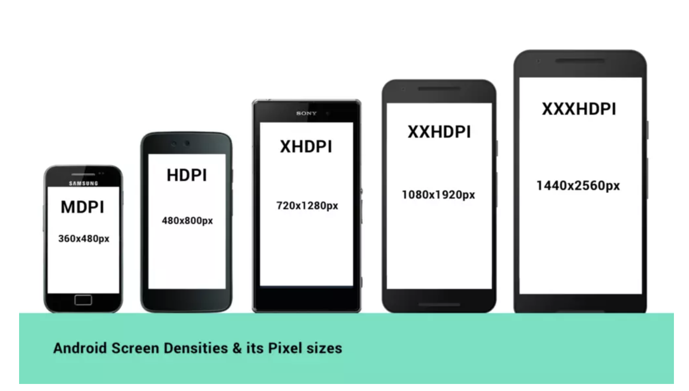

当然，所有的Android设备不一定严格按照上面的分辨率，每个类型可能对应几种不同分辨率，所以，每个Android手机都能根据给定的区间范围，确定自己的DPR,从而拥有类似的显示。当然，仅仅是类似，由于各个设备的尺寸、分辨率上的差异，设别独立像素也不会完全相等，所以各种Android设备仍然不能做到在展示上完全相等。

#### 原生移动端开发

在IOS,Android和React Native开发中样式单位其实都使用的是设备独立像素。

ios的尺寸单位是`pt`,Android的尺寸单位是`dp`,React-Native中没有指定明确的单位，他们其实都是设别独立像素`dp`。

在使用React Native开发App时，UI给我们的圆形如一般时基于iPhone6的像素给定的。

为了适配所有机型，我们在写样式时需要把物理像素转换为设备独立像素：例如：如果给定一个元素的高度为200px(这里的px指物理像素，非css像素)，iPhone6的设备像素比为2，我们给定的height应为`200px/2 = 100dp`。

当然，最好的是，你可以和设计沟通好，所有的UI图都按照设备独立像素来出。

我们还可以在代码(RN)中进行`px`和`dp`的转换：

``` js
import { PixelRatio } from 'react-native'

const dpr = PixelRatio.get()

// px 转换为 dp
export function pxToDp(px) {
    return px / dpr
}

// dp 转换为 px
export function dpToPx(dp) {
    return dp * dpr
}
```
#### web端开发
在写CSS时，我们用到最多的单位是px,即CSS像素，当页面缩放比例为100%时，一个CSS像素等于一个设备独立像素。

但是CSS像素是很容易被改变的，当用户对浏览器进行了放大，CSS像素会被放大，这时一个CSS像素会跨越更多的物理像素。

`页面缩放系数 = CSS像素 / 设备独立像素`

#### 关于屏幕
这里多说两句`Retina屏幕`，因为我在很多文章中看到对`Retina屏幕`的误解。

Retina只是苹果提出的一个营销术语：

> 在普通的使用距离下，人的肉眼无法分辨单个的像素点

为什么强调`普通的使用距离下`呢？我们来看看它的计算公式：

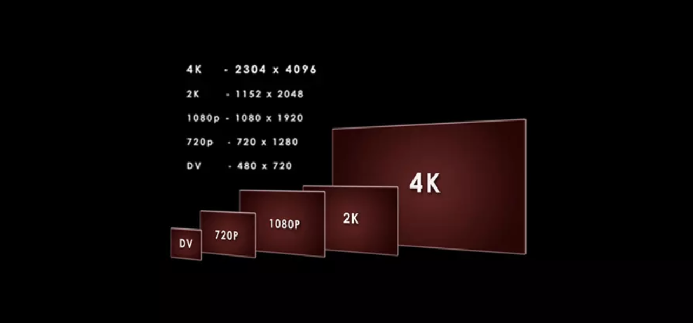

a代表人眼视角，h代表像素间距，d代表肉眼与屏幕的距离，符合以上条件的屏幕可以使肉眼看不见单个物理像素点。

它不能单纯的表达分辨率和PPI,只是一种视觉表达的效果。

让多个物理像素渲染一个独立像素只是`Retina屏幕`为了达到效果而使用的一种技术。而不是所有`DPR > 1`的屏幕就是`Retina屏幕`。

比如：给你一块超大尺寸的屏幕，即使它的PPI很高，DPR很高，但是在因为屏幕太大了，所以近距离还是可以看到它的物理像素点，这就不算Retina屏。


我们经常使用K和P这两个单位来描述屏幕。

P代表的就是屏幕纵向的像素点数，比如：`1080P`即纵向有`1080`个像素，分辨率为`1920 x 1080`的屏幕就属于1080P屏幕。

我们平常所说的高清屏其实就是屏幕的物理分辨率达到或者超过`1920 x 1080`的屏幕。

K代表屏幕的横向有几个1024个像素，一般来讲横向像素超过`2048`就术语`2K`屏，横向像素超过`4096`就属于`4K`屏。

### 视口
视口(viewport)代表当前可见的计算机图形区域。在WEB浏览器术语中，通常与浏览器窗口相同，但不包括浏览器的UI,菜单栏--即指你正在浏览文档的那一部分。

#### 布局视口
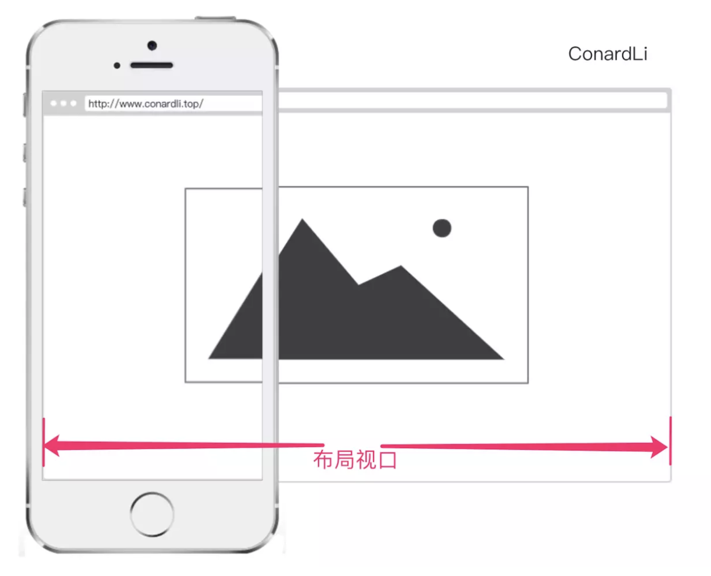
布局视口(`layout viewport`):当我们以百分比来指定一个元素的大小时，它的计算值是有这个元素的包含块计算而来的。当这个元素是最顶级的元素时，他就是基于布局视口来计算的。

布局视口是网页布局的基准窗口

在PC浏览器上，布局视口就等于当前浏览器的窗口大小(不包括borders,margins,滚动条)。

在移动端，布局视口被赋予一个默认值，大部分为`980px`,这保证PC的网页可以在手机浏览器上呈现，但是非常小，用户可以手动对网页进行放大。

我们可以通过调用`document.documentElement.clientWidth / clientHeight`来获取布局视口的宽高。

#### 视觉视口
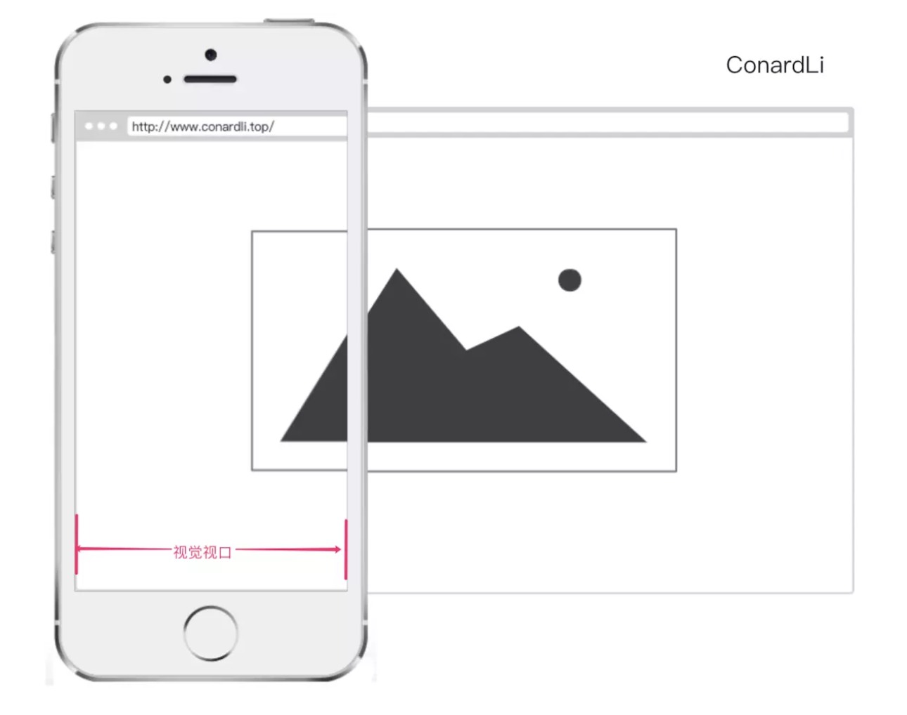
视觉视口(visual viewport):用户通过屏幕真实看到的区域。

视觉视口默认等于当前浏览器的窗口大小，(包含滚动条宽度)。

当用户对浏览器进行缩放时，不会改变布局窗口的大小，所以页面布局是不变的，但是缩放会改变视觉视口的大小。

例如：用户将浏览器窗口放大了200%，这时浏览器窗口中的CSS像素会随着数据额的放大而放大，这时一个CSS像素会跨越更多的物理像素。

所以，布局视口会限制你的CSS布局而视觉视口决定用户具体能看到什么。

我们可以通过调用`window.innerWidth / innerHeight`来获取视觉视口大小。

#### 理想视口


布局视口在移动端展示的效果并不是一个理想的效果，所以理想视口(ideal viewport)就诞生了：网站页面在移动端展示的理想大小。

如上图，我们在描述设备独立像素时曾使用过这张图，在浏览器调试移动端页面上给定的元素大小就是理想视口大小，它的单位正是设备独立像素。

在上面介绍CSS像素时，曾提到`页面的缩放系数 = CSS像素 / 设备独立像素`，实际上说`页面的缩放系数 = 理想视口宽度 / 视觉视口宽度`更为准确。

所以，当页面缩放比例为100%时，`CSS像素 = 设备独立像素`，`理想视口 = 视觉视口`。

我们可以通过调用`screen.width / height`来获取理想视口大小。

#### Meta viewport

我们可以借助`<meta>`元素viewport来帮助我们设置视口、缩放等，从而让移动端得到更好的展示效果。

``` html
<meta name="viewport" content="width=device-width, initial-scale=1.0">
```

上面`viewport`的一个配置，我们来看看他们的具体含义：

* width(正整数或device-width) -- 以pixels(整数)为单位，定义布局视口的宽度。

* height(正整数或device-height) -- 以pixels(整数)为单位，定义布局视口的高度。

* initial-scale(0.0 - 10.0) -- 定义页面初始缩放比例。

* minimun-scale(0.0 - 10.0) -- 定义页面可缩放的最小值；必须小于或者等于`maximun-scale`的值。

* maximun-scale(0.0 -10.0) -- 定义页面可放大的最大值；必须大于或者等于`minimun-scale`的值。

* user-scalable(yes or no) -- 如果设置为no,用户将不能放大或缩小网页。默认值为yes(IOS10以后，该属性被Safari浏览器全部重置为yes)

#### 移动端适配

为了在移动端让页面获得更好的显示效果，我们必须让布局视口、视觉视口都尽可能等于理想视口。

`deive-width`就等于理想视口的宽度，所以设置`width=device-width`就相当于让布局视口等于理想视口。

由于`initial-scale = 理想视口宽度 / 视觉视口宽度`，所以我们设置`initial-scale=1`,就相当于让视觉视口等于理想视口。

这时，1个CSS像素就等于1个设备独立像素，而且我们也是基于理想视口来进行布局的，所以呈现出来的页面布局在各种设备上都能大致相似。

#### 缩放

上面提到的width可以决定布局适口的宽度，实际上它并不是布局适口的唯一决定性因素，设置initial-scale也有可能影响到布局视口，因为布局视口宽度取 的是width和视觉视口宽度的最大值。

例如：若手机的理想视口宽度为`400px`,设置`width=device-width,initial-scale=2`,此时`视觉视口宽度 = 理想适口宽度 / initial-scale`即`200px`,布局视口取两者最大值即`device-width 400px`。

若设置`width=device-width,initial-scale=0.5`,此时`视觉视口宽度 = 理想视口宽度 / initial-scale`即`800px`,布局视口取两者最大值`800px`。


