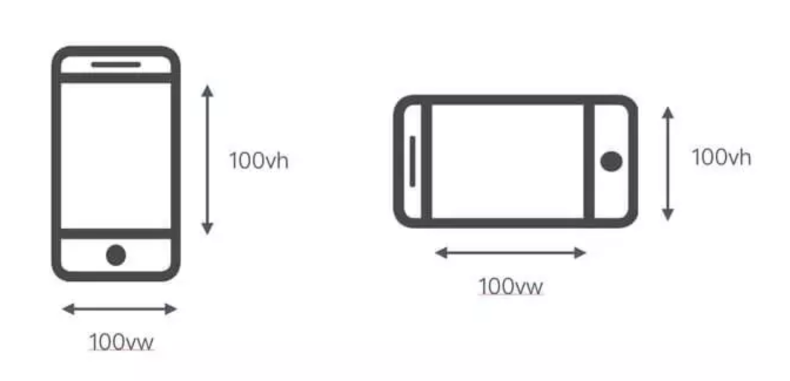

### rem布局

#### lib-flexible
假设设计MM给我们的设计稿尺寸为`750 x 1340`，那么我们前端拿到设计稿之后要如何动手开始开发呢？经过上面的介绍了移动端开发的基本概念之后，应该有了一些基本的思路，我们可以使用js动态计算rem的方案来实现。

rem是根据html节点的font-size来做计算的

举个例子：假如html元素的font-size为 `Npx`,一个元素的宽度设定为`2rem`;则该元素的实际宽度为：`2 * N px`；

换句话说px与rem的一定是成正比关系的。

那么既然设计MM给我们的设计稿尺寸为`750 x 1340`，那么我们完全可以把屏幕的布局视口平均分为750份；设计稿中的某个元的宽度直接按照，占了750份中的多少份来计算就可以了。

举例：
iPhone6的布局视口宽度为`document.documentElement.clientWidth = 375px`分为750份，则每份的宽度为`375px/750 = 0.5px`;并把`0.5px`设置为html元素的`font-size`;

现在有一个元素的宽度为`20px`,则只需要把元素的宽度用CSS编写为`20rem`即可！

因为`20px`，相对于平均分成`750`份之后,确实是只占了`20`份，每份是`0.5rem`。

**但是我们这样做了之后就会发现有问题啊，为何结果没有达到我们的预期呢？至少从数学计算的角度来说，我们的逻辑没问题！**

那么问题出在哪里呢？

**是浏览器在作妖！chrome的浏览器所允许的最小`font-size`为`12px`,所以我们设置了html元素的`font-size=.5px`是被忽略的，并且被重置为了`12px`**

那么我们再次运用小学数学知识，只要把html元素的`font-size`等比例扩大100倍，然后元素的大小在缩小100倍不就可以解决这个问题啦！

所以我们把html元素的`font-size = 50px`,然后元素的宽度设定为`.2rem`，这样在计算之后不就没问题啦！

现在总结一下计算公式：
``` js
// html元素的font-size大小，单位：px
const htmlFontSize = (document.documentElement.clientWidth / 750) * 100;

// 普通元素宽度，单位：rem
const eleWidth = (设计稿宽度) / 100;
```
如果上面的换算觉得还是麻烦，可以借助`postCss`的插件`px2rem`来帮助我们完成换算，我们在代码中直接写px就可以了！

其实这也是阿里巴巴`lib-flexible`的大概实现原理！

#### rem的缺陷
rem是弹性布局的一种实现方式，弹性布局可以算作响应式布局的一种，但响应式布局不是弹性布局，弹性布局强调等比缩放，100%还原；响应式布局强调不同屏幕要有不同的显示，比图媒体查询。

一般内容型的网站，都不太使用使用rem,因为大屏用户可以自己选择要更大的字体，还是更多的内容，一旦使用了rem，就剥夺了用户的自由；一些偏向App类型的，图标类的，图片类的，比如：淘宝，活动页面，比较适合使用rem,因为调大字体时并不能调大图片的大小。同时rem存在一下问题：

* **字体问题** - 字体大小并不能使用rem,字体的大小和字体宽度并不成正比关系，这个关系完全取决于字体的作者。所以字体大小不能使用rem。
* **PC浏览** - 如果用户在PC段浏览页面怎么办？一般我们都会设置一个最大宽度，大于这个宽度的话，页面居中，两边留白，或者直接跳PC页面

``` js
var clientWidth = document.documentElement.clientWidth;
clientWidth = clientWidth < 780 ? clientWidth : 780;
document.documentElement.style.fontSize = clientWidth / 100 + 'px';
```

设置body的宽度为100rem，并水平居中:
``` css
body {
    margin: auto;
    width: 100rem
}
```

### vh、vw方案

vh、vw方案即将视觉视口宽度`window.innerWidth`和视觉视口宽度`window.innerHeight`等分为100份。

本质上来说，`flexible`方案就是模仿这种方案，随着浏览器兼容性的进步，`vh、vw`方案已经可以直接用了。



举例来说：视觉视口为375px,那么`1vw = 3.75px`,这时UI给定一个元素的宽为`20px`(设备独立像素)，那么我们只要只需要把它设置为`20 / 3.75 = 5.3333vw`。

这里的比例关系我们也不用自己换算，我们可以使用`PostCSS`的`postcss-px-viewport`插件帮助我们完成这个过程。写代码时，我们只需要根据UI给的设计图写px单位即可.

没有任何一种方案是完美的，vw,vh也存在一下缺陷：
* `px`转换成vw不一定能完全整除，因此有一定的像素差。
* 当容器使用vw,margin使用px时，很容易造成整体宽度超过100vw,从而影响布局效果。当然我们也是可以避免的，比如使用`padding`代替`margin`，结合`calc`函数使用
* 兼容性
部分机型不支持vw,vh，可以采用csspolyfill来进行降级处理，推荐[viewport-units-buggyfill](https://github.com/rodneyrehm/viewport-units-buggyfill)


