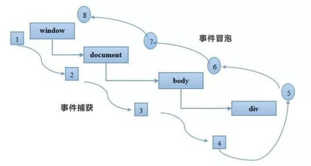

### Lazy loading     
几乎所有的懒加载都是通过JavaScript来实现的
#### Scroll Listeners and relayout
我们一般会通过监听元素的`scroll`事件，来检查图像的占位符是否位于当前可是区域内，如果是，则开始加载，这是目前我们大多数人采用的思路，但是`scroll`事件可能会对页面性能产生负面影响，在滚动期间，浏览器会多次触发`scroll`事件，并加载我们即将要被加载的图像，这会导致浏览器的重新布局，这是一个很影响性能的操作，可以尽量给scroll监听的事件添加`防抖`来降低触发频率，或者我们可以缓存某些元素的位置，这样可以防止反弹的发生，类似于`Quora`的解决方案

首先回忆几个基本概念：
* clientHeight:clientHeight描述的是可见内容的高度，不包括由垂直滚动条引起的隐藏内容。并且要去除掉水平滚动条和border和margin的大小，因为他们不是实际可见内容。     
所以 `clientHeight = visible content + padding`

* scrollHeight:描述的是内容的总高度。包括可见内容的高度和填充(padding);由于垂直滚动条导致的隐藏的内容和padding的高度。 注意这里不包括border和margin,以为这两个也不是真正的内容。     
所以 `scrollHright = entier content + padding`

* offsetHeight:描述的是元素在html页面中占用的空间量。包括一下内容：可见内容的高度和可见的填充(不包括由垂直滚动条引起的隐藏内容高度)；顶部和底部的边框；如果有水平滚动条的情况下，还应该包括水平滚动条的高度。注意这里也不包括margin,因为margin看作是该元素和它的邻居之间的距离，而不是它本身所占据的空间。      
所以 `offsetHeight = visible content + padding + border + horizontal scrollbar`

[详细图解](http://usefulangle.com/post/40/javascript-client-height-vs-offset-height-vs-scroll-height)

* scrollTop:代表有滚动条时，滚动条向下滚动的距离，也就是元素顶部被遮挡住的高度，在没有滚动条的时候scrollTop===0,可读可设置。

* offsetTop:当前元素顶部距离最近父元素顶部的距离，和有没有滚动条没有关系，是只读属性。

[详细图解](https://www.imooc.com/article/17571)

根据以上概念，判断滚动条即将(eg.500px)滚动到底部的逻辑如下:
``` js
/**
 * 判断滚动条即将滚动到底部
 * @param {Event} event scroll 事件
 */
function handleDocScroll(event) {
    var htmlHeight = document.documentElement.scrollHeight || document.body.scrollHeight;

    //clientHeight是网页在浏览器中的可视高度，
    var clientHeight = document.documentElement.clientHeight || document.body.clientHeight;

    //scrollTop是浏览器滚动条的top位置，
    var scrollTop = document.documentElement.scrollTop || document.body.scrollTop;

    //通过判断滚动条的top位置与可视网页之和与整个网页的高度是否相等来决定是否加载内容；
    if (scrollTop + clientHeight >= htmlHeight - 600) {
        console.log('即将滚动到底部')
    }
}
```
上面的`handleDocScroll`函数在页面滚动的时候会频繁触发，而我们想要的是在用户滚动结束之后，执行该监听函数，这个时候就需要`防抖`，
``` js
/**
 * 函数防抖，滚动事件结束之后，在执行
 * @param {Function} fn 
 * @param {Number} wait 
 * @returns {Function}
 */
const debounce = (fn, wait) => {
    let timeout = null;
    return function () {
        if (timeout !== null) {
            clearInterval(timeout)
        }
        timeout = setTimeout(fn, wait)
    }
}
```

判断元素是否在可是区域内
``` js
/**
* @params {HTMLElement} el
*/
function isElementInViewport(el) {
    var rect = el.getBoundingClientRect();

    return (
    rect.top >= 0 &&
    rect.left >= 0 &&
    rect.bottom <= (window.innerHeight || document.documentElement.clientHeight) &&
    rect.right <= (window.innerWidth || document.documentElement.clientWidth)
    );
}
```
#### passive event listeners
DOM2.0中`addEventListeners`函数,可以接收三个参数，其中第三个参数是用来控制监听器是在事件捕获阶段执行还是事件冒泡阶段执行，`true`为捕获阶段，`false`为冒泡阶段，默认值为`false(冒泡阶段)`，因为传`true`的情况太少了

<div style="text-align:center;margin-top:20px" align="center">
  
</div>  

此过程被称为事件传播，会以此执行捕获阶段的监听函数和冒泡阶段的监听函数(注意`触发事件元素本身的监听函数，会按照监听顺序执行，而不是先执行捕获阶段的，后执行冒泡阶段的`，因为目标本身只有一个，自己本身没有捕获和冒泡,自然会按照监听的顺序执行)。在捕获过程中最外层的祖先元素最先响应，然后依次向目标元素捕获；而在冒泡过程中，子元素最先响应，然后依次向父元素冒泡。

在事件处理函数中，会传递`Event`对象作为参数，而这个参数最常用的2个方法就是：
* event.stopPaopagation()   阻止事件传播
* event.preventDefault()    阻止事件的默认行为

我们可以使用如下代码绑定事件：
``` js
div.addEventListeners("touchstart",function (e){
    // 逻辑代码
    // e.preventDefault()  浏览器在没有执行上面的逻辑代码的时候不知道这里会有阻止默认事件的方法
})
```
由于`touchstart`事件对象的`cancelable`属性为`true`，也就是说它的默认行为可以被监听器通过`e.preventDefault()`方法阻止，那它的默认行为是什么呢，通常来说就是滚动当前页面（还可能是缩放页面），如果它的默认行为被阻止了，页面就必须静止不动。但浏览器无法预先知道一个监听器会不会调用`e.preventDefault()`，它能做的只有等监听器执行完后再去执行默认行为，而监听器执行是要耗时的，有些甚至耗时很明显，这样就会导致页面卡顿。视频里也说了，即便监听器是个空函数，也会产生一定的卡顿，毕竟空函数的执行也会耗时。

统计发现，有`80%`的滚动事件监听器是不会阻止默认行为的，也就是说大部分情况下，浏览器是白等了。所以，`passive监听器`诞生了，passive 的意思是“顺从的”，表示它不会对事件的默认行为说 no，浏览器知道了一个监听器是`passive`的，它就可以在两个线程里同时执行监听器中的JavaScript代码和浏览器的默认行为了

这里有一个视频，可以看到`passive监听器`和普通监听对页面性能的影响[视频地址](https://www.webreflection.co.uk/blog/2016/04/17/new-dom4-standards)，现在大部分的浏览器都支持`passive`,我们可以用起来了，不过也要做好回退的方案。
``` js
let passiveEventSupported = false;
try {
    const opts = Object.defineProperty({}, 'passive', {
        get() {
            passiveEventSupported = true
        }
    })
    window.addEventListener('test', null, opts)
} catch (e) { }

const passiveEvent = passiveEventSupported ? { capture: false, passive: true } : false

div.addEventListeners("touchstart",function (e){},passiveEvent)
```

如果我们在`passive`监听器中调用了`e.preventDefault`函数会如何呢？不用担心，这个时候`e.preventDefault`函数将不会起作用，并且浏览器会发出警告。

#### IntersectionObserver
[IntersectionObserver](https://developer.mozilla.org/en-US/docs/Web/API/Intersection_Observer_API)是一个处于试验阶段的api,可以直接监听image元素进入可视区域内，并触发回调函数,由于目前只有较新版本的浏览器支持，就不在做讲解，如果感兴趣可以去看一下文档，不过这个可能也是未来的发展方向，可以保持关注

[lazy-load & IntersectionObserver的react案例](https://jmperezperez.com/high-performance-lazy-loading/)
