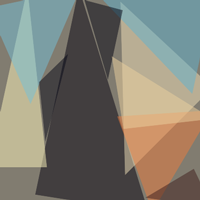
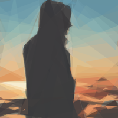
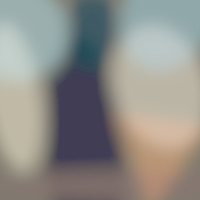

大概的placeholder的技术方案基本思路都是先加载一个很小的模糊但是能基本展示图片的轮廓和色调的图片作为占位符，然后再加载真正要展示的图像，大的图像加载完成之后，使用一个渐变的效果隐藏小的图片，展示真正的图片。

placeholder也分为很多类型，常见的有：

<div style="text-align:center;margin-top:20px" align="center">
  
</div>

* 使用一片空白占位：这样可以在图像还没有加载出来的时候出现页面塌陷和跳动，不仅用户体验比较差，性能上会导致浏览器的重绘
* 一张固定图片作为占位符：我们经常会在用户头像的地方使用这个方案，在用户头像没有设置的时候，或者用户头像家在失败的时候，我们可以使用一个内联的矢量图像(e.g.:svg/base64)作为默认的图像
* 纯色：从图像中获取主颜色，并将其用作占位符的背景颜色，这样可以在你从没有图像到图像家在成功的时候有一个视觉上更加平滑的过度(eg:twitter)。
* 使用渐变色：使用渐变色，可以获取最终图像的更准确的预览，效果上比纯色更棒(eg:tumblr)。
* 模糊图像：也称为模糊技术。首先渲染一个低像素和提及很小的模糊话的图像，然后在大图像加载成功的时候，隐藏模糊图像，也会有一个平滑的过度(eg:Quartz).

我们可以先了解一下，目前国内外访问量比较大，比较优秀的网站对图片的优化方案

#### facebook
facebook的技术方案:https://code.fb.com/android/the-technology-behind-preview-photos/

#### [Quartz](https://qz.com/894001/theres-a-wrong-and-a-right-way-to-talk-to-your-dog-according-to-science/)
* 1.首先加载一个非常小的的``，在他们的网页中他们使用了50px宽度和80%质量的图片
* 2.使用css来使图片模糊化
* 3.在小的图片加载完成的时候，开始加载大的图片
* 4.在大图片加载完毕的时候，隐藏小的图片的同时通过`transition:opacity .3s`来展现大的图片
* 5.在用户禁用JavaScript的时候，使用一个`<noscript>`里面包含一个``作为回退方案
``` html
<picture style="padding-bottom: 56.23333333333328%;">
    
    
    <noscript>
        
    </noscript>
</picture>
```

#### [Quora](https://www.quora.com)
quora也是先渲染一个模糊的`canvas`作为placeholder,然后懒加载一个大的图片，先看一下html结构：
``` html
<div style="position: relative;">
    <!-- a canvas with a data-uri containing the thumbnail -->
    <!-- which is in PNG format and very small (in this page 6x10 px) -->
    <canvas style="position: relative"
        width="499"
        height="874"
        data-src="data:image/PNG;base64,UklGRmgAAABXRUJQVlA4IFwAAADwAQCdASoGAAoAAUAmJYgCdEf/g…iD0z/yA/5ipcuk5xHSdrS38j8CkH7s+vKeZu9EwRy0f/KPIlo/+UifdfcpiRcJiRnXXAAAAA==">
    </canvas>
    <!-- a lazy image with src set as data-src and master_src -->
    <!-- data-src is a webp image (at least when requested using Chrome). -->
    <!-- the size for data-src in this page is ~34kB -->
    <!-- master_src is a png image. Its size in this page is ~177kB -->
    
</div>
```
 * 1.外层的容器`div`和`canvas`都设置了`position:relative`,然后设置`img`标签`position:absolute`来让img标签可以完全重叠在canvas上，并且设置img标签`opacity:0`，使用户可以看到模糊的图片，模糊的图片的内容用`base64`内嵌在html中，这样可以减少一次http请求，加快渲染速度。

 * 2.这里使用`canvas`作为placeholder而不是`img`标签的原因是，我们需要手动设置占位符图像的宽度和高度，如果你希望输出的图像的宽高比和源图像的宽高比不一样的话，这个时候img标签就无能为力了
 * 3.使用JavaScript来操作展现全部的canvas,首先获取全部带有`data-src`属性的`canvas`标签，然后遍历，并获取`canvas`上的`data-src`属性，然后使用该值动态创建`img`，`img`的load事件中在canvas中绘制出来新建的图片，用户就可以看到模糊的图片了
``` js
function loadPlaceholderImage(placeholder) {
    if(placeholder.getAttribute('data-src')) {
        var placeholder_img = new Image();
            placeholder_img.src = placeholder.getAttribute('data-src');
        var width = placeholder.getAttribute('width');
        var height = placeholder.getAttribute('height');
        var ctx = placeholder.getContext('2d');
            placeholder_img.addEventListener('load', function () {
                ctx.drawImage(
                placeholder_img,
                0,
                0,
                width,
                height);
            }, false);
    }
}
function loadPlaceholderImages() {
    var placeholders = document.querySelectorAll('canvas[data-src]');
    // Progressively load placeholder images on page load
    [].forEach.call(placeholders, loadPlaceholderImage);
}
// We want to load the placeholder images as soon as possible
loadPlaceholderImages();
```

* 4.在页面加载完成之后，直接获取所有带有`data-src`属性的img标签，并便利，重新设置`img`的`src`属性，在该`img`元素加载完毕之后，设置该元素的`opacity`的值为1(让清晰的img元素显示出来)，并隐藏原来的占位符`canvas`元素(记得中间添加过度的动画元素) 

``` js
function loadDeferredImages() {
    var imgDefer = document.querySelectorAll('img[data-src]');
    for (var i = 0; i < imgDefer.length; i++) {
        loadDeferredImage(imgDefer[i]);
    }
}

function loadDeferredImage(img_element) {
    if (img_element.getAttribute('data-src')) {
        img_element.setAttribute('src', img_element.getAttribute('data-src'));
        img_element.removeAttribute('data-src');
        img_element.addEventListener('load', function () {
            img_element.style.opacity = 1;
            // hide the placeholder image
            var placeholder_elm = img_element.previousElementSibling;
            if (placeholder_elm && placeholder_elm.classList.contains('qtext_image_placeholder')) {
            // Without timeout, we would see a flash of white before the image loads in.
            setTimeout(function () {
                placeholder_elm.style.visibility = 'hidden';
            }, 1000);
            }
        });
    }
}

window.onload = loadDeferredImages;
```
* 5.为什么清晰的`img`元素上面还要添加`master_src`属性，是为了在用户点击的时候，可以全屏展现更大更清晰的图片

[在线的例子](https://jsfiddle.net/zhangela/wmppojjq/)

#### [Clicktorelease](https://www.clicktorelease.com/)
先看一下html结构：
``` js
<div class="hero image">
    <!-- the lazy loaded image -->
    <!-- thumb-src is a matrix of DCT coefficients -->
    <!-- note that a background-color is also set so -->
    <!-- it is rendered while the image is fetched -->
    <div thumb-lazy
        original-src="/images/graphical-web-2016.jpg"
        thumb-src="/images/graphical-web-2016-thumb.png"
        thumb-width="2880" thumb-height="1800"
        style="background-color:#121513;width:100%">
    <!-- a div with intrinsic ratio -->
    <div style="padding-bottom:62.5%">
        <!-- fallback for browsers not using JS / bots -->
        <noscript></noscript>
    </div>
</div>
```

* 使用`div`上的`thumb-src`属性值创建一个`img`元素,一般是一个16X16的png图片，大小一般在300B之内
* 使用上一步创建的img,动态创建`<canvas/>`标签，`canvas`中的内容是`img`
* 使用`div`上的`original-src`请求大的图片，如果支持webp的时候，可以使用webp

上面的代码还添加了一个使用`<noscript></noscript>`，这是一个渐进增强的例子，`<noscript>`可以在用户禁用JavaScript的时候，提供一个很好的替代方案，并且从一个纯色的背景到一个模糊的渐变色。

[在线的例子](https://codepen.io/jmperez/pen/yYjPER)

#### medium
* 1.创建一个`div`标签作为placeholder，并且使用`padding-bottom`属性，来设置该div的宽高比和图像的宽高比一样，防止图片在加载的时候出现塌陷的问题
* 2.请求一个很小的图片，一般是一个很小的jpeg图片，并且有很低的分辨率(e.g.20%),可以使用一个img标签来使浏览器自动去加载该图片资源
* 3.在小图片的`onload`的时候，把小图片渲染进`canvas`标签中，同时使用一个自定义的模糊化函数来使图像模糊化，类似于[StackBlur](http://www.quasimondo.com/StackBlurForCanvas/StackBlurDemo.html),同时，开始加载大的image图像
* 在大图片加载完成的时候，显示大的图片，然后隐藏`canvas`     
在上述步骤中，注意使用css动画和渐变，来使上面的过程更加平缓和渐进
``` html
<figure name="7012" id="7012" class="graf--figure graf--layoutFillWidth graf-after--h4">
    <div class="aspectRatioPlaceholder is-locked">
        <div class="aspect-ratio-fill" style="padding-bottom: 66.7%;"></div>
        <div class="progressiveMedia js-progressiveMedia graf-image is-canvasLoaded is-imageLoaded" data-image-id="1*sg-uLNm73whmdOgKlrQdZA.jpeg" data-width="2000" data-height="1333" data-scroll="native">
            
            <canvas class="progressiveMedia-canvas js-progressiveMedia-canvas" width="75" height="47"></canvas>
            
            <noscript class="js-progressiveMedia-inner">
                
            </noscript>
        </div>
    </div>
</figure>
```

### 基于SVG的placeholders

SVG对于矢量图像非常理想，但是我们作为开发人员大多数拿到的图像都是位图，那么问题就是我们应该如何是量化位图，整体上来说，有三种解决方案：描绘轮廓，形状和区域。 
   
* 使用轮廓：我们可以尝试找出图像的边缘并创建动画      
[使用轮廓动画](https://codepen.io/jmperez/pen/oogqdp)      

* 形状：SVG可以用于从图像中绘制区域而不是轮廓，在某种程度上，我们可以用三角形来是量化一个位图，从而创建一个占位符，三角形的生成基于[三角剖分](https://en.wikipedia.org/wiki/Delaunay_triangulation)，很明显三角形越多，对图像的描绘会更多，但是体积也会更大       
[三角形占位符](https://codepen.io/jmperez/pen/BmaWmQ)         

* Primitive：使用[Primitive](https://github.com/fogleman/primitive)库可以将位图转化由重叠的图像(三角形，矩形，圆形)组成的SVG,它的尺寸很小使其适合内嵌到页面中,从上到下分别是10个，100个多边形组成的图像和原图

<div style="text-align:center;margin-top:20px" align="center">
  
  
  
</div>      

* SQIP:SQIP试图在模糊化的图像和`Primitive`之间寻找一个平衡点：它利用Primitive生成一个由几个简单形状组成的SVG,近似于原图像的主要特征，然后使用SVGO为SVG添加一个模糊的效果，这样可以生成一个仅占据800-1000字节的SVG占位符，这样可以在屏幕上看起来很流畅，并提供了图像内容的视觉提示，它和其他网站使用的模糊话的技术不一样的地方在于，这里使用的是SVG的矢量图，而其他大都是使用的位图(eg JPG or WebP).SQIP也可以生成Base64编码的模糊化的图像，直接内嵌在html中，这样可以减少一次网络请求
<div style="text-align:center;margin-top:20px" align="center">
  
</div>  

从上面可以看出几乎所有的网站都会采用placeholder的技术方案,并且经过向网站开发人员的查证，也基本罗列了他们基本的技术思路。

### How To Generate Placeholder Image
primitive生成的图片更为优美和更高还原度，但是图片体积比较大,sqip生成的svg体积超小，更为适合作为placeholder，primitive基于go开发，而sqip是完全基于node.js开发的，天然的对前端开发人员更为熟悉。简单介绍一下sqip的使用方法，更详细的参数的用法可以去看看官方文档。

>primitive有一个应用场景就是可以实现，“很科幻”的图片渐变的清晰的效果，类似于铁血战士的视角镜头中，从很模糊的一个会动的红点，到一个异性的基本轮廓，再到很清晰的影像，再到肩炮的设计

我们可以使用[`sqip`](https://github.com/technopagan/sqip)生成svg格式的placeholder图片,首先安装sqip
``` 
npm install -g sqip
```
然后，直接在node.js中调用sqip方法即可：
``` js
/**
 * 创建svg图片
 * @param {string} filePath 
 * @param {string} fileName 
 */
function createSVG(filePath, fileName) {
    const result = sqip({
        filename: filePath,
        numberOfPrimitives: 10
    });
    var svgName = `${fileName.split('.')[0]}.svg`;
    fs.writeFile(`./svg/${svgName}`, result.final_svg, function (err) {
        if (err) {
            return console.log(err)
        }
        console.log('svg 生成成功');
    })
}
```

### placeholder drawbacks
* 会增加一次http请求，增加用户体验的同时，增加了整体的加载时间
* 在配合lazy-load的时候，实际上placeholder并不会被用户察觉


### 面向未来的更炫酷的placeholder的案例于技术分享
* https://codepen.io/jmperez/pen/BmaWmQ
* https://codepen.io/jmperez/pen/oogqdp
* https://codepen.io/ainalem/full/aLKxjm/
* https://github.com/EmilTholin/image-trace-loader