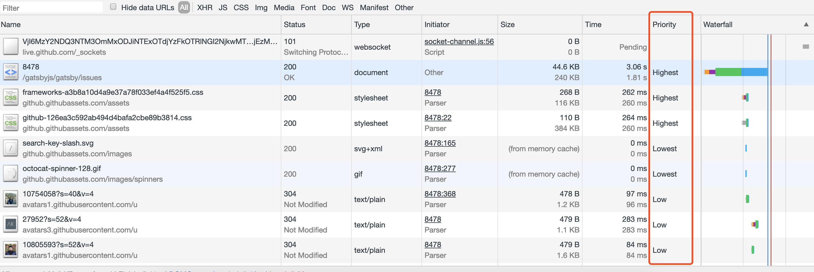
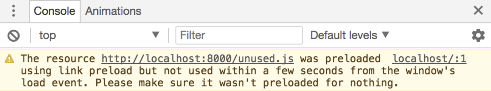
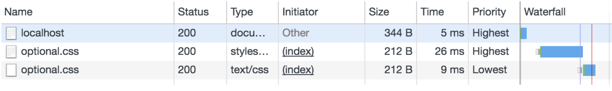

浏览器里并不是每一个资源加载都很重要。 

为了达到重要的资源先加载，浏览器有试探法，尝试对资源进行权重分配，例如CSS会在脚本和图片之前先加载。 因为浏览器在试探权重分配，所以并不总是分配的很正确，通常因为没有足够的信息，浏览器可能做出错误的决定。

下面介绍如何在现代浏览器中以代码的形式来调整资源加载的优先级。

### 默认优先级
如前所述，浏览器根据它们的重要程度为不同类型的资源分配不同的相对优先级。 像页面的`<head>`中的`<script>`标记将以"高优先级(High priority)"(CSS是"最高优先级(Highest priority)")加载到Chrome中，但如果它具有`async`属性，则该优先级将更改为"低(Low priority)"（意味着它可以加载并异步运行）。在查看站点的加载性能时，优先级变得很重要。 除了测量和分析关键渲染路径的常用技术之外，了解Chrome对每种资源的优先级分配也很有用。您可以在Chrome开发者工具的"网络"面板中找到它。 这是它的样子：



> Chrome开发者工具中网络面板中的优先级,如果没有看到该列，您可以通过右键单击列标题来启用“优先级”列 

优先级使您了解浏览器处理每个资源的相对重要性。 请记住，微妙的差异足以让浏览器分配不同的优先级; 例如，作为初始渲染的一部分的图像优先于高于从屏幕外开始的图像。

如果您发现资源加载的优先级与您想要的不同，您会怎么做？本文展示了三种不同的声明性解决方案，它们都是相对较新的`<link>`类型。 如果您的资源对用户体验至关重要，但加载的优先级过低，则可以尝试通过以下两种方式之一进行修复：`预加载(Preload)`或`预链接(Preconnect)`。 另一方面，如果您希望浏览器在完成处理其他内容时获取某些资源，请尝试`预获取(Prefetch)`。

### 预加载(Preload)
`<link rel="preload">`通知浏览器接下来可能用到的资源，并尽快开始加载资源。 你可以像这样使用：
``` html   
<link rel="preload" as="script" href="super-important.js">
<link rel="preload" as="style" href="critical.css">
```
如你期望，"as"告诉浏览器资源类型。你要通过`as`设置正确的类型，否则浏览器不会使用预加载的资源。 

浏览器在空闲的时候会去加载相应的资源，并在合适的时候使用它们。

`<link rel="preload">`是浏览器的强制性指令，preload后浏览器就必定去预加载相应的资源。使用时需要仔细测试，确保您不会因为使用它而意外导致任何资源加载2次。使用`<link rel="preload">`获取但在3秒内未被当前页面使用的资源将在Chrome开发者工具的控制台中触发警告，因此请务必留意这些！



图中显示unused.js通过预加载进行了资源加载，但是接下来并没有使用，如果用不到的资源最好不要使用预加载。

#### preload使用场景
##### 字体
字体资源是预获取的一个很好的例子

为了减少用户等待站点文本内容的时间，以及避免系统字体与样式中定义的字体之间应用时的闪烁，您可以在HTML中使用`<link rel ="preload">`让浏览器知道样式文件中需要加载的字体资源。

``` html
<link rel="preload" as="font" crossorigin="crossorigin" type="font/woff2" href="myfont.woff2">
```
请注意，使用`crossorigin`很重要; 如果没有此属性，浏览器将忽略预加载的字体，并发起一个新的请求。 这是因为浏览器使用匿名请求加载字体，也只有使用`crossorigin`属性使预加载请求匿名。

> 如果您使用的是CDN，例如Google字体，请确保您预加载的字体文件与CSS中的字体文件匹配，由于unicode范围，权重和字体变体，这可能很棘手。 字体也可以定期更新，如果你预加载了一个旧版本的字体，但在样式文件中使用了新版本的字符，则最终可能会下载相同字体的两个版本并浪费用户的带宽。 这种情况请考虑使用`<link rel ="preconnect">`。

#### 关键路径CSS和JavaScript
在谈论页面性能时，一个有用的概念是“关键路径”。 关键路径是指在初始渲染之前必须加载的资源。 这些资源(如CSS)对于获取用户屏幕上的第一个像素至关重要。以前，建议将此内容内嵌到您的HTML中。

但是，在多页，服务器端呈现的场景中，这很快就会变成大量浪费的字节。 它还使版本控制变得更加困难，因为关键代码中的任何更改都会使任何内联页面无效。`<link rel ="preload">`允许您保留单个文件版本控制和缓存的好处，同时为您提供尽快请求资源的机制。
``` html
<link rel="preload" as="script" href="super-important.js">
<link rel="preload" as="style" href="critical.css">
```
预加载缺点：需要额外的往返。 这个额外的往返来自于浏览器先获取HTML，然后它才能从HTML中找出要加载的下一个资源。

解决额外往返的一种方法是使用`HTTP/2推送`，在这种情况下，您可以将关键资源附加到和发送HTML的同一连接。 这可以保证用户浏览器检索HTML和开始下载关键资源之间没有停顿时间。 但是，在使用HTTP/2推送时要小心，因为这是控制用户带宽使用的一种非常有力的方式，并且留给浏览器做决定的空间很小，例如不检索已经在缓存中的文件！

### 预连接(Preconnect)
`<link rel ="preconnect">`通知浏览器您的页面打算与另一个来源建立连接，并且您希望该过程尽快启动。

建立连接通常需要在慢速网络中占用大量时间，特别是在涉及安全连接时，因为它可能涉及DNS查找，重定向以及到处理用户请求的最终服务器的多次往返。 提前处理所有这些可以使您的应用程序对用户感觉更加快捷，而不会对带宽的使用产生负面影响。 建立连接的大部分时间都花在等待上，而不是交换数据。

告知浏览器您的意图就像在页面中添加链接标记一样简单：
``` html
<link rel="preconnect" href="https://example.com">
```
在这种情况下，我们让浏览器知道我们打算连接到"example.com"并从那里检索内容。请记住，虽然`<link rel ="preconnect">`轻量，但它仍然占用宝贵的CPU时间，特别是在安全连接上。 如果在10秒内没有使用连接，这会特别糟糕，因为浏览器会关闭它，浪费所有早期的连接工作。

一般情况下，尝试使用<link rel ="preload">，因为它是一个更全面的性能优化方案，其它更复杂的情况，你需要使用<link rel ="preconnect">。

>注意：
>
>实际上还有另一个与连接相关的`<link>`类型：`<link rel ="dns-prefetch">`。 这仅处理DNS查找，它是`<link rel ="preconnect">`的一小部分。`<link rel ="dns-prefetch">`具有更广泛的浏览器支持，因此它可以作为一个很好的后备。 您可以用相同的方式使用它：`<link rel ="dns-prefetch" href ="https://example.com">`

#### Preconnect用例CDN
知道资源会从哪里来，但不知道最终获取什么资源。有时您知道将从给定的CDN中检索资源，但并不知道完整路径。 根据用户的使用情况或其它运行时特征，从CDN上获取一个或多个资源。

在这种情况下，如果您要获取的资源很重要，您可能希望通过预连接到服务器来节省尽可能多的时间。 浏览器不会在需要之前开始提取文件（也就是说，一旦请求以某种方式从您的页面发出），但至少它可以提前处理连接，从而使用户无需等待几次往返。

#### Preconnect 流媒体
流媒体不同来源的流媒体，您可能希望在连接阶段节省一些时间但不一定立即开始获取内容。根据页面处理流内容的方式，您可能需要等到脚本加载完毕并做好准备后才处理流。 一旦准备加载资源，预连接可帮助您缩短单次往返的等待时间。

### 预获取(Prefetch)
它通过向浏览器通知将来需要的资源来加速页面的后续展现，例如，如果用户采取了我们期望的操作，则我们可以提前加载稍后可能需要的东西。 

当前页面加载并且有可用带宽时，这些资源在Chrome中以最低优先级获取。这意味着预获取最适合提前做好用户下一步可能做的事情的准备，例如检索结果列表中的第一个产品详细信息页面，或检索分页内容中的下一页。
``` js
<link rel="prefetch" href="page-2.html">
```
但请记住，预取不会递归地起作用。 在上面的示例中, 除非您明确预获取page-2.html中的内容，否则浏览器不会提前下载page-2.html所需的任何资源。

### 预获取(Prefetch)不会覆盖
请务必注意，不能使用`<link rel ="prefetch">`作为降低现有资源优先级的方法。 在下面的HTML中，您可能认为在预取中声明`optional.css`会降低后续`<link rel ="stylesheet">`的优先级：
``` html
<html>
  <head>
    <link rel="prefetch" href="optional.css">
    <link rel="stylesheet" href="optional.css">
  </head>
  <body>
    Hello!
  </body>
</html>
```
事情上，这会导致样式表被加载两次（尽管第二个可能命中缓存），一次是默认的最高优先级，一次是最低优先级：



资源多次加载对用户来说是不好的。 在这种情况下，他们不仅要等待渲染阻止CSS，而且还可能通过两次下载文件来浪费他们的带宽。务必彻底分析您的网络请求，并留意任何相同资源的多次加载！

**什么时候该用`<link rel=”preload”>`？什么时候又该用`<link rel=”prefetch”>` ?**

**建议：对于当前页面很有必要的资源使用`preload`，对于可能在将来的页面中使用的资源使用`prefetch`。**