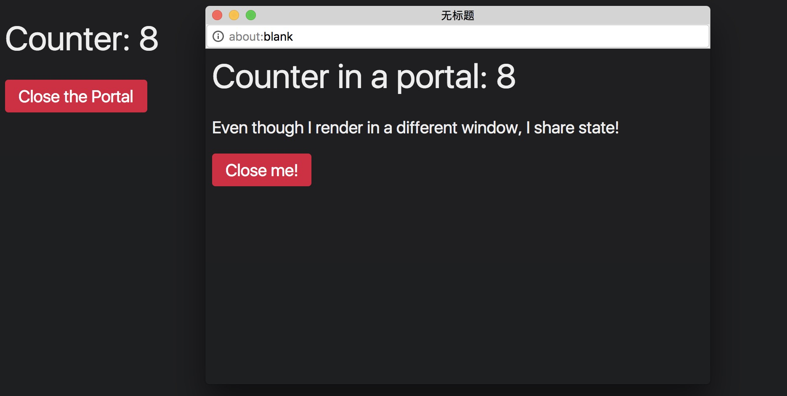

React最近发布了16.0版本,该版本中，主要新增了 `componentDidCatch`用来捕捉错误信息,`render return gragments or string`使得render方法，可以返回两种新的数据类型-数组和字符串,`custom DOM attributes`可以对原生的DOM元素添加自定义的属性,`Portals`可以让我们在组件的父组件之外渲染一个React Component。     

我觉得最有趣的应该是上面描述中的第四个:`Portals`。[React docs](https://reactjs.org/docs/portals.html)把这个特性解释的很清楚，并且使用了一个`modal`的应用作为示例。    

好像上面的描述没有什么有趣的地方，不过让接下来让我们开始做一些不可思议的事情吧。    

`Portals`所做的事情，就是把一个React Component 插入到一个DOM Element中，这个操作绝不仅仅局限于把组件插入到 *current* document。你完全可以把组件插入到一个不同的`document`中，甚至是不同的`window`对象中的document。     

下面的图片中，我有一个父页面(左侧)，里面包含一个计数器和一个红色的按钮，另外一个小的窗口(右侧)，包含几乎一样的内容，不过没有暂时没有`css`。     



上面例子中看到所有的内容都在一个Component中：      
``` javascript{17,25,38,43}
class App extends React.PureComponent {
  constructor(props) {
    super(props);

    this.state = {
      counter: 0,
      showWindowPortal: false,
    };

    this.toggleWindowPortal = this.toggleWindowPortal.bind(this);
  }

  componentDidMount() {
    window.setInterval(() => {
      this.setState(state => ({
        ...state,
        counter: state.counter + 1,
      }));
    }, 1000);
  }

  toggleWindowPortal() {
    this.setState(state => ({
      ...state,
      showWindowPortal: !state.showWindowPortal,
    }));
  }

  render() {
    return (
      <div>
        <h1>Counter: {this.state.counter}</h1>

        <button onClick={this.toggleWindowPortal}>
          {this.state.showWindowPortal ? 'Close the' : 'Open a'} Portal
        </button>

        {this.state.showWindowPortal && (
          <MyWindowPortal>
            <h1>Counter in a portal: {this.state.counter}</h1>
            <p>Even though I render in a different window, I share state!</p>

            <button onClick={() => this.setState({ showWindowPortal: false })} >
              Close me!
            </button>
          </MyWindowPortal>
        )}
      </div>
    );
  }
}
```

上面的代码中`<MyWindowPortal>`是一个稍微特殊一点的组件，这个组件内的所有的内容都会在另一个window中渲染，`<MyWindowPortal>`做了两件事：    
1. 在`componentDidMount`时，打开一个新的浏览器窗口       
2. 创建一个`Portal`并把`props.children`的内容添加到新的window的body中     

请仔细看下面的代码：   
``` js{5,11,16,19,24}
class MyWindowPortal extends React.PureComponent {
  constructor(props) {
    super(props);
    // STEP 1: 创建一个容器 <div>
    this.containerEl = document.createElement('div');
    this.externalWindow = null;
  }

  render() {
    // STEP 2: 在渲染额时候，把 props.children 添加到容器 <div> 中 
    return ReactDOM.createPortal(this.props.children, this.containerEl);
  }

  componentDidMount() {
    // STEP 3: 打开一个新的浏览器窗口
    this.externalWindow = window.open('', '', 'width=600,height=400,left=200,top=200');
    copyStyles(document, this.externalWindow.document);
    // STEP 4: 把容器 <div> 添加到新打开的窗口的 body 中
    this.externalWindow.document.body.appendChild(this.containerEl);
  }

  componentWillUnmount() {
    // STEP 5: 当父组件中的 this.state.showWindowPortal 变为 false 的时候将会执行(关闭窗口)
    this.externalWindow.close();
  }
}
```
上面的`MyWindowPortal`组件没有返回具体的内容，但是却在别的地方进行了渲染。通常来说，一个父组件对子组件说:"hey,render some DOM,then append the results to me",子组一般也是照做。但是在这个例子中，子组件说:"No! ’m gonna render stuff in a different window"。     

上面的逻辑中还有一个缺陷就是，子窗口中的元素暂时没有style,刚开始我的想法是直接把所有的css文件都复制到新的window中，但是很明显，这样太费时间了，所以写了一个方法，来做这件事情：   
``` js
function copyStyles(sourceDoc, targetDoc) {
  Array.from(sourceDoc.styleSheets).forEach(styleSheet => {
    if (styleSheet.cssRules) { // for <style> elements
      const newStyleEl = sourceDoc.createElement('style');

      Array.from(styleSheet.cssRules).forEach(cssRule => {
        // write the text of each rule into the body of the style element
        newStyleEl.appendChild(sourceDoc.createTextNode(cssRule.cssText));
      });

      targetDoc.head.appendChild(newStyleEl);
    } else if (styleSheet.href) { // for <link> elements loading CSS from a URL
      const newLinkEl = sourceDoc.createElement('link');

      newLinkEl.rel = 'stylesheet';
      newLinkEl.href = styleSheet.href;
      targetDoc.head.appendChild(newLinkEl);
    }
  });
}
```
现在我可以用下面的代码复制样式文件：
``` js
this.externalWindow = window.open(/* ... */);
                                  
copyStyles(document, this.externalWindow.document);
```
上面整个示例的代码在[example](https://stackblitz.com/edit/react-ztiawz).