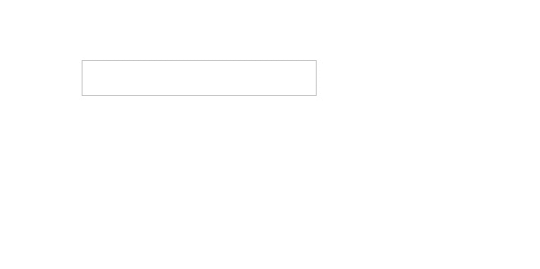
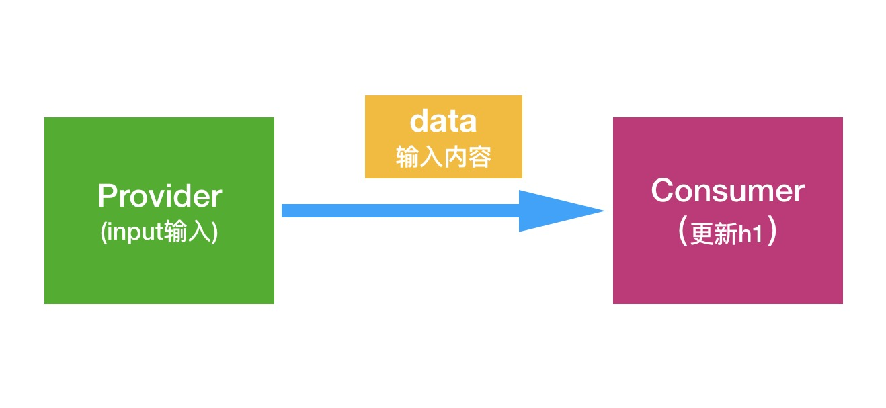
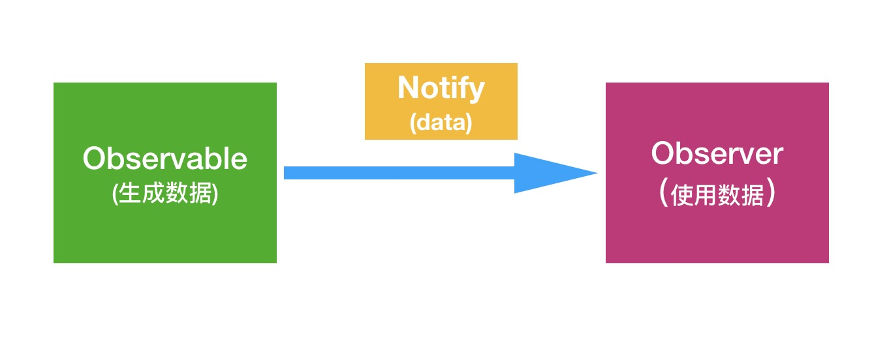
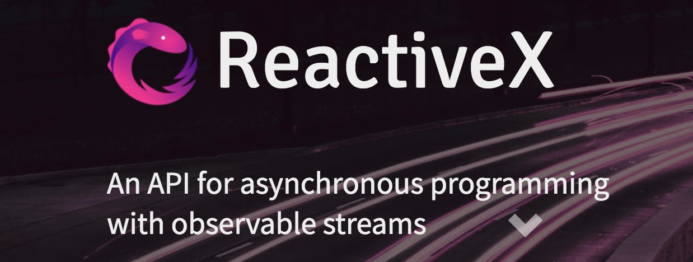

在介绍Rxjs之前，先通过一个简单的输入框示例的演化来了解一下Rxjs的核心思想。
     
这是input输入框的示例非常简单，就是在input输入的时候，实时更新下面的文字，程序的逻辑看起来是这样的：
  
从上面的实例中我们可以梳理处三个基本的概念：       

+ Provider/数据的提供者     
   在这个示例中**数据的提供者**就是input的输入内容，每当输入一个字符的时候都会生成新的数据value。       
``` javascript
var input = document.querySelector('input');
input.addEventListener('input', function (event) {
    var value = event.target.value;
});
```
+ data/数据    
    这个实例中的**数据**就是输入框输入的内容
+ Consumer/数据的消费者    
    在这个小程序中**数据的消费者**就是一个简单的界面，根据**数据**来更新h1标签的内容。         
```javascript
var h1 = document.querySelector('h1');
h1.innerHTML = data;
```

### 观察者模式  
现在我们使用观察者模式来重写这个例子：   
在观察者模式中，我们总结出的三个基本概念都有了正式的定义：   
+ 数据提供者：可观察对象／Observable
+ 数据：通知／Notification
+ 数据消费者：观察者／Observer     

除此之外观察者模式明确定义了**可观察对象**和**观察者**之前的契约：每当**可观察对象**生成新的数据的时候，就调用**观察者预定义的数据接收接口**，然后观察者调用**自身的数据消费逻辑**。
  
+ 1.Observer/观察者          
   + 1.1出于扩展的考虑，我们将**数据的消费逻辑**封装到一个函数中：

    ``` js
    var Observer = function (consumer) {
        this._consumer = consumer;
    };
    ```
    
    + 1.2观察者要实现一个**数据接收的接口**，例如：onNotify，**可观察对象**要调用这个接口来传递数据     

    ``` js
    Observer.prototype.onNotify = function (data) {
        //调用真正的消费逻辑
        this._consumer.call(this, data);
    };
    ```
+ 2.Observable 可观察对象
    + 2.1一个**可观察对象要能生成数据**，我们把生成数据的逻辑封装到一个函数中，调用这个函数生成器，就能生成新的数据。    

    ``` js
    var Observable = function (generator) {
        //先保存生成器，当观测者连接时再执行
        this._generator = generator;
    };
    ```
    + 2.2**可观察对象还需要提供一个方法供观察者连接**，当连接契约建立的时候，将观察者传入数据生成器。     

    ``` js
    Observable.prototype.subscribe = function (observer) {
        //将观察者传入数据生成器
        this._generator.call(this, observer);  
    };
    ```
    > 在数据生成器中调用观察者的onNotify方法，把新的数据传递给观察者.
+ 3.现在我们可以使用Observable类和Observer类来重写我们的input的示例
    + 3.1 定义可观察对象     

    ``` js
    var generator = function (observer) {
        input.addEventListener('input', function (event) {
            var value = event.target.value;
            observer.onNotify(value);
        });
    };
    var inputStream = new Observable(generator);
    ```
    + 3.2 定义观察者    

    ``` js
    var consumer = function (data) {
            h1.innerHTML = data;
    };
    var uiRefresher = new Observer(consumer);
    ```
    + 3.3 建立连接契约    

    ``` js
    inputStream.subscribe(uiRefresher);
    ```

**上面基于观察者模式实现的示例，全部的代码在完整的代码在[jsbin](https://jsbin.com/gopurogile/1/edit?html,js,output)**


### Rxjs        
现在我们使用Rxjs来重写这个示例：     
首先简单介绍一下Rxjs,Rxjs的全名为：**Reactive Extensions for JavaScript**,RxJS is a reactive streams library that allows you to work with *asynchronous data streams*. RxJS can be used both in the browser or in the server-side using Node.js.     
Rxjs隶属是庞大的[ReactiveX](http://reactivex.io/)家族的一员,同样有RxJava,RxSwift等等。


+ Rx.Observable.fromEvent()      
Rxjs提供了Rx.Observable.fromEvent()方法让我们从一个DOM事件，来实例化一个**Observable/可观察对象**。    

``` js
var input = document.querySelector('input');
var observable = Rx.Observable.fromEvent(input, 'input');
```
+ Observer       
在Rxjs中**Observer/观察者**是一个由回调函数组成的对象，键名分别为`next`,`error`,`complete`, 值分别为三个函数，这三个属性并不是全部必须的。   

``` js    
var h1 = document.querySelector('h1');
var observer = {
    next: function (event) {
        let value = event.target.value;
        h1.innerHTML = value;
    }
};
```
+ subscribe()    
和我们的示例一样，调用可观察对象的`subscribe`方法，来建立可观察对象和观察者之间契约。    

``` js    
observable.subscribe(observer);
```

**短短几行代码，实现了和上面一样的逻辑，希望通过这个简单的例子，能让大家对Rxjs的核心思路有个基本的概念，上面的Rxjs实现的完整的例子在[jsbin](https://jsbin.com/rasesupapa/edit?html,js,output)**
